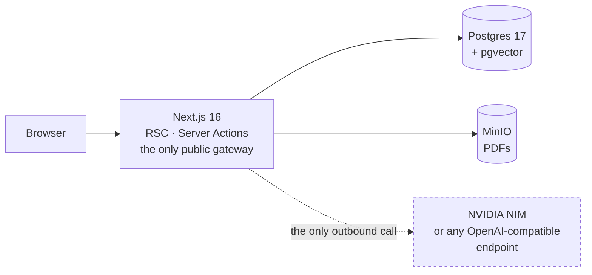
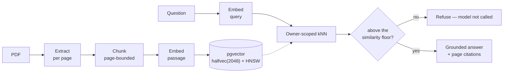

<div align="center">

# Rag Boilerplate

Upload a PDF knowledge base and chat with your documents — answers grounded in
your own files, with a citation for every claim. Built on a production-grade
Next.js foundation: auth, database, storage, PWA and Docker already wired up.


</div>

---

## What it is

An opinionated, batteries-included template built on **Next.js 16** (App Router, RSC, Server Actions) with:

- 🔐 **Auth** via Auth.js v5 — email + password (Argon2id, JWT), plus opt-in **[GitHub & Google OAuth](docs/oauth.md)**; edge-protected routes
- ✉️ **[Password reset & email verification](docs/email.md)** — single-use hashed tokens, anti-enumeration, optional verify soft gate (opt-in with SMTP)
- 🧑‍⚖️ **Role-based access control** — roles on the JWT, edge + server guards, admin user-management, invite-based account claim
- 🗄️ **PostgreSQL + Drizzle ORM** — type-safe schema (see the **[ERD](docs/database.md#entity-relationship-diagram)**), committed migrations
- 📁 **File uploads** — self-hosted, S3-compatible object storage (MinIO), size/type validation, per-user quota
- 🧠 **[RAG document chat](docs/rag.md)** — PDF knowledge base, `pgvector` + HNSW retrieval, answers grounded in your own documents, clickable page-level citations, conversation history, and per-answer generation metrics
- 📱 **PWA + responsive app shell** — installable, offline-resilient, **[Web Push](docs/push.md)**, light/dark theming, mobile-to-desktop layout
- 🔎 **SEO** — OpenGraph/Twitter cards, `robots.txt` + `sitemap.xml`
- 💾 **[Automated backups](docs/backups.md)** — nightly Postgres + MinIO, doctor script, tested restore runbook
- 🧪 **Tested** — Vitest units + Playwright E2E, green in CI
- 🐳 **Docker + CI** — multi-stage image, GitHub Actions pipeline
- 🛡️ **Strict TypeScript**, ESLint, Prettier, and pre-commit hooks

Everything is verified end to end — auth flow, container, and PWA all proven working, not just scaffolded. See **[Features](docs/features.md)** for the full list.

## Quick start

**Prerequisites:** Node ≥ 20.9 (22 recommended) · [pnpm](https://pnpm.io) (`corepack enable`) · Docker

```bash
# 1. Install
pnpm install

# 2. Configure environment
cp .env.example .env
npx auth secret            # generates AUTH_SECRET — paste into .env

# 3. Start Postgres + MinIO, apply schema, seed a demo user
pnpm docker:db
pnpm docker:minio
pnpm db:migrate
pnpm db:seed                # → demo@example.com / Password123

# 4. Run
pnpm dev                    # http://localhost:3000
```

Sign in with the demo account, or register a new one at `/register`.
For the installable PWA (service worker is production-only): `pnpm build && pnpm start`.

**Deploy it to your own domain** — one guided command takes a fresh clone to a
live app behind a Cloudflare Tunnel (HTTPS, no open ports): `make setup`. Or let
your AI agent do it: a **`self-host` skill** ships for both Claude Code and
opencode (`/self-host`). See **[Self-hosting](docs/self-hosting.md)**.

## Documentation

| Doc                                             | What's inside                                                         |
| ----------------------------------------------- | --------------------------------------------------------------------- |
| 📋 **[Features](docs/features.md)**             | Complete feature list and what's included                             |
| 🏛️ **[Architecture](docs/architecture.md)**     | Request flow, auth design, security model, project structure          |
| 🗄️ **[Database](docs/database.md)**             | ERD, schema, migrations, Drizzle workflow, seeding                    |
| 🔑 **[OAuth](docs/oauth.md)**                   | GitHub + Google sign-in — setup, callback URLs, linking               |
| ✉️ **[Email](docs/email.md)**                   | SMTP setup, password reset, email verification, soft gate             |
| 🧠 **[RAG](docs/rag.md)**                       | PDF knowledge base, pgvector, grounded document chat with citations   |
| 📱 **[PWA & App Shell](docs/pwa.md)**           | Manifest, service worker strategy, icons, responsive shell            |
| 🔔 **[Web Push](docs/push.md)**                 | VAPID setup, subscribe/send, service-worker handlers                  |
| 🛠️ **[Usage & Development](docs/usage.md)**     | Scripts, env vars, testing, Docker, extending the app                 |
| 📦 **[Self-hosting](docs/self-hosting.md)**     | `make setup` clone-to-live + continuous deployment (`make deploy`)    |
| 🚀 **[Deployment](docs/deployment.md)**         | Cloudflare Tunnel — quick, guided, and Terraform paths                |
| ⚙️ **[CI/CD](docs/ci-cd.md)**                   | _Removed in this fork_ — record of the former GitHub Actions pipeline |
| 🔁 **[Feature → Production](docs/workflow.md)** | One playbook: branch → PR → CI → release → Mac mini deploy            |
| 💾 **[Backups](docs/backups.md)**               | Nightly Postgres + MinIO backups, restore runbook, offsite            |
| 📄 **[Summary](docs/summary.md)**               | One-page project overview — stats, stack, what ships                  |
| 📐 **[Specs](specs/README.md)**                 | Spec-driven development — one spec per feature/release                |

## Scripts

Full reference — see **[Usage & Development](docs/usage.md)** for details.

| Command                              | What it does                                            |
| ------------------------------------ | ------------------------------------------------------- |
| `pnpm dev`                           | Start the dev server (Turbopack) at `localhost:3000`    |
| `pnpm build` · `pnpm start`          | Production build · serve the build                      |
| `pnpm lint` · `pnpm lint:fix`        | ESLint (check · autofix)                                |
| `pnpm typecheck`                     | Type-check with `tsc --noEmit`                          |
| `pnpm format` · `pnpm format:check`  | Prettier (write · check)                                |
| `pnpm test` · `pnpm test:watch`      | Unit tests (Vitest) — run once · watch                  |
| `pnpm test:coverage`                 | Unit tests with a coverage report                       |
| `pnpm test:e2e` · `pnpm test:e2e:ui` | End-to-end tests (Playwright) — headless · UI runner    |
| `pnpm db:generate`                   | Generate a SQL migration from the Drizzle schema        |
| `pnpm db:migrate`                    | Apply pending migrations                                |
| `pnpm db:push`                       | Push the schema without a migration file (prototyping)  |
| `pnpm db:studio`                     | Open Drizzle Studio (visual DB browser)                 |
| `pnpm db:seed`                       | Seed the demo admin + base roles (idempotent)           |
| `pnpm docker:db`                     | Start local Postgres                                    |
| `pnpm docker:minio`                  | Start local MinIO + one-shot bucket init                |
| `pnpm docker:mail`                   | Start local Mailpit (email catcher for the email E2E)   |
| `pnpm gen:icons` · `pnpm gen:og`     | Regenerate the PWA icon set · the OpenGraph share image |

**Before pushing:** `pnpm lint && pnpm typecheck && pnpm test && pnpm build`
(add `pnpm test:e2e` for the full suite — it needs Postgres, MinIO, and, for the
email round-trips, Mailpit).

## Architecture



Postgres and MinIO have no public ingress. The one dashed edge is everything
that leaves your machine — point `RAG_LLM_BASE_URL` at a local Ollama or
llama.cpp and it disappears too. More in
**[Architecture](docs/architecture.md)**.

## How the RAG works



Three things that are load-bearing rather than incidental:

- **The model is never called when retrieval finds nothing.** Refusal is a code
  path, so an empty knowledge base cannot produce a confident hallucination.
- **Ownership is enforced in the SQL `WHERE` clause**, not after the fact, so a
  question can only ever reach your own documents.
- **The vector column is `halfvec(2048)`, not `vector(2048)`** — pgvector cannot
  index a `vector` above 2000 dimensions, and the embedding model emits exactly
  2048, so the obvious choice would silently sequential-scan every query.

The full walkthrough — chunking algorithm, index shape, the passage/query
asymmetry, the two retrieval paths, measured similarity numbers and the known
gaps — is in **[RAG — how it works](docs/rag.md)**.

## Tech stack

| Layer      | Choice                                                                            |
| ---------- | --------------------------------------------------------------------------------- |
| Framework  | Next.js 16 · React 19 · TypeScript 5.9 (strict)                                   |
| Auth       | Auth.js (NextAuth) v5 — Credentials + GitHub/Google OAuth, JWT, Argon2id, RBAC    |
| Email      | Optional SMTP via nodemailer — off by default, any provider                       |
| Database   | PostgreSQL 17 · Drizzle ORM + drizzle-kit                                         |
| Storage    | MinIO (S3-compatible) · @aws-sdk/client-s3                                        |
| Retrieval  | pgvector `halfvec(2048)` + HNSW (cosine) · owner-scoped kNN                       |
| Extraction | unpdf (in-process, per-page text) — no OCR sidecar                                |
| Inference  | Any OpenAI-compatible endpoint — NVIDIA NIM by default, or local Ollama/llama.cpp |
| UI         | Tailwind CSS v4 · shadcn/ui · lucide-react                                        |
| Validation | Zod (shared client/server schemas)                                                |
| Testing    | Vitest + Testing Library · Playwright (Mailpit for email)                         |
| Tooling    | ESLint (flat) · Prettier · Husky · lint-staged                                    |
| Delivery   | Multi-stage Docker (standalone, non-root) · GitHub Actions                        |

## Project structure

```
src/
├── app/            # App Router: (auth) + (dashboard) groups, api/ (chat, documents/[id]/source,
│                   # files/[id]), PWA manifest & offline
├── components/     # auth · files · push · pwa · settings · shell · theme · ui (shadcn)
├── db/             # Drizzle schema, client, migrate & seed scripts
├── lib/            # rag (extract/chunk/embed/retrieve/scope/ingest), chat (history/metrics),
│                   # auth, email, push, storage (S3/MinIO), shell/nav, validations, env
├── types/          # shared TypeScript types
└── proxy.ts        # edge route protection + role gating (Next 16 "proxy" convention)
```

Full tree and rationale in **[Architecture](docs/architecture.md)**.

## Deployment

Serve the Docker stack on a Cloudflare domain via **Cloudflare Tunnel** — no
open ports, no reverse proxy, no certs. Three on-ramps, all converging on the
same runtime:

- **Quick** — `make tunnel-quick` → an instant `https://<random>.trycloudflare.com` URL, no Cloudflare account.
- **Guided** — your domain, a tunnel token pasted from the Cloudflare dashboard.
- **Automated** — your domain, provisioned end-to-end by Terraform.

The guided path to all three, clone-to-live, is `make setup` — see
**[Self-hosting](docs/self-hosting.md)**. For per-command / Terraform
reference: **[Deployment](docs/deployment.md)**.

## Roadmap

Forked per project and self-hosted on one box (Docker + Cloudflare Tunnel) —
not scaled across a cluster. Specs live in [`specs/`](specs/README.md).

- [x] Credentials auth · Drizzle/Postgres · Docker · CI · PWA · responsive app shell
- [x] Auth rate limiting · nonce CSP + HSTS · structured-logging shim
- [x] RBAC · invite-based account claim · optional email delivery
- [x] Cloudflare Tunnel deployment
- [x] File uploads & object storage — self-hosted MinIO, per-user quota
- [x] Dark-mode toggle & theming
- [x] SEO & OpenGraph metadata — shareable link-preview cards
- [x] OAuth providers (GitHub, Google)
- [x] Email verification & password reset
- [x] Web Push notifications
- [x] Automated backups — nightly Postgres + MinIO, documented restore path

**Explicit non-goals** (not planned for the single-box portfolio model):
internationalisation (i18n), third-party error tracking, and shared-store
rate limiting.

## Contributing

Commits run ESLint + Prettier via a Husky `pre-commit` hook. Before opening a PR:

```bash
pnpm lint && pnpm typecheck && pnpm test && pnpm build
```

See **[Usage & Development](docs/usage.md)** for the full workflow.

## License

Released under the [MIT License](LICENSE).
