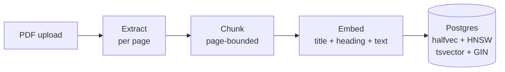
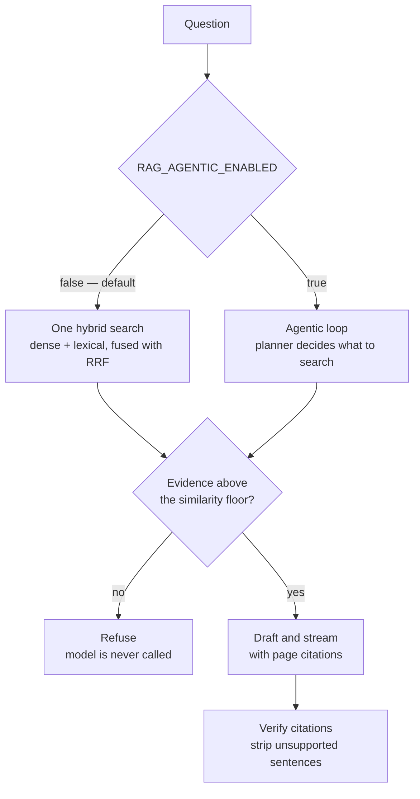
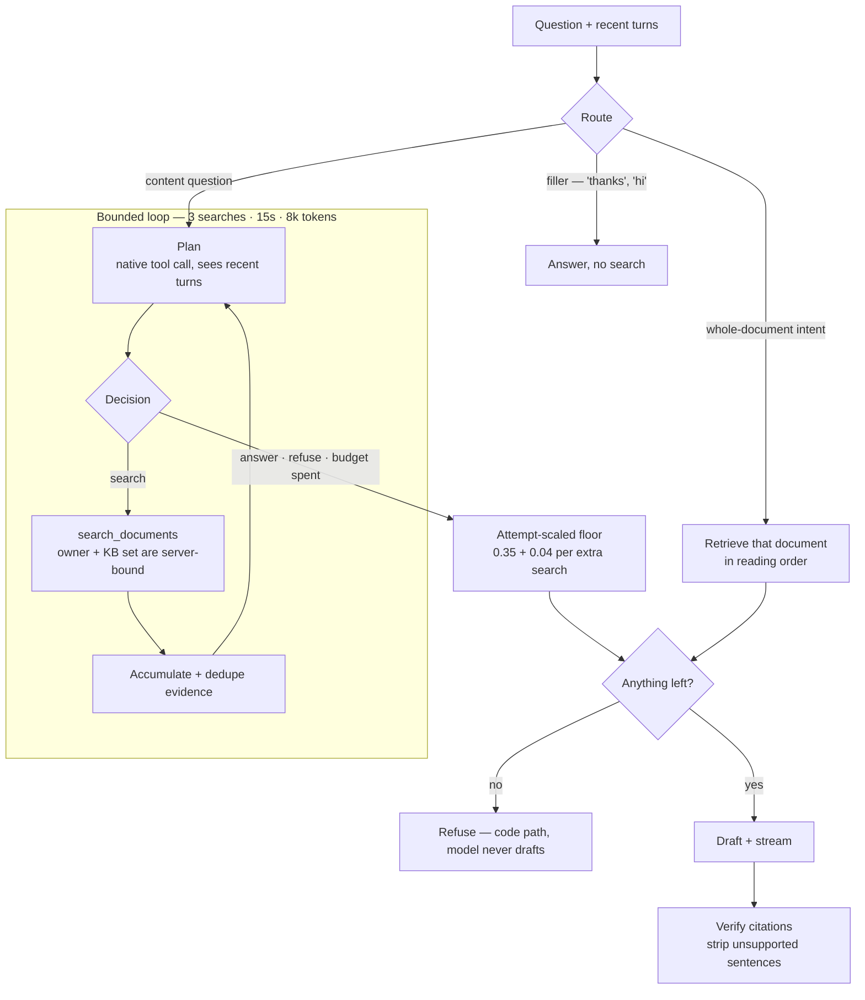
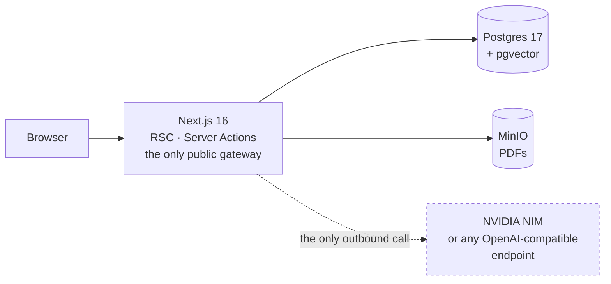

<div align="center">

# Next.js RAG Boilerplate

**A production-ready Next.js 16 template for building grounded document chat —
with an optional agentic retrieval loop.**

Upload PDFs into private knowledge bases and ask questions answered only from
those documents, with a page-level citation for every claim. Auth, Postgres +
pgvector, object storage, PWA, Docker and a retrieval evaluation harness are
already wired together.


[Getting started](#getting-started) · [Configuration](#configuration) ·
[How retrieval works](#how-retrieval-works) · [Documentation](#documentation)

</div>

---

## Overview

This is an opinionated application template, not a library. Clone it, point it
at an LLM endpoint, and you have a working multi-user document-chat product:
users register, upload PDFs into knowledge bases they own, and hold cited
conversations against them.

Two properties are enforced in code rather than left to the model:

1. **An answer is grounded, or there is no answer.** If retrieval returns
   nothing above the similarity floor, the chat model is never called and a
   fixed refusal is returned. An empty or irrelevant knowledge base cannot
   produce a confident hallucination.
2. **You can only retrieve your own documents.** Ownership and knowledge-base
   scope are applied in the SQL `WHERE` clause of every retrieval channel — not
   as a filter over results, and not as an instruction to the model.

Retrieval quality is measured, not asserted: `pnpm rag:eval` scores hit@k, MRR,
refusal accuracy and cross-knowledge-base leakage against a ground-truth corpus,
and fails the run on a refusal regression.

### What's included

| Area              | What ships                                                                                                                                          |
| ----------------- | --------------------------------------------------------------------------------------------------------------------------------------------------- |
| **Retrieval**     | PDF ingestion, page-bounded chunking, hybrid `pgvector` + `tsvector` search fused with RRF, grounded refusal, page-level citations                  |
| **Agentic RAG**   | Optional bounded planner loop with a server-scoped `search_documents` tool, attempt-scaled similarity floor, citation verification — off by default |
| **Evaluation**    | `pnpm rag:eval` — hit@k · MRR · refusal accuracy · leakage · `--compare` A/B of the fixed and agentic paths                                         |
| **Auth**          | Auth.js v5 — email + password (Argon2id, JWT), optional [GitHub & Google OAuth](docs/oauth.md), edge-protected routes                               |
| **Accounts**      | Role-based access control, admin user management, invite-based claim, [password reset & email verification](docs/email.md)                          |
| **Data**          | PostgreSQL 17 + Drizzle ORM, committed migrations, [ERD](docs/database.md#entity-relationship-diagram)                                              |
| **Storage**       | Self-hosted S3-compatible object storage (MinIO), type/size validation, per-user quota                                                              |
| **Client**        | Installable PWA, [Web Push](docs/push.md), light/dark theming, mobile-to-desktop app shell, OpenGraph/SEO metadata                                  |
| **Operations**    | Multi-stage Docker image, Cloudflare Tunnel deployment, [nightly backups](docs/backups.md) with a tested restore runbook                            |
| **Quality gates** | Strict TypeScript, ESLint, Prettier, Vitest units, Playwright E2E, Husky pre-commit hooks                                                           |

The full inventory is in **[Features](docs/features.md)**.

---

## How retrieval works

### Ingestion

A PDF becomes searchable in four steps, all bounded and resumable:



Chunks never span a page boundary, so every retrieved passage can cite an exact
page. Each chunk is embedded together with its document title and section
heading, which gives short chunks enough context to be retrievable on their own.

The vector column is `halfvec(2048)`, not `vector(2048)`: pgvector cannot index
a `vector` above 2000 dimensions, and the default embedding model emits exactly
2048 — the obvious column type would silently sequential-scan every query.

### Answering a question

Every question takes one of two paths. The **fixed pipeline** is the default:
one hybrid search, then the model writes prose over whatever was retrieved. The
**agentic path** puts a planner model in charge of retrieval instead.



In both paths the refusal gate sits **outside** the model. The decision to
refuse is never delegated to the LLM, so a prompt-injected or misbehaving model
still cannot produce an ungrounded answer — with no retrieved context, there is
no drafting call to hijack.

---

## Agentic RAG

Classic RAG retrieves once, with a query the user happened to type. That works
for direct, single-hop questions and fails predictably on two shapes:
conversational follow-ups that omit their subject (_"what about carrying it
over?"_), and multi-hop questions whose answer lives in passages no single query
retrieves together.

Agentic RAG replaces the single fixed search with a **planner model that decides
what to search for, reads what came back, and decides whether to search again**.
Retrieval becomes a loop the model steers rather than a step it consumes.



### The four guardrails

An LLM in a retrieval loop introduces failure modes a fixed pipeline does not
have. Each one is closed deliberately:

**1. Scope is bound by the server, never by the planner.**
`userId` and the conversation's permitted knowledge bases are resolved once per
question and closed over by the tool implementation. The planner supplies a
query string and at most a `documentId` hint; there is no parameter through
which it can widen scope. An out-of-scope `documentId` returns nothing,
indistinguishable from a document that does not exist.

**2. The loop is bounded on three axes.** `RAG_MAX_SEARCHES` (3),
`RAG_MAX_LOOP_MS` (15s) and `RAG_MAX_LOOP_TOKENS` (8k) are all checked _before_
each expensive call, never after — checking afterwards lets every bound be
exceeded by exactly one call. An unbounded loop against a rate-limited endpoint
is a denial-of-service against yourself.

**3. The similarity floor rises with each extra attempt.** Three attempts get
three chances to clear a fixed threshold by luck, which is a real regression and
not a theoretical one: the first measured A/B put agentic refusal accuracy at
**0.667** against a baseline of 1.000 while every other metric improved. Raising
the flat floor does not fix it — true positives on the evaluation corpus score
0.41–0.62, so any floor high enough to reject the lucky match also discards real
answers. Instead the floor rises by `RAG_AGENTIC_FLOOR_STEP` (0.04) per extra
search, so evidence found on the first search is judged exactly as the fixed
pipeline judges it, and evidence that took three phrasings must clear a higher
bar.

**4. Refusal and prose stay outside the loop.** The loop gathers evidence and
reports why it stopped; it never composes an answer and never decides to refuse.
The caller applies the same refusal gate the fixed pipeline uses.

### Why the loop stopped

Every exit is named in the response trace rather than swallowed, which makes a
slow or empty answer diagnosable:

| Termination           | Meaning                                                            |
| --------------------- | ------------------------------------------------------------------ |
| `planner-answered`    | The planner judged the accumulated evidence sufficient             |
| `planner-refused`     | The planner reported the corpus cannot answer this                 |
| `search-budget`       | `RAG_MAX_SEARCHES` reached — answer from what was found, or refuse |
| `time-budget`         | `RAG_MAX_LOOP_MS` reached — never a partial ungrounded answer      |
| `token-budget`        | `RAG_MAX_LOOP_TOKENS` reached                                      |
| `planner-unavailable` | The planning call failed; the loop stops rather than retries       |
| `whole-document`      | A whole-document request was detected; the loop was skipped        |
| `no-scope`            | The conversation has no permitted knowledge bases                  |

Because the loop is silent for seconds before any prose exists, the response
stream carries `step` frames — `routing`, `searching` with an iteration number,
`drafting`, `verifying` — so the client shows a phase label rather than an
ambiguous spinner.

### Measured: agentic vs fixed

`pnpm rag:eval --compare`, one uncontended run against the bundled corpus:

| Metric                                   | Fixed pipeline | Agentic                               | Δ          |
| ---------------------------------------- | -------------- | ------------------------------------- | ---------- |
| hit@1 / hit@3 / MRR _(single-hop, n=20)_ | 0.941          | 0.882                                 | −0.059     |
| Refusal accuracy                         | 1.000          | 1.000                                 | ±0         |
| Cross-KB leakage                         | 0              | 0                                     | ±0         |
| Follow-up hit@1 _(n=3)_                  | 0.000          | 0.667                                 | **+0.667** |
| Multi-hop full match _(n=2)_             | 0.000          | 1.000                                 | **+1.000** |
| Multi-hop fact recall                    | 0.500          | 1.000                                 | **+0.500** |
| Cost per question                        | ~1 search, ~1s | 1.44 searches, **11.1s**, 1617 tokens | —          |

**The flag is off by default**, and the reason is the trade rather than a
failure. Agentic retrieval is dramatically better at what it was built for —
follow-ups and multi-hop questions — marginally worse on single-hop, and about
ten times slower. Most questions in this corpus are single-hop, so the default
favours the cheap path.

Enable it for conversational workloads where follow-ups dominate, and re-run
`--compare` on your own corpus first. Note that the follow-up and multi-hop
slices are n=3 and n=2 — treat the direction as real and the magnitude as
provisional — and that two concurrent runs against one rate-limited key measure
contention rather than the product.

Full detail, including the module map and the measurements that shaped the
design, is in **[RAG — how it works](docs/rag.md)**.

---

## Architecture



Postgres and MinIO have no public ingress; the app is the only gateway to
either. The dashed edge is everything that leaves the host — point
`RAG_LLM_BASE_URL` at a local Ollama or llama.cpp instance and it disappears
too. See **[Architecture](docs/architecture.md)** for the request flow, security
model and module boundaries.

### Project structure

```
src/
├── app/            # App Router: (auth) + (dashboard) groups, api/ (chat, documents/[id]/source,
│                   # files/[id]), PWA manifest & offline
├── components/     # auth · files · push · pwa · settings · shell · theme · ui (shadcn)
├── db/             # Drizzle schema, client, migrate & seed scripts
├── lib/            # rag (extract/chunk/embed/retrieve/scope/ingest), chat (history/metrics),
│                   # auth, email, push, storage (S3/MinIO), shell/nav, validations, env
├── types/          # shared TypeScript types
└── proxy.ts        # edge route protection + role gating (Next 16 "proxy" convention)
```

### Tech stack

| Layer      | Choice                                                                                         |
| ---------- | ---------------------------------------------------------------------------------------------- |
| Framework  | Next.js 16 · React 19 · TypeScript 5.9 (strict)                                                |
| Auth       | Auth.js (NextAuth) v5 — Credentials + GitHub/Google OAuth, JWT, Argon2id, RBAC                 |
| Database   | PostgreSQL 17 · Drizzle ORM + drizzle-kit                                                      |
| Storage    | MinIO (S3-compatible) · @aws-sdk/client-s3                                                     |
| Retrieval  | Hybrid — pgvector `halfvec(2048)` + HNSW (cosine) fused with Postgres `tsvector` + GIN via RRF |
| Extraction | unpdf (in-process, per-page text) — no OCR sidecar                                             |
| Inference  | Any OpenAI-compatible endpoint — NVIDIA NIM by default, or local Ollama / llama.cpp            |
| Evaluation | `pnpm rag:eval` — hit@k · MRR · refusal accuracy · cross-KB leakage · `--compare` agentic A/B  |
| Email      | Optional SMTP via nodemailer — off by default, any provider                                    |
| UI         | Tailwind CSS v4 · shadcn/ui · lucide-react                                                     |
| Validation | Zod (shared client/server schemas)                                                             |
| Testing    | Vitest + Testing Library · Playwright (Mailpit for email round-trips)                          |
| Tooling    | ESLint (flat) · Prettier · Husky · lint-staged                                                 |
| Delivery   | Multi-stage Docker (standalone, non-root) · Cloudflare Tunnel · opt-in tag-triggered deploy    |

---

## Getting started

**Prerequisites:** Node ≥ 20.9 (22 recommended) · [pnpm](https://pnpm.io)
(`corepack enable`) · Docker · an API key for an OpenAI-compatible endpoint
(a free [NVIDIA NIM](https://build.nvidia.com) key works — rate-limited, not
token-billed).

```bash
# 1. Install dependencies
pnpm install

# 2. Configure the environment
cp .env.example .env
npx auth secret            # writes AUTH_SECRET into .env
# then set NVIDIA_API_KEY in .env

# 3. Start Postgres + MinIO, apply the schema, seed a demo user
pnpm docker:db
pnpm docker:minio
pnpm db:migrate
pnpm db:seed               # → demo@example.com / Password123

# 4. Run
pnpm dev                   # http://localhost:3000
```

Sign in with the demo account or register at `/register`, create a knowledge
base, upload a PDF, and start a conversation scoped to it.

Without `NVIDIA_API_KEY` the app still boots — `/chat` and `/documents` report
themselves as unconfigured and the RAG test suites self-skip — so you can
evaluate the rest of the template first.

The service worker is production-only; to exercise the installable PWA, run
`pnpm build && pnpm start`.

### Verify the setup

```bash
pnpm lint && pnpm typecheck && pnpm test && pnpm build
pnpm rag:eval              # scores retrieval against the ground-truth corpus
```

`pnpm test:e2e` runs the full Playwright suite; it needs Postgres, MinIO and —
for the email round-trips — Mailpit (`pnpm docker:mail`). With the agentic path
enabled, run it with `--workers=1`: parallel workers exceed a free-tier rate
limit and measure contention rather than the product.

---

## Configuration

All configuration is environment variables, validated at boot — the app fails
fast on a missing or malformed required value rather than at first use. Start
from **[`.env.example`](.env.example)**, which documents every key inline.

### Required

| Variable       | Description                                                                                  |
| -------------- | -------------------------------------------------------------------------------------------- |
| `DATABASE_URL` | PostgreSQL connection string (pgvector extension required)                                   |
| `AUTH_SECRET`  | Auth.js signing secret — generate with `npx auth secret`                                     |
| `S3_ENDPOINT`  | S3-compatible endpoint; `S3_ACCESS_KEY_ID`, `S3_SECRET_ACCESS_KEY`, `S3_BUCKET` alongside it |

In production also set `AUTH_URL` (canonical app URL), `APP_URL` (used for
OpenGraph cards, robots and sitemap) and `AUTH_TRUST_HOST=true` when TLS is
terminated at a trusted proxy.

### Models and endpoint

| Variable           | Default                               | Description                                                                                 |
| ------------------ | ------------------------------------- | ------------------------------------------------------------------------------------------- |
| `NVIDIA_API_KEY`   | —                                     | API key for the inference endpoint; unset disables chat + documents                         |
| `RAG_LLM_BASE_URL` | `https://integrate.api.nvidia.com/v1` | Any OpenAI-compatible base URL                                                              |
| `RAG_CHAT_MODEL`   | `nvidia/nemotron-3-super-120b-a12b`   | Writes the answer prose                                                                     |
| `RAG_EMBED_MODEL`  | `nvidia/nemotron-3-embed-1b`          | **Fixed at 2048 dimensions** — changing it requires a schema migration and a full re-ingest |

**Running fully offline.** Point the base URL at Ollama or llama.cpp:

```bash
RAG_LLM_BASE_URL=http://host.docker.internal:11434/v1
RAG_CHAT_MODEL=gpt-oss
RAG_PLANNER_MODEL=gpt-oss   # only used when RAG_AGENTIC_ENABLED=true
```

Two constraints apply. The embedding model must emit **2048-dimension** vectors
to match the column, or you need a migration and a re-ingest. And the planner
model must emit **native tool calls** reliably — on Ollama that means `gpt-oss`;
coder GGUFs tend to leak tool calls as plain text.

### Retrieval tuning

| Variable                                    | Default | Effect                                              |
| ------------------------------------------- | ------- | --------------------------------------------------- |
| `RAG_CHUNK_TOKENS`                          | 512     | Context per hit vs retrieval precision              |
| `RAG_CHUNK_OVERLAP_TOKENS`                  | 64      | Guards facts split across a chunk boundary          |
| `RAG_TOP_K`                                 | 8       | Chunks passed to the model                          |
| `RAG_MIN_SIMILARITY`                        | 0.35    | Below this, the answer is "not in your documents"   |
| `RAG_DOC_SCOPE_MAX_CHUNKS`                  | 24      | Cap on a whole-document request                     |
| `RAG_HYBRID_CANDIDATES`                     | 20      | Per-channel pool before RRF, scaled by selected KBs |
| `RAG_RRF_K`                                 | 60      | RRF damping constant; not sensitive                 |
| `RAG_EMBED_BATCH` / `RAG_EMBED_CONCURRENCY` | 32 / 4  | Ingestion throughput vs endpoint rate limits        |
| `RAG_MIN_CHARS_PER_PAGE`                    | 50      | Image-only page rejection threshold                 |
| `RAG_MAX_DOCUMENT_PAGES`                    | 200     | Bounds worst-case ingestion cost                    |

`RAG_MIN_SIMILARITY` is the one worth tuning deliberately. On the bundled corpus
true positives score 0.41–0.62 and an off-topic question 0.13; the 0.35 default
sits in that gap, but closer to the true positives than is comfortable. Raise it
only with `pnpm rag:eval` output for your own corpus in front of you.

### Agentic retrieval

| Variable                 | Default                                 | Effect                                                       |
| ------------------------ | --------------------------------------- | ------------------------------------------------------------ |
| `RAG_AGENTIC_ENABLED`    | `false`                                 | Off: the fixed pipeline runs byte-identically                |
| `RAG_PLANNER_MODEL`      | `nvidia/nemotron-3.5-lightning-30b-a3b` | Plans retrieval and calls tools; needs reliable tool calling |
| `RAG_MAX_SEARCHES`       | `3`                                     | Hard cap on `search_documents` calls per question            |
| `RAG_MAX_LOOP_MS`        | `15000`                                 | Wall-clock budget for the loop, excluding answer streaming   |
| `RAG_MAX_LOOP_TOKENS`    | `8000`                                  | Prompt + completion across every planning call               |
| `RAG_AGENTIC_FLOOR_STEP` | `0.04`                                  | Similarity floor rises by this per **extra** search          |

Planning and prose are separate settings because they were measured separately:
the model probe scored structural reliability (does it emit a valid tool call),
not answer quality. Collapse them into one model if your own evaluation says
they are interchangeable.

Enable the loop only after `pnpm rag:eval --compare` shows it is better on your
corpus. Budget for the cost: a free NIM key allows roughly 40 requests a minute,
which is ~20 questions per minute on the fixed path and ~5–8 on the agentic one.

### Optional features

Each block is inert until configured — none of them is required to run the app.

| Feature                 | Enable with                                                                      | Docs                                 |
| ----------------------- | -------------------------------------------------------------------------------- | ------------------------------------ |
| GitHub / Google OAuth   | `AUTH_GITHUB_ID` + `AUTH_GITHUB_SECRET`, `AUTH_GOOGLE_ID` + `AUTH_GOOGLE_SECRET` | [OAuth](docs/oauth.md)               |
| Email (reset, invites)  | `EMAIL_ENABLED=true` + `EMAIL_FROM` + `SMTP_HOST` + `SMTP_PORT`                  | [Email](docs/email.md)               |
| Email verification gate | `REQUIRE_EMAIL_VERIFICATION=true` (requires email enabled)                       | [Email](docs/email.md)               |
| Web Push                | `VAPID_PUBLIC_KEY` + `VAPID_PRIVATE_KEY` + `VAPID_SUBJECT`                       | [Web Push](docs/push.md)             |
| Upload limits           | `UPLOAD_MAX_SIZE_MB`, `MAX_STORAGE_PER_USER_MB`, `UPLOAD_ALLOWED_MIME_TYPES`     | [Usage](docs/usage.md)               |
| Nightly backups         | `BACKUP_RETENTION_DAYS`, `BACKUP_INTERVAL_SECONDS`, `OFFSITE_BACKUP_*`           | [Backups](docs/backups.md)           |
| Cloudflare Tunnel       | `CLOUDFLARE_TUNNEL_TOKEN` + `AUTH_URL`                                           | [Deployment](docs/deployment.md)     |
| Pre-built image deploy  | `APP_IMAGE` + `APP_TAG`                                                          | [Self-hosting](docs/self-hosting.md) |

Runtime knobs: `LOG_LEVEL` (`debug` \| `info` \| `warn` \| `error`) and
`RATE_LIMIT_DISABLED` for test runs that must bypass the in-memory auth limiter.

---

## Deployment

The Docker stack is served on a Cloudflare domain via **Cloudflare Tunnel** — no
open ports, no reverse proxy, no certificates to manage. Three on-ramps converge
on the same runtime:

- **Quick** — `make tunnel-quick` gives an instant `https://<random>.trycloudflare.com` URL with no Cloudflare account.
- **Guided** — your own domain, using a tunnel token pasted from the Cloudflare dashboard.
- **Automated** — your own domain, provisioned end to end by Terraform.

`make setup` walks a fresh clone to a live deployment on any of the three; a
`self-host` skill ships for both Claude Code and opencode (`/self-host`) if you
would rather an agent drive it. Continuous deployment thereafter is
`make deploy`. See **[Self-hosting](docs/self-hosting.md)** and
**[Deployment](docs/deployment.md)**.

---

## Scripts

| Command                              | What it does                                            |
| ------------------------------------ | ------------------------------------------------------- |
| `pnpm dev`                           | Start the dev server (Turbopack) at `localhost:3000`    |
| `pnpm build` · `pnpm start`          | Production build · serve the build                      |
| `pnpm lint` · `pnpm lint:fix`        | ESLint (check · autofix)                                |
| `pnpm typecheck`                     | Type-check with `tsc --noEmit`                          |
| `pnpm format` · `pnpm format:check`  | Prettier (write · check)                                |
| `pnpm test` · `pnpm test:watch`      | Unit tests (Vitest) — run once · watch                  |
| `pnpm test:coverage`                 | Unit tests with a coverage report                       |
| `pnpm test:e2e` · `pnpm test:e2e:ui` | End-to-end tests (Playwright) — headless · UI runner    |
| `pnpm db:generate`                   | Generate a SQL migration from the Drizzle schema        |
| `pnpm db:migrate`                    | Apply pending migrations                                |
| `pnpm db:push`                       | Push the schema without a migration file (prototyping)  |
| `pnpm db:studio`                     | Open Drizzle Studio (visual DB browser)                 |
| `pnpm db:seed`                       | Seed the demo admin + base roles (idempotent)           |
| `pnpm docker:db`                     | Start local Postgres                                    |
| `pnpm docker:minio`                  | Start local MinIO + one-shot bucket init                |
| `pnpm docker:mail`                   | Start local Mailpit (email catcher for the email E2E)   |
| `pnpm rag:eval`                      | Score retrieval against the ground-truth corpus         |
| `pnpm rag:corpus`                    | Regenerate the evaluation corpus PDFs                   |
| `pnpm gen:icons` · `pnpm gen:og`     | Regenerate the PWA icon set · the OpenGraph share image |

Full reference in **[Usage & Development](docs/usage.md)**.

---

## Documentation

| Doc                                             | What's inside                                                         |
| ----------------------------------------------- | --------------------------------------------------------------------- |
| 🧠 **[RAG](docs/rag.md)**                       | Ingestion, index design, hybrid search, the agentic loop, evaluation  |
| 📋 **[Features](docs/features.md)**             | Complete feature list and what's included                             |
| 🏛️ **[Architecture](docs/architecture.md)**     | Request flow, auth design, security model, project structure          |
| 🗄️ **[Database](docs/database.md)**             | ERD, schema, migrations, Drizzle workflow, seeding                    |
| 🔑 **[OAuth](docs/oauth.md)**                   | GitHub + Google sign-in — setup, callback URLs, linking               |
| ✉️ **[Email](docs/email.md)**                   | SMTP setup, password reset, email verification, soft gate             |
| 📱 **[PWA & App Shell](docs/pwa.md)**           | Manifest, service worker strategy, icons, responsive shell            |
| 🔔 **[Web Push](docs/push.md)**                 | VAPID setup, subscribe/send, service-worker handlers                  |
| 🛠️ **[Usage & Development](docs/usage.md)**     | Scripts, env vars, testing, Docker, extending the app                 |
| 📦 **[Self-hosting](docs/self-hosting.md)**     | `make setup` clone-to-live + continuous deployment (`make deploy`)    |
| 🚀 **[Deployment](docs/deployment.md)**         | Cloudflare Tunnel — quick, guided, and Terraform paths                |
| ⚙️ **[CI/CD](docs/ci-cd.md)**                   | _Removed in this fork_ — record of the former GitHub Actions pipeline |
| 🔁 **[Feature → Production](docs/workflow.md)** | One playbook: branch → PR → CI → release → deploy                     |
| 💾 **[Backups](docs/backups.md)**               | Nightly Postgres + MinIO backups, restore runbook, offsite            |
| 📄 **[Summary](docs/summary.md)**               | One-page project overview — stats, stack, what ships                  |
| 📐 **[Specs](specs/README.md)**                 | Spec-driven development — one spec per feature/release                |

---

## Contributing

Commits run ESLint and Prettier through a Husky `pre-commit` hook. Before
opening a pull request:

```bash
pnpm lint && pnpm typecheck && pnpm test && pnpm build
```

Changes that touch retrieval should include a `pnpm rag:eval` run — refusal
accuracy is a hard gate, not a report line. See
**[Usage & Development](docs/usage.md)** for the full workflow and
**[CONTRIBUTING.md](CONTRIBUTING.md)** for conventions.

## License

Released under the [MIT License](LICENSE).
