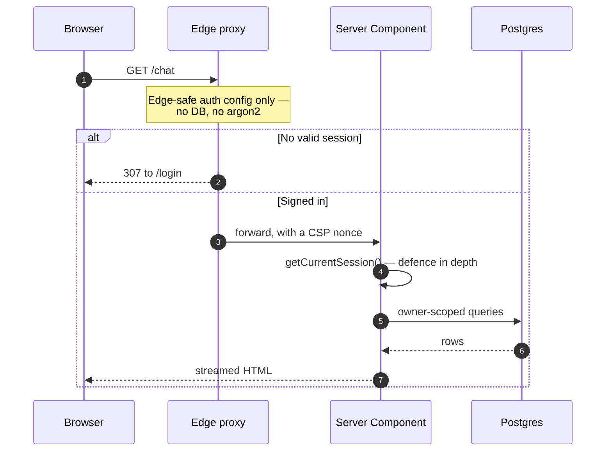
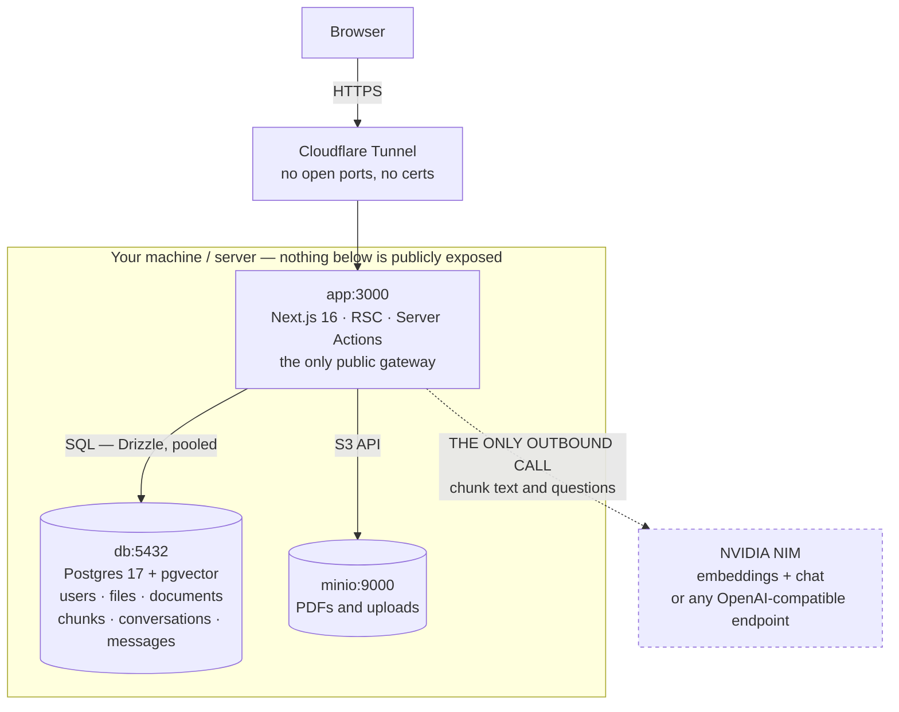

# Architecture

[← Back to README](../README.md)

A single Next.js 16 application (App Router) backed by PostgreSQL. Rendering is server-first (React Server Components + Server Actions); the client bundle is only what interactivity requires.

### Core Stack

| Component | Technology                  | Purpose                                  |
| --------- | --------------------------- | ---------------------------------------- |
| Framework | Next.js 16                  | App Router, RSC, Server Actions          |
| Auth      | Auth.js v5                  | Credentials + OAuth, JWT, Argon2id, RBAC |
| Database  | PostgreSQL 17 + Drizzle ORM | Type-safe schema, migrations             |
| Storage   | MinIO (S3-compatible)       | File uploads, object storage             |
| PWA       | Custom service worker       | Offline resilience, push notifications   |

### Retrieval

The RAG layer is hybrid and lives entirely in Postgres: a dense channel
(`pgvector` `halfvec(2048)`, HNSW cosine) and a lexical one (generated
`tsvector`, GIN), fused with Reciprocal Rank Fusion. No additional service.

Both channels filter on `owner_id` **and** `knowledge_base_id` in their own
`WHERE` clause — each boundary is enforced per channel rather than trusted to
fusion — and the decision to answer at all is gated on cosine similarity, so
retrieval that finds nothing relevant never reaches the model.

Documents live in independent, user-owned knowledge bases, and a conversation
searches a set of them fixed when it was created. The two boundaries are not the
same kind of thing: `owner_id` isolates tenants, while `knowledge_base_id` is a
scoping choice the account holder made about their own data. Both are enforced
identically; only one is a defence against an adversary.

An optional **agentic path** (`RAG_AGENTIC_ENABLED`, off by default) lets the
model plan its own searches through a `search_documents` tool inside hard caps
on searches, wall-clock and tokens. Scope is bound server-side once per
question, and refusal stays a code path _around_ the loop — the model is never
asked to decide whether to refuse.

Changes here are measured rather than argued: `pnpm rag:eval` scores retrieval
against a ground-truth corpus and reports hit@k, MRR, refusal accuracy and
cross-knowledge-base leakage, and `--compare` scores both paths side by side.
Full detail in **[RAG — how it works](rag.md)**.

### Request Flow

1. **Edge proxy** (`src/proxy.ts`) runs first on protected paths:
   - Uses edge-safe auth config (no DB, no native crypto)
   - Checks session via JWT
   - Redirects unauthenticated users to `/login`
   - Redirects users without required roles to `/403`

2. **App Router** renders pages as Server Components:
   - Protected layouts/pages re-read session server-side (`getCurrentSession`) as defense in depth
   - Server Actions handle mutations (register, login, sign-out)
   - No separate API layer for forms

3. **Drizzle ORM** executes type-safe queries:
   - Against Postgres via pooled `postgres-js` client



The session is checked **twice on purpose**: once at the edge so unauthenticated
requests never reach application code, and again server-side because the edge
check alone is a single point of failure.

### Container Topology

#### Production Stack (`docker-compose.prod.yml`)



Postgres and MinIO have **no public ingress** — the Next.js app is the sole
gateway, which is why a stored PDF is only ever reachable through an
ownership-checked route. The one dashed edge is the only thing that leaves the
machine: document text and questions, sent to the configured inference
endpoint. Point `RAG_LLM_BASE_URL` at a local Ollama or llama.cpp and even that
edge disappears.

### Authentication Design

The authentication layer covers:

- JWT session strategy (`src/lib/auth/config.ts`, `src/lib/auth/index.ts`)
- Edge protection with `proxy.ts`
- Role-based access control (`src/lib/auth/rbac.ts`)
- Rate limiting and security (`src/lib/rate-limit.ts`)

See [Features](features.md) for the user-facing capabilities and
[OAuth](oauth.md) / [Email](email.md) for provider-specific setup.

## Security model

- **Password storage** — Argon2id (`@node-rs/argon2`, OWASP-recommended
  parameters); passwords are never stored or logged in plaintext.
- **Sessions** — HTTP-only, encrypted JWT cookies (Auth.js); an undecryptable
  cookie (e.g. after an `AUTH_SECRET` rotation) is treated as "signed out"
  rather than crashing the request.
- **Rate limiting** (`src/lib/rate-limit.ts`) — per-account (IP + email) and a
  global per-IP cap on login/registration, enforced non-bypassably inside the
  credentials `authorize` callback, not just at the route layer.
- **Enumeration resistance** — failed logins run a dummy Argon2id verify so
  response timing doesn't reveal whether an account exists; invite/reset/verify
  flows are similarly silent on non-existent accounts.
- **Headers** — a nonce-based Content-Security-Policy (per request, via
  `src/proxy.ts`), HSTS, and `X-Frame-Options: DENY`.
- **Access control** — roles carried as a claim on the JWT/session; edge
  gating in `src/proxy.ts` (`ROLE_REQUIRED`) plus server-side re-checks
  (`requireRole()` / `requireAnyRole()`, `src/lib/auth/rbac.ts`) as defense in
  depth. See [Features → Access control](features.md#access-control-rbac).
- **Environment validation at boot** (`src/lib/env.ts`) — the app refuses to
  start if required variables are missing or malformed, rather than failing
  unpredictably at request time.
- **Docker image** — non-root user, multi-stage build, no build tooling in the
  runtime image.

See [SECURITY.md](../SECURITY.md) for the vulnerability-reporting process and
[Usage → Production checklist](usage.md#production-checklist) before deploying.

## Project Structure

```
src/
├── app/
│   ├── (auth)/                  # login · register · forgot/reset-password · verify-email
│   ├── (dashboard)/             # protected area with app shell
│   ├── api/                     # auth · files · health endpoints
│   └── manifest.ts, offline/    # PWA support
├── components/                  # auth forms, file upload, push, pwa, settings, shell, theme, UI primitives
├── db/                          # Drizzle schema, migrate.ts, seed.ts
├── lib/                         # auth, email, push, storage, shell/nav, validations, env
├── types/                       # shared TypeScript types
└── proxy.ts                     # edge protection + role gating
```

### Key Files for Reference

- `src/proxy.ts:52` - Edge route protection
- `src/lib/auth/index.ts:70` - Credentials provider
- `src/lib/auth/rbac.ts` - Role guards
- `src/db/schema.ts` - Database schema
- `src/db/migrate.ts:23` - Migration runner
- `src/db/seed.ts` - Seed script (roles + demo admin user)
