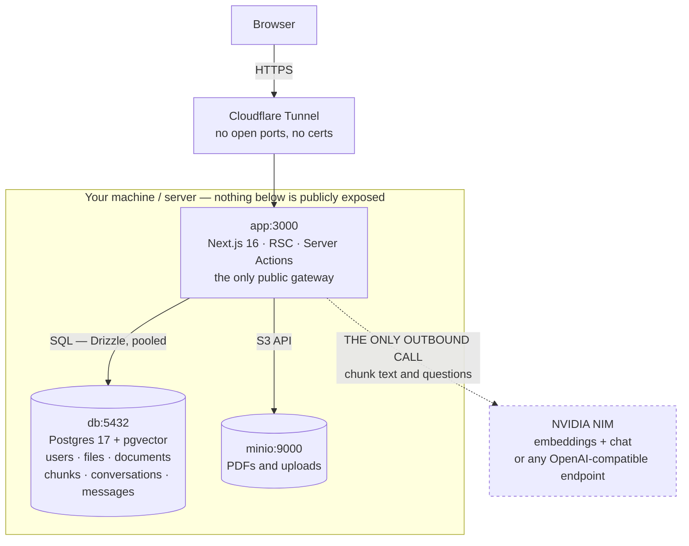
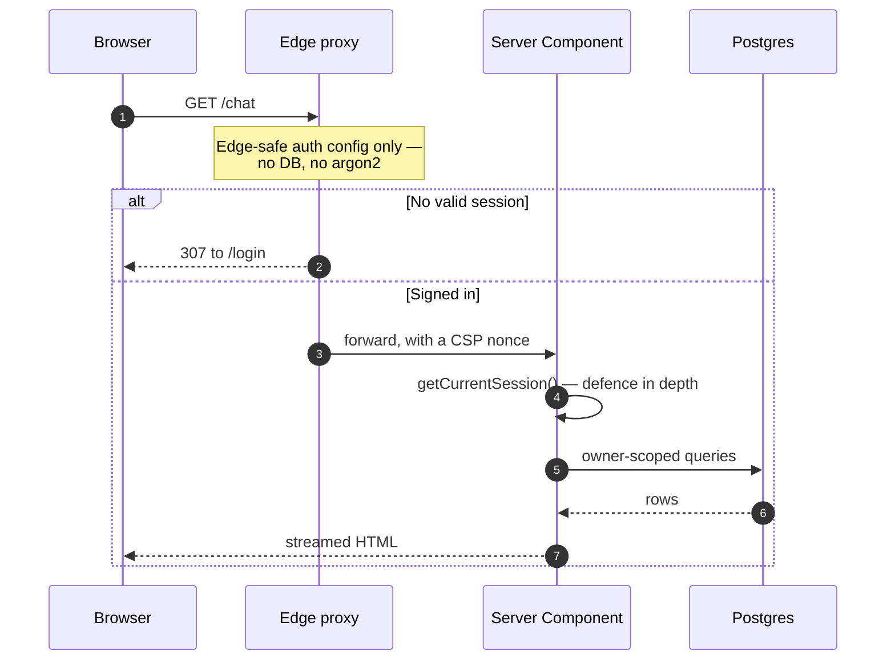
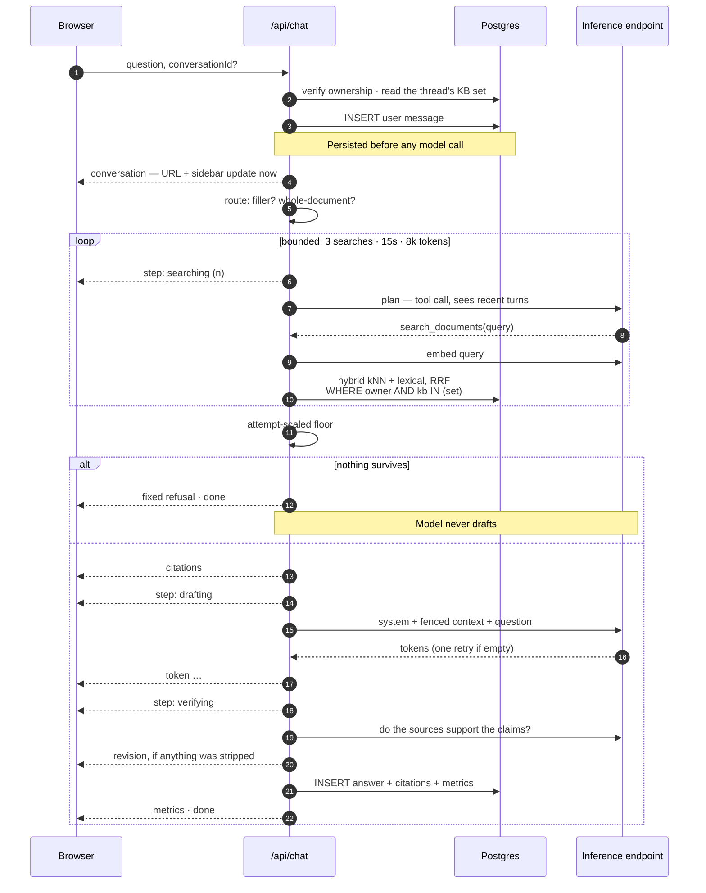

# Architecture

**What this covers:** the shape of the system before you read any code. It
shows what runs where, what a request touches on its way through, why the app
is the only door into Postgres and MinIO, and where each piece of code lives.

## The whole system, in one picture

There are only three long-running pieces, plus one thing you talk to over the
internet.

A Next.js 16 app serves every page and every API route. It is the only process
a browser ever reaches. A PostgreSQL 17 database holds all the data: accounts,
roles, file records, documents, the searchable text of those documents, and
conversations. A MinIO bucket holds the actual bytes, meaning uploaded PDFs and
profile photos. The fourth piece is an inference endpoint, the HTTP service
that runs the language models. By default it is somewhere else, and it is the
only thing outside your machine that the app speaks to.

The diagram shows what can be reached from where. Count the arrows that cross
the box.



Only two edges cross the boundary: the browser coming in through the app, and
the app going out to the model endpoint.

Postgres and MinIO have **no public ingress**. The Next.js app is the sole
gateway, so a stored PDF can only be reached through an ownership-checked
route. No stray URL can reach an S3 bucket, and no scanner can find a database
port. The one dashed edge is the only thing that leaves the machine: document
text and questions, sent to the configured inference endpoint. If you point
`RAG_LLM_BASE_URL` at a local Ollama or llama.cpp, even that edge disappears.

Traffic arrives over a Cloudflare Tunnel, a small daemon on your box that dials
out to Cloudflare and holds the connection open. That means there are no
inbound ports to open and no certificates to manage. The tunnel is a deployment
choice and the architecture does not depend on it; see
[Deployment](deployment.md) for how it works and what the alternatives are.

The stack is Next.js 16 for the App Router, React Server Components and Server
Actions, and Auth.js v5 for credentials and OAuth sign-in, JWT sessions,
Argon2id password hashing and role-based access control. PostgreSQL 17 with
Drizzle ORM provides a type-safe schema and generated migrations. MinIO (or any
S3-compatible store) handles object storage, and a hand-rolled service worker
provides offline resilience and push notifications. Exact versions are in
[Summary → Core tech stack](summary.md#core-tech-stack).

Rendering is server-first. Pages are React Server Components, mutations are
Server Actions, and the client bundle carries only what interactivity actually
requires.

## What a page request does

Three things happen in order, and the first two both check who you are.

1. The edge proxy (`src/proxy.ts`) runs first on protected paths. It uses an
   edge-safe auth config with no database and no native crypto. It reads the
   session from the JWT cookie, sends unauthenticated users to `/login`, and
   sends users without the required role to `/403`. It also attaches the
   per-request Content-Security-Policy nonce.

2. The App Router renders the page as a Server Component. Protected layouts and
   pages re-read the session server-side with `getCurrentSession()`. Mutations
   such as register, login and sign-out are Server Actions, so forms need no
   separate API layer.

3. Drizzle ORM runs the queries against Postgres through a pooled `postgres-js`
   client, with the owner id already in hand.



The session is checked twice on purpose. The edge check keeps unauthenticated
requests from ever reaching application code, and the server-side check is
there because the edge check alone would be a single point of failure. Checking
the same thing in two independent places is called **defence in depth**: if
one check fails, the other still holds.

## How retrieval fits in

The document-chat half of the app adds no new services. All of it lives inside
the Postgres you already run.

When a PDF is uploaded, the app extracts its text, splits it into short
passages, turns each passage into a list of numbers with an embedding model,
and stores those numbers next to the text. When you ask a question, the app
searches those numbers for the passages closest in meaning and hands only those
passages to the chat model. If nothing it finds is close enough, the chat model
is never called. Every term in that paragraph is defined properly in
[RAG — how it works](rag.md).

Two channels run side by side. A dense channel searches by meaning, using the
`pgvector` extension with a `halfvec(2048)` column and an HNSW cosine index. A
lexical channel searches by keyword, using Postgres full-text search with a
generated `tsvector` column and a GIN index. Reciprocal Rank Fusion merges
their two result lists, all without an additional service or a separate search
cluster.

Two properties are enforced in code instead of being requested of the model.
[RAG → Two guarantees](rag.md#two-guarantees) states both in full; for the
architecture, what matters is _where_ they are enforced. Both retrieval
channels filter on `owner_id` and `knowledge_base_id` in their own `WHERE`
clause, so each channel enforces each boundary itself instead of trusting
fusion to do it. The decision to answer at all depends on cosine similarity,
so retrieval that finds nothing relevant never reaches the model.

Documents live in independent, user-owned knowledge bases, and a conversation
searches a set of them that is fixed when the conversation is created. The two
boundaries differ in kind. `owner_id` isolates tenants, while
`knowledge_base_id` is a scoping choice the account holder made about their own
data. Both are enforced identically, but only one is a defence against an
adversary.

An optional agentic path (`RAG_AGENTIC_ENABLED`, on by default) lets the model
plan its own searches through a `search_documents` tool, within hard caps on
searches, wall-clock time and tokens. Scope is bound server-side once per
question, and refusal stays a code path _around_ the loop. The model is never
asked to decide whether to refuse.

Changes here are measured. `pnpm rag:eval` scores retrieval against a
ground-truth corpus and reports hit@k, MRR, refusal accuracy and
cross-knowledge-base leakage, and `--compare` scores both paths side by side.
Full detail is in [RAG — how it works](rag.md).

## What a question does

This is the one request that is not a page render, and the only one that runs
for tens of seconds. Everything after the first frame happens inside a single
streaming response, so the client always has a heartbeat. The conversation id
arrives immediately, followed by progress steps, then citations, then the
answer token by token.

The diagram traces one question with the agentic path switched on. Read the
`alt` block at the bottom first. It is the refusal gate, and it sits outside
every model call.



The owner id and the permitted knowledge-base set are bound once, at the top,
from the session and the thread. The planner supplies a query and at most a
document hint, and it has no parameter through which it could widen scope.

## Authentication design

Sign-in is Auth.js v5. Two things about it shape the rest of the code.

First, the auth config is split in two. `src/lib/auth/config.ts` is edge-safe:
it imports no database client and no native crypto, because `src/proxy.ts` runs
on the edge runtime and cannot load either. The Credentials provider, Argon2id
and every database call live in `src/lib/auth/index.ts`, which runs on Node.
**Never import the database or argon2 into `config.ts` or `proxy.ts`.** The
code depends on the split.

Second, the session is a JWT and has no database row. Nothing needs looking up
on each request, which is what lets the edge check a session without a database
round-trip.

### Session strategy & revocation

Sessions are HTTP-only, encrypted JWT cookies with a 30-day `maxAge`
(`src/lib/auth/config.ts`). The user id, roles and avatar are written onto the
token at sign-in and read back out onto the session object, so the edge can
gate by role from the token claim alone.

Because the claims live in the token, they can go stale. A role change or a new
profile photo is picked up on an explicit session update: the `jwt` callback in
`src/lib/auth/index.ts` re-fetches roles when `trigger === 'update'`, when a
token has no roles yet, or on a fresh OAuth sign-in. On the client, calling
`useSession().update()` with **no argument** is only a GET re-fetch and does
not trigger that branch. Pass any defined argument, such as `update({})`, to
actually force the refresh.

One limitation follows from this: **JWT sessions are not server-revocable
today.** Signing out clears the cookie in that browser, but an already-issued
token stays valid until it expires. Password reset therefore does not
invalidate other sessions. This is a known, documented gap (see
[Email → Security notes](email.md#security-notes)). Rotating `AUTH_SECRET`
invalidates every session at once; an undecryptable cookie is treated as
"signed out" and the request does not crash (`getCurrentSession()`,
`src/lib/auth/session.ts`).

### Where the auth code lives

- JWT session strategy: `src/lib/auth/config.ts`, `src/lib/auth/index.ts`
- Edge protection and role gating: `src/proxy.ts`
- Role-based access control: `src/lib/auth/rbac.ts`
- Rate limiting: `src/lib/rate-limit.ts`

See [Features](features.md) for the user-facing capabilities and
[OAuth](oauth.md) / [Email](email.md) for provider-specific setup.

## Security model

- Passwords are hashed with Argon2id (`@node-rs/argon2`, OWASP-recommended
  parameters), an algorithm that is deliberately slow and memory-hungry so that
  stolen hashes are expensive to crack. Passwords are never stored or logged in
  plaintext.
- Sessions are HTTP-only, encrypted JWT cookies (Auth.js). An undecryptable
  cookie (e.g. after an `AUTH_SECRET` rotation) is treated as "signed out"
  instead of crashing the request.
- Rate limiting (`src/lib/rate-limit.ts`) applies per account (IP + email),
  with a global per-IP cap on login/registration. It is enforced inside the
  credentials `authorize` callback, where it cannot be bypassed, as well as at
  the route layer.
- Failed logins run a dummy Argon2id verify so that response timing doesn't
  reveal whether an account exists. The invite/reset/verify flows are similarly
  silent about non-existent accounts, which resists user enumeration.
- Headers include a nonce-based Content-Security-Policy (per request, via
  `src/proxy.ts`), HSTS, and `X-Frame-Options: DENY`.
- For access control, roles are carried as a claim on the JWT/session. Edge
  gating in `src/proxy.ts` (`ROLE_REQUIRED`) is backed by server-side re-checks
  (`requireRole()` / `requireAnyRole()`, `src/lib/auth/rbac.ts`) as defence in
  depth. See [Features → Access control](features.md#access-control-rbac).
- Environment validation runs at boot (`src/lib/env.ts`). The app refuses to
  start if required variables are missing or malformed, so it does not fail
  unpredictably at request time.
- Retrieval scope comes from owner and knowledge-base filters in the SQL
  `WHERE` clause of every retrieval channel. They are never applied to results
  afterwards ([RAG](rag.md#two-guarantees)).
- The Docker image uses a non-root user and a multi-stage build, with no build
  tooling in the runtime image.

See [SECURITY.md](../SECURITY.md) for the vulnerability-reporting process, and
read [Usage → Production checklist](usage.md#production-checklist) before
deploying.

## Project structure

```
src/
├── app/
│   ├── (auth)/                  # login · register · forgot/reset-password · verify-email
│   ├── (dashboard)/             # protected area with app shell: chat · documents · settings
│   ├── api/                     # auth · chat · files · document source · health
│   ├── 403/                     # role-denied page
│   └── manifest.ts, offline/    # PWA support
├── components/                  # auth, chat, files, push, pwa, rag, settings, shell, theme, UI primitives
├── db/                          # Drizzle schema, migrate.ts, seed.ts
├── lib/
│   ├── auth/                    # config (edge-safe) · index (Node) · rbac · session · actions
│   ├── rag/                     # extract · chunk · embed · ingest · retrieve · agentic · prompt
│   ├── chat/                    # server actions, metrics, titles, recents
│   ├── email/ push/ storage/    # optional subsystems
│   ├── shell/ validations/      # nav data, Zod schemas
│   └── env.ts, logger.ts, rate-limit.ts
├── types/                       # shared TypeScript types
└── proxy.ts                     # edge protection + role gating + CSP
```

The retrieval evaluation harness lives outside `src/`, in `eval/`. It holds the
corpus, the questions and the runner behind `pnpm rag:eval`.

### Key files for reference

| File                        | What it does                            |
| --------------------------- | --------------------------------------- |
| `src/proxy.ts`              | Edge route protection, role gating, CSP |
| `src/lib/auth/index.ts:70`  | Credentials provider                    |
| `src/lib/auth/rbac.ts`      | Role guards                             |
| `src/lib/auth/session.ts`   | `getCurrentSession()`                   |
| `src/db/schema.ts`          | Database schema                         |
| `src/db/migrate.ts`         | Migration runner                        |
| `src/db/seed.ts`            | Seed script (roles + demo admin user)   |
| `src/app/api/chat/route.ts` | The streaming question endpoint         |
| `src/lib/rag/retrieve.ts`   | Owner-scoped hybrid retrieval           |

**Next:** [Features](features.md) for the full inventory of what ships, then
[OAuth](oauth.md) if you want GitHub or Google sign-in.
