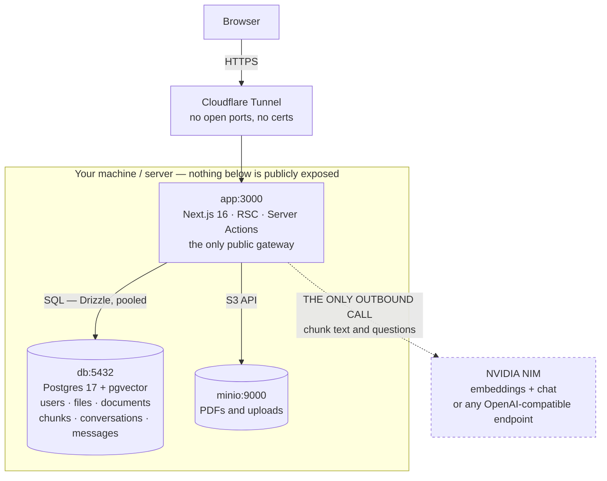
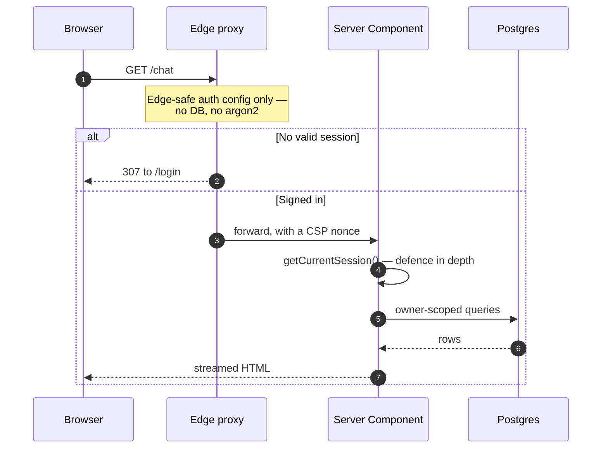
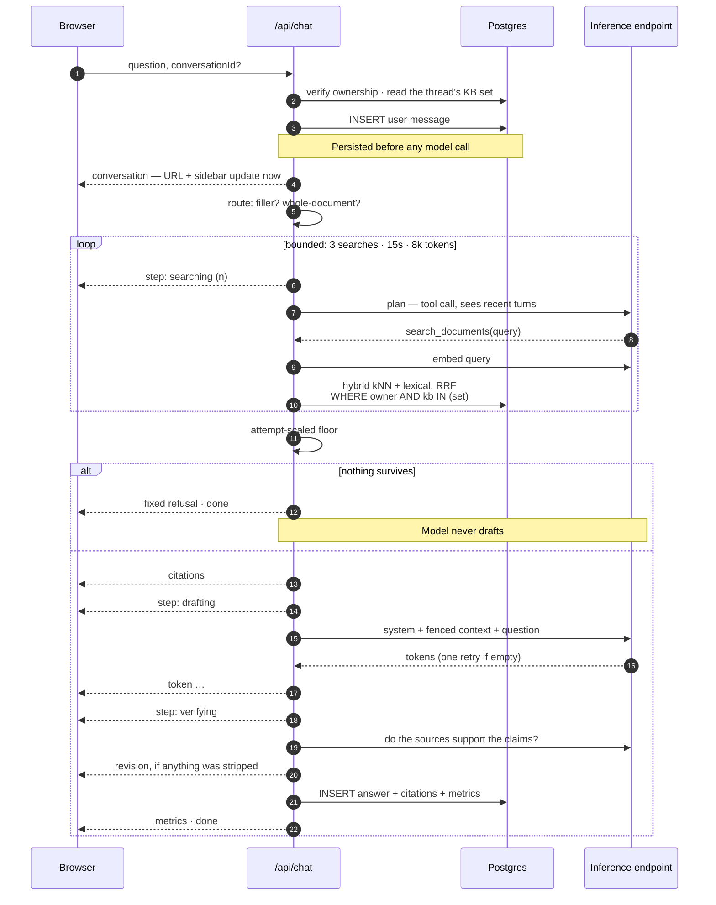

# Architecture

[← Back to README](../README.md)

**What this covers:** the shape of the system before you read any code — what
runs where, what a request touches on its way through, why the app is the only
door into Postgres and MinIO, and where each piece of code lives.

## The whole system, in one picture

There are only three long-running pieces, plus one thing you talk to over the
internet.

A **Next.js 16 app** serves every page and every API route. It is the only
process a browser ever reaches. A **PostgreSQL 17** database holds all the
data — accounts, roles, file records, documents, the searchable text of those
documents, and conversations. A **MinIO** bucket holds the actual bytes:
uploaded PDFs and profile photos. The fourth piece is an **inference
endpoint** — the HTTP service that runs the language models. It is somewhere
else by default, and it is the only thing outside your machine that the app
speaks to.

The diagram shows what can be reached from where. Look at how many arrows
cross the box.



Only two edges cross the boundary: the browser coming in through the app, and
the app going out to the model endpoint.

Postgres and MinIO have **no public ingress** — the Next.js app is the sole
gateway, which is why a stored PDF is only ever reachable through an
ownership-checked route. There is no S3 bucket a stray URL can reach and no
database port a scanner can find. The one dashed edge is the only thing that
leaves the machine: document text and questions, sent to the configured
inference endpoint. Point `RAG_LLM_BASE_URL` at a local Ollama or llama.cpp
and even that edge disappears.

Traffic arrives over a Cloudflare Tunnel, which is a small daemon on your box
that dials out to Cloudflare and holds the connection open — so there are no
inbound ports to open and no certificates to manage. That is a deployment
choice, not an architectural requirement; see
[Deployment](deployment.md) for how it works and what the alternatives are.

**The stack.** Next.js 16 for the App Router, React Server Components and
Server Actions. Auth.js v5 for credentials and OAuth sign-in, JWT sessions,
Argon2id password hashing and role-based access control. PostgreSQL 17 with
Drizzle ORM for a type-safe schema and generated migrations. MinIO (or any
S3-compatible store) for object storage. A hand-rolled service worker for
offline resilience and push notifications. Exact versions are in
[Summary → Core tech stack](summary.md#core-tech-stack).

Rendering is server-first: pages are React Server Components, mutations are
Server Actions, and the client bundle carries only what interactivity actually
requires.

## What a page request does

Three things happen in order, and the first two both check who you are.

1. **The edge proxy** (`src/proxy.ts`) runs first on protected paths. It uses
   an edge-safe auth config — no database, no native crypto — reads the session
   from the JWT cookie, sends unauthenticated users to `/login`, and sends
   users without the required role to `/403`. It also attaches the per-request
   Content-Security-Policy nonce.

2. **The App Router** renders the page as a Server Component. Protected
   layouts and pages re-read the session server-side with `getCurrentSession()`.
   Mutations are Server Actions — register, login, sign-out — so there is no
   separate API layer for forms.

3. **Drizzle ORM** runs the queries against Postgres through a pooled
   `postgres-js` client, with the owner id already in hand.



The session is checked **twice on purpose**: once at the edge so
unauthenticated requests never reach application code, and again server-side
because the edge check alone is a single point of failure. Checking the same
thing in two independent places is called **defence in depth** — one failure
then is not the whole failure.

## How retrieval fits in

The document-chat half of the app adds no new services. All of it lives inside
the Postgres you already run.

When a PDF is uploaded, the app extracts its text, splits it into short
passages, turns each passage into a list of numbers with an embedding model,
and stores those numbers next to the text. When you ask a question, the app
searches those numbers for the passages closest in meaning, and hands only
those passages to the chat model. If nothing found is close enough, the chat
model is never called at all. Every term in that paragraph is defined properly
in **[RAG — how it works](rag.md)**.

Two channels run side by side. A **dense** one searches by meaning, using the
`pgvector` extension — a `halfvec(2048)` column with an HNSW cosine index. A
**lexical** one searches by keyword, using Postgres full-text search — a
generated `tsvector` column with a GIN index. Their two result lists are merged
with Reciprocal Rank Fusion. No additional service, no separate search cluster.

Two properties are enforced in code rather than requested of the model —
[RAG → Two guarantees](rag.md#two-guarantees) is the full statement of both.
Architecturally, what matters is _where_ they are enforced. Both retrieval
channels filter on `owner_id` **and** `knowledge_base_id` in their own `WHERE`
clause — each boundary is enforced per channel rather than trusted to fusion —
and the decision to answer at all is gated on cosine similarity, so retrieval
that finds nothing relevant never reaches the model.

Documents live in independent, user-owned knowledge bases, and a conversation
searches a set of them fixed when it was created. The two boundaries are not
the same kind of thing: `owner_id` isolates tenants, while `knowledge_base_id`
is a scoping choice the account holder made about their own data. Both are
enforced identically; only one is a defence against an adversary.

An optional **agentic path** (`RAG_AGENTIC_ENABLED`, off by default) lets the
model plan its own searches through a `search_documents` tool inside hard caps
on searches, wall-clock and tokens. Scope is bound server-side once per
question, and refusal stays a code path _around_ the loop — the model is never
asked to decide whether to refuse.

Changes here are measured rather than argued: `pnpm rag:eval` scores retrieval
against a ground-truth corpus and reports hit@k, MRR, refusal accuracy and
cross-knowledge-base leakage, and `--compare` scores both paths side by side.
Full detail in **[RAG — how it works](rag.md)**.

## What a question does

This is the one request that is not a page render, and the only one that runs
for tens of seconds. Everything below the first frame happens inside a single
streaming response, so the client is never silent without a heartbeat — the
conversation id arrives immediately, then progress steps, then citations, then
the answer token by token.

The diagram traces one question with the agentic path switched on. Read the
`alt` block at the bottom first: it is the refusal gate, and it sits outside
every model call.



The owner id and the permitted knowledge-base set are bound **once**, at the
top, from the session and the thread. The planner supplies a query and at most
a document hint; there is no parameter through which it could widen scope.

## Authentication design

Sign-in is Auth.js v5. Two things about it shape the rest of the code.

First, **the auth config is split in two.** `src/lib/auth/config.ts` is
edge-safe: it imports no database client and no native crypto, because
`src/proxy.ts` runs on the edge runtime and cannot load either. The Credentials
provider, Argon2id and every database call live in `src/lib/auth/index.ts`,
which runs on Node. Never import the database or argon2 into `config.ts` or
`proxy.ts` — the split is load-bearing, not stylistic.

Second, **the session is a JWT, not a database row.** There is nothing to look
up on each request, which is what lets the edge check a session without a
database round-trip.

### Session strategy & revocation

Sessions are HTTP-only, encrypted JWT cookies with a 30-day `maxAge`
(`src/lib/auth/config.ts`). The user id, roles and avatar are written onto the
token at sign-in and read back out onto the session object, so the edge can
gate by role from the token claim alone.

Because the claims live in the token, they can go stale. A role change or a new
profile photo is picked up on an explicit session update: the `jwt` callback in
`src/lib/auth/index.ts` re-fetches roles when `trigger === 'update'`, when a
token has no roles yet, or on a fresh OAuth sign-in. On the client, calling
`useSession().update()` with **no argument** is only a GET re-fetch and does
not trigger that branch — pass any defined argument, such as `update({})`, to
actually force the refresh.

The limitation that follows: **JWT sessions are not server-revocable today.**
Signing out clears the cookie in that browser, but an already-issued token
stays valid until it expires. Password reset therefore does not invalidate
other sessions — a documented gap, not an oversight (see
[Email → Security notes](email.md#security-notes)). Rotating `AUTH_SECRET`
invalidates every session at once; an undecryptable cookie is treated as
"signed out" rather than crashing the request
(`getCurrentSession()`, `src/lib/auth/session.ts`).

### Where the auth code lives

- JWT session strategy — `src/lib/auth/config.ts`, `src/lib/auth/index.ts`
- Edge protection and role gating — `src/proxy.ts`
- Role-based access control — `src/lib/auth/rbac.ts`
- Rate limiting — `src/lib/rate-limit.ts`

See [Features](features.md) for the user-facing capabilities and
[OAuth](oauth.md) / [Email](email.md) for provider-specific setup.

## Security model

- **Password storage** — Argon2id (`@node-rs/argon2`, OWASP-recommended
  parameters), a hashing algorithm deliberately slow and memory-hungry so that
  stolen hashes are expensive to crack; passwords are never stored or logged in
  plaintext.
- **Sessions** — HTTP-only, encrypted JWT cookies (Auth.js); an undecryptable
  cookie (e.g. after an `AUTH_SECRET` rotation) is treated as "signed out"
  rather than crashing the request.
- **Rate limiting** (`src/lib/rate-limit.ts`) — per-account (IP + email) and a
  global per-IP cap on login/registration, enforced non-bypassably inside the
  credentials `authorize` callback, not just at the route layer.
- **Enumeration resistance** — failed logins run a dummy Argon2id verify so
  response timing doesn't reveal whether an account exists; invite/reset/verify
  flows are similarly silent on non-existent accounts.
- **Headers** — a nonce-based Content-Security-Policy (per request, via
  `src/proxy.ts`), HSTS, and `X-Frame-Options: DENY`.
- **Access control** — roles carried as a claim on the JWT/session; edge
  gating in `src/proxy.ts` (`ROLE_REQUIRED`) plus server-side re-checks
  (`requireRole()` / `requireAnyRole()`, `src/lib/auth/rbac.ts`) as defence in
  depth. See [Features → Access control](features.md#access-control-rbac).
- **Environment validation at boot** (`src/lib/env.ts`) — the app refuses to
  start if required variables are missing or malformed, rather than failing
  unpredictably at request time.
- **Retrieval scope** — owner and knowledge-base filters live in the SQL
  `WHERE` clause of every retrieval channel, never as a filter applied to
  results afterwards ([RAG](rag.md#two-guarantees)).
- **Docker image** — non-root user, multi-stage build, no build tooling in the
  runtime image.

See [SECURITY.md](../SECURITY.md) for the vulnerability-reporting process and
[Usage → Production checklist](usage.md#production-checklist) before deploying.

## Project structure

```
src/
├── app/
│   ├── (auth)/                  # login · register · forgot/reset-password · verify-email
│   ├── (dashboard)/             # protected area with app shell: chat · documents · settings
│   ├── api/                     # auth · chat · files · document source · health
│   ├── 403/                     # role-denied page
│   └── manifest.ts, offline/    # PWA support
├── components/                  # auth, chat, files, push, pwa, rag, settings, shell, theme, UI primitives
├── db/                          # Drizzle schema, migrate.ts, seed.ts
├── lib/
│   ├── auth/                    # config (edge-safe) · index (Node) · rbac · session · actions
│   ├── rag/                     # extract · chunk · embed · ingest · retrieve · agentic · prompt
│   ├── chat/                    # server actions, metrics, titles, recents
│   ├── email/ push/ storage/    # optional subsystems
│   ├── shell/ validations/      # nav data, Zod schemas
│   └── env.ts, logger.ts, rate-limit.ts
├── types/                       # shared TypeScript types
└── proxy.ts                     # edge protection + role gating + CSP
```

The retrieval evaluation harness lives outside `src/`, in `eval/` — corpus,
questions and the runner behind `pnpm rag:eval`.

### Key files for reference

| File                        | What it does                            |
| --------------------------- | --------------------------------------- |
| `src/proxy.ts`              | Edge route protection, role gating, CSP |
| `src/lib/auth/index.ts:70`  | Credentials provider                    |
| `src/lib/auth/rbac.ts`      | Role guards                             |
| `src/lib/auth/session.ts`   | `getCurrentSession()`                   |
| `src/db/schema.ts`          | Database schema                         |
| `src/db/migrate.ts`         | Migration runner                        |
| `src/db/seed.ts`            | Seed script (roles + demo admin user)   |
| `src/app/api/chat/route.ts` | The streaming question endpoint         |
| `src/lib/rag/retrieve.ts`   | Owner-scoped hybrid retrieval           |

**Next:** [Features](features.md) for the full inventory of what ships, then
[OAuth](oauth.md) if you want GitHub or Google sign-in.
