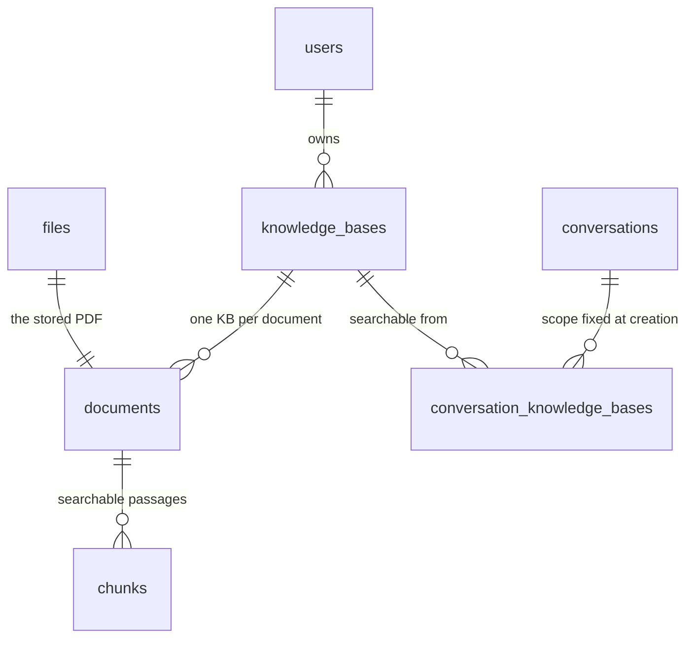

# Database

[← Back to README](../README.md)

**You'll learn:** what pgvector adds to an ordinary Postgres, how the tables are
laid out and why, and how to run migrations and seed data.

PostgreSQL 17 accessed through [Drizzle ORM](https://orm.drizzle.team) with a
`postgres-js` driver. One database holds everything: accounts, uploaded-file
metadata, chat history, and the entire search index. There is no separate vector
database, no search service, and nothing to keep in sync — a point worth
appreciating if you have read RAG tutorials that start by spinning up three
services.

If you know SQL but have never stored a vector, read the next section first. If
you only came for the commands, jump to
[Migration workflow](#migration-workflow).

## What pgvector adds

A retrieval-augmented-generation system searches your documents by _meaning_
rather than by keyword. It does that by turning every passage into an
**embedding** — a long list of numbers a model produces from text, arranged so
that passages meaning similar things get similar lists. Search becomes
arithmetic: embed the question the same way, then find the stored lists closest
to it. [RAG — how it works](rag.md) explains that pipeline end to end.

Postgres cannot do that on its own. **pgvector** is the extension that teaches
it three things:

- **A column type that holds an embedding.** Here it is `halfvec(2048)` — 2048
  numbers, each stored at half precision. The 2048 is not a preference. The
  embedding model this repo uses emits exactly that many numbers, so the column
  and the model must agree exactly or nothing can be inserted.
- **A distance operator, `<=>`.** It measures how far apart two embeddings
  point. `1 - (a <=> b)` is the cosine similarity — a 0-to-1 score where 1 means
  near-identical meaning.
- **An index that makes it fast.** `USING hnsw` builds a navigable graph over
  the embeddings so Postgres can find the nearest rows without comparing the
  question against every row in the table.

That is the whole addition. The dense half of retrieval is then a perfectly
ordinary SQL query — this is the shape of it, simplified from
`src/lib/rag/retrieve.ts`:

```sql
SELECT c.id, 1 - (c.embedding <=> $1::halfvec) AS similarity
FROM chunks c
WHERE c.owner_id = $2
  AND c.knowledge_base_id = ANY($3)
ORDER BY c.embedding <=> $1::halfvec
LIMIT 8;
```

The keyword half of retrieval needs no extension at all: `chunks.content_tsv` is
a generated `tsvector` column with a GIN index, which is Postgres's built-in
full-text search. The real query runs both halves and merges them. The full
explanation of why both are needed is in
[RAG → Hybrid retrieval](rag.md#hybrid-retrieval--dense-and-lexical-fused), and
the `halfvec` choice is in
[RAG → Why `halfvec(2048)`](rag.md#why-halfvec2048-and-not-vector2048).

> **The extension has to be present before the first migration runs.** The `db`
> service image is **`pgvector/pgvector:pg17`**, not stock `postgres`, which does
> not ship it. Migration `0008` runs `CREATE EXTENSION IF NOT EXISTS vector;`
> before it creates the `chunks` table.

## How the schema is organised

Fifteen tables in three groups.

**Accounts and access** — `users`, `accounts`, `sessions`,
`verification_tokens`, `authenticators`, `roles`, `user_roles`. These follow the
Auth.js Drizzle adapter's table conventions deliberately, so an OAuth provider
can be added later without rewriting migrations.

**Storage** — `files` (object metadata; the bytes live in MinIO/S3) and
`push_subscriptions`.

**RAG** — `knowledge_bases`, `documents`, `chunks`, `conversations`, `messages`
and `conversation_knowledge_bases`. These are the ones worth understanding
before you read the diagram, because their shape is driven by how retrieval
queries them.

A **knowledge base** is a named collection of documents owned by one user. A
**document** is one uploaded PDF, and it lives in exactly one knowledge base. A
**chunk** is a short passage of that PDF — a few paragraphs — stored as its own
searchable row with its embedding. A **conversation** is pinned to a set of
knowledge bases when it is created, recorded in
`conversation_knowledge_bases`, and retrieval can never see outside that set.

Here is just that chain. Follow it from `files`: an uploaded PDF becomes a
document, a document becomes many chunks, and chunks are what search actually
reads.



Everything cascades downward: delete a knowledge base and its documents and
chunks go with it, in the database rather than in cleanup code.

### Why chunks repeats owner_id and knowledge_base_id

`chunks.owner_id` and `chunks.knowledge_base_id` are **denormalised columns** —
values copied into a second table on purpose, when a join could have fetched
them. Both already exist on `documents`, and duplicating data is normally the
wrong instinct. Two reasons make it right here.

The first is safety. Every retrieval query filters on both columns in its own
`WHERE` clause. If those values were reached through a join to `documents`, the
filter that keeps one user's chunks away from another's would be one refactor
away from being dropped. Keeping them on the row makes the isolation check
impossible to lose by accident.

The second is speed, and it is the more interesting one — the full argument is
under [Why it's built this way](#why-its-built-this-way).

## Entity-relationship diagram

The whole schema: every table, and the columns that matter. The RAG chain from
the previous section is in here, along with everything that hangs off `users`.


The two columns worth pausing on are `chunks.embedding` and
`chunks.content_tsv`: between them they are the entire search index, and both
sit on the same row as the text a citation displays.

### Schema tables

| Table                          | Purpose                                                                              |
| ------------------------------ | ------------------------------------------------------------------------------------ |
| `users`                        | Accounts with password, email, invites, avatar                                       |
| `accounts`                     | OAuth provider links (GitHub/Google)                                                 |
| `sessions`                     | Database sessions (unused under JWT strategy)                                        |
| `verification_tokens`          | Single-use tokens for password reset & email verification                            |
| `authenticators`               | WebAuthn/passkey credentials                                                         |
| `roles`                        | Roles: admin, member, viewer                                                         |
| `user_roles`                   | Many-to-many users ↔ roles                                                           |
| `files`                        | Uploaded file metadata + S3 storage                                                  |
| `push_subscriptions`           | Web Push subscriptions per device                                                    |
| `knowledge_bases`              | An independent, user-owned collection of documents                                   |
| `documents`                    | A PDF in one knowledge base + its ingestion status                                   |
| `chunks`                       | Indexed passages: `halfvec(2048)` embedding + generated `tsvector` for hybrid search |
| `conversations`                | Chat threads, ordered in Recents by `updated_at`                                     |
| `messages`                     | Turns, with stored citations and generation metrics                                  |
| `conversation_knowledge_bases` | Which knowledge bases a thread may search — fixed at creation                        |

`sessions` is empty in practice. The Auth.js Drizzle adapter requires the table,
but `session.strategy` stays `'jwt'` so that edge route protection in
`src/proxy.ts` can read the session with zero database round-trips.

## Migration workflow

Schema changes are code. You edit one TypeScript file, generate the SQL, read
it, and commit both.

```bash
# 1. edit src/db/schema.ts
pnpm db:generate    # writes a new numbered .sql file into drizzle/
# 2. READ the generated SQL — see the two gotchas below
# 3. commit the schema change and the migration together
pnpm db:migrate     # applies pending migrations
```

Two more commands exist for local work:

```bash
pnpm db:push        # push the schema straight to the DB, no migration file
pnpm db:studio      # visual DB browser
```

`db:push` skips the migration file entirely. It is for throwaway prototyping
only — anything that reaches another machine needs a committed migration.

**Key files:**

- `src/db/schema.ts` — the single source of truth for every table
- `src/db/migrate.ts` — the migration runner (Docker entrypoint)
- `src/db/seed.ts` — the idempotent seed (roles admin/member/viewer + demo admin
  user)
- `drizzle/` — the generated migrations, committed
- `drizzle.config.ts` — points drizzle-kit at the schema and `DATABASE_URL`

### Read the generated SQL before you commit it

drizzle-kit is good but not omniscient, and this repo has two migrations that
had to be corrected by hand. Both are worth knowing about, because you will hit
the same shapes.

**It cannot express the vector index.** `halfvec_cosine_ops` is an operator
class for a custom column type, which drizzle-kit does not model, so the HNSW
index is written directly in migration `0008` and only referenced in a comment
in `schema.ts`:

```sql
CREATE INDEX "chunks_embedding_idx"
  ON "chunks" USING hnsw ("embedding" halfvec_cosine_ops);
```

If you ever regenerate that table from scratch, this line has to be carried
across manually. Lose it and queries still return correct results — they just
sequential-scan every row, with no error to tell you.

**It generates `ADD COLUMN ... NOT NULL` on populated tables.** That statement
fails outright anywhere real data exists. Migration `0012` is the hand-staged
form of the same change: create the new table, add the columns nullable,
backfill them, assert the backfill did what was intended, then apply the
`NOT NULL` constraints and the indexes. Drizzle's migrator wraps each file in a
transaction, so a failed assertion rolls the whole file back rather than leaving
a half-migrated database.

That assertion is the part to copy. The backfill's failure mode was silent — a
wrong grouping key would have "succeeded" while fragmenting every user's
library into singletons — so the migration raises an exception if any owner ends
up spread across multiple knowledge bases, or if any document or chunk is left
without one.

## Seeding

`pnpm db:seed` is idempotent and safe to re-run. It creates the three roles
(`admin`, `member`, `viewer`) if they are missing, creates a demo user, and
gives that user the `admin` role.

| Credential | Value              |
| ---------- | ------------------ |
| Email      | `demo@example.com` |
| Password   | `Password123`      |

The script is development-only — it hard-codes a known password. Never run it
against production.

## Database commands

| Command             | Description                                          |
| ------------------- | ---------------------------------------------------- |
| `pnpm docker:db`    | Start local Postgres                                 |
| `pnpm docker:minio` | Start local MinIO with bucket                        |
| `pnpm db:migrate`   | Apply migrations                                     |
| `pnpm db:seed`      | Seed demo user (`demo@example.com` / `Password123` ) |

The full quick-start sequence, and the environment variables these commands
read, are in [Usage → Environment variables](usage.md#environment-variables).

## Why it's built this way

Design decisions that are not obvious from the diagram. You can use the database
without reading any of this.

### Denormalised columns on the retrieval hot path

Beyond the safety argument [above](#why-chunks-repeats-owner_id-and-knowledge_base_id),
there is a performance reason that is specific to vector search.

Both retrieval channels query `chunks` **directly**. The dense one orders by
`embedding <=> $q` under the HNSW index, where the filter is applied _after_ the
approximate-nearest-neighbour scan. The lexical one runs a GIN bitmap scan.
Reaching a chunk's knowledge base through a join to `documents` would put a
per-candidate lookup on that hot path and, as data grows, invite the planner to
abandon the index path altogether. Correct results, silently degrading, no
error — the same failure shape as putting an embedding in a `vector` column too
wide to index.

That is also why a document lives in exactly one knowledge base. Many-to-many
would make a chunk's knowledge-base membership non-scalar, forcing either that
join or a duplicated 2048-dimension embedding per membership. `moveDocument`
re-tags both tables in one transaction instead, so refiling a document costs a
`WHERE` clause rather than hundreds of rate-limited embedding calls.

`messages.owner_id` is denormalised from `conversations` for the first reason
only: every read filters on it.

### A join table, not a jsonb array

`conversation_knowledge_bases` could have been a `jsonb` array of ids on
`conversations`. The array reads more simply and gives no referential
integrity — deleting a knowledge base would leave a dangling id in every
conversation that ever selected it, to be cleaned up by app-level sweep code.
The join table cascades instead. It is read once per chat page load, never
inside a retrieval query, so the extra table costs nothing where it matters.

Selection is fixed when the conversation is created, so every message in a
thread has one auditable scope.

### Knowledge-base names are not unique per owner

Deliberately. A "Taxes" per year is legitimate, and a rename colliding would be
a loud failure for a cosmetic problem. The switcher shows counts and dates to
disambiguate.

### content_tsv is generated, not written

The lexical index column is `GENERATED ALWAYS AS (to_tsvector('english',
content)) STORED`. Nothing in application code writes to it, so it can never
drift out of sync with the text it indexes.

### Citations and metrics are stored, not recomputed

`messages.citations` records the sources as they were resolved at answer time,
and `messages.metrics` records the tokens, tokens-per-second, latency and model.
Both are `jsonb` on the message. Reopening an old conversation therefore shows
the sources the answer was actually built from, even if the document has since
been deleted or re-ingested into different chunks.

### Indexes follow the queries that exist

`chunks_owner_kb_idx` leads with `owner_id`, so owner-only queries still use it
and owner-plus-knowledge-base queries get the composite for free.
`conversations_owner_updated_idx` is exactly how the Recents list is read: this
owner, newest activity first. `conversation_kb_kb_id_idx` exists because the
join table's primary key leads with `conversation_id`, so "which conversations
use this knowledge base" would otherwise have no index.

### One pooled client, guarded against hot reload

`src/db/index.ts` creates a single `postgres-js` pool per process — `max: 10` in
production, `5` otherwise. In development Next.js clears the module cache on
every hot reload, which would open a new pool on every save and exhaust
connections, so the client is stashed on `globalThis`. The module is guarded by
`server-only`, so importing it into a client component is a build error rather
than a runtime leak.

## What else lives in these tables

Short pointers to the features these tables back, each documented in full
elsewhere.

**Role-based access control.** Roles are carried as a `roles: string[]` claim on
the JWT, so no database round-trip is needed to read them. Edge gating happens
in `src/proxy.ts`; server-side guards are in `src/lib/auth/rbac.ts`. See
[Features → Access control (RBAC)](features.md#access-control-rbac).

**File storage.** MinIO (S3-compatible) holds the objects; the `files` table
holds the metadata. Downloads are ownership-checked, and profile photos are
supported via `users.avatar_file_id`. See
[Features → File uploads](features.md#file-uploads).

**Security.** Passwords are stored with Argon2id. Email uniqueness is enforced
case-insensitively — a unique index on `lower(email)` backs up the app's own
lowercasing. Verification tokens are stored as SHA-256 hashes, never raw. The
invite flow is passwordless, keyed on `users.invite_token_hash`. See
[Architecture → Security model](architecture.md#security-model).

## Production setup

See [deployment.md](deployment.md) for production Docker configuration, and
[Backups](backups.md) for how the database volume is dumped and retained.

---

**Next:** [Architecture](architecture.md) — how the app is wired together
around this schema: the edge/node auth split, request flow, and the container
topology.
