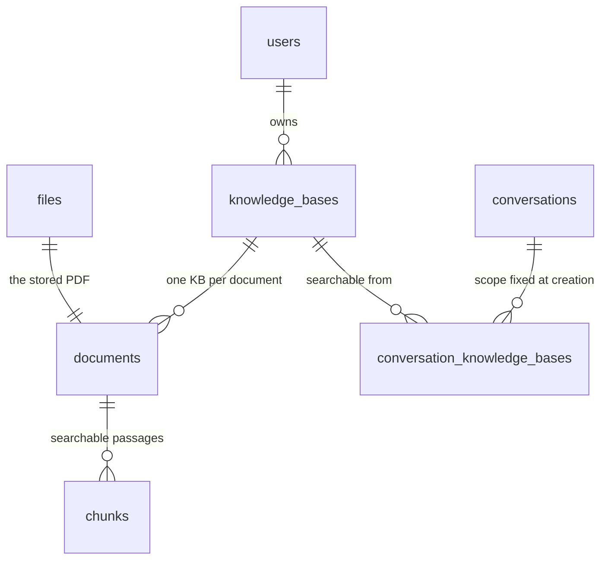
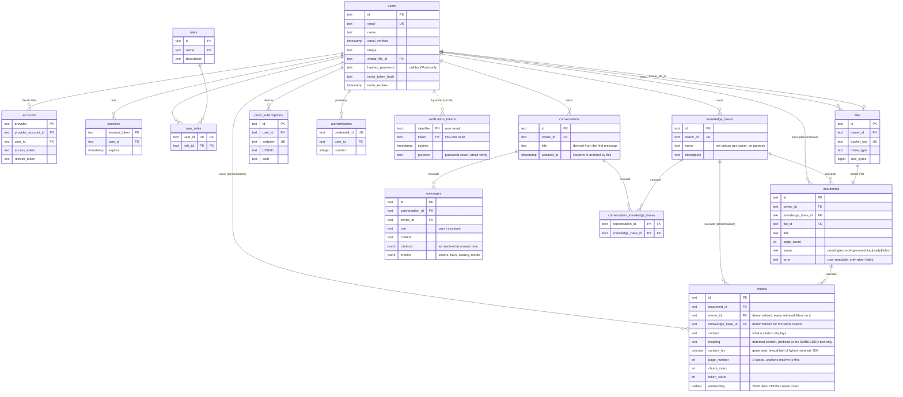

# Database

**You'll learn:** what pgvector adds to an ordinary Postgres, how the tables are
laid out and why, and how to run migrations and seed data.

The app uses PostgreSQL 17 through [Drizzle ORM](https://orm.drizzle.team) with
a `postgres-js` driver. One database holds accounts, uploaded-file metadata,
chat history and the entire search index. There is no separate vector database
or search service, and nothing has to be kept in sync. Many RAG tutorials start
by spinning up three services; this one needs none of that.

If you know SQL but have never stored a vector, read the next section first. If
you only came for the commands, jump to
[Migration workflow](#migration-workflow).

## What pgvector adds

A retrieval-augmented-generation system searches your documents by _meaning_
instead of by keyword. It turns every passage into an **embedding**: a long
list of numbers a model produces from text, arranged so that passages with
similar meanings get similar lists. Search then becomes arithmetic. You embed
the question the same way and find the stored lists closest to it.
[RAG — how it works](rag.md) explains that pipeline end to end.

Postgres cannot do this on its own. **pgvector** is the extension that adds the
missing pieces:

- A column type that holds an embedding: `halfvec`, numbers stored at half
  precision. `chunk_embeddings.embedding` is untyped, so models of any size fit
  (2048 for the default model), and each model's vectors are indexed at their
  own size.
- A distance operator, `<=>`, which measures how far apart two embeddings
  point. `1 - (a <=> b)` is the cosine similarity, a 0-to-1 score where 1 means
  near-identical meaning.
- An index that makes search fast. `USING hnsw` builds a navigable graph over
  the embeddings so Postgres can find the nearest rows without comparing the
  question against every row in the table.
- A setting that keeps filtered search accurate. HNSW applies the
  `owner_id` / `knowledge_base_id` filter _after_ its scan, so when the planner
  uses the index, a tenant with a small share of all chunks can lose most of its
  true matches. Migration `0017` sets `hnsw.iterative_scan = relaxed_order` on
  the database, which keeps scanning until enough rows pass the filter. In
  measurements, top-20 recall for a 0.1%-share tenant went from 0.055 to 0.950
  on the HNSW path (spec 0033, 1e). At today's sizes the planner uses an exact
  owner-index scan for tenant queries anyway, so the setting is insurance for
  larger corpora.

With those in place, the dense half of retrieval is an ordinary SQL query. This
is its shape, simplified from `src/lib/rag/retrieve.ts`:

```sql
SELECT e.chunk_id, 1 - (e.embedding::halfvec(2048) <=> $1::halfvec(2048)) AS similarity
FROM chunk_embeddings e
WHERE e.generation_id = 'initial'
  AND e.owner_id = $2
  AND e.knowledge_base_id = ANY($3)
ORDER BY e.embedding::halfvec(2048) <=> $1::halfvec(2048)
LIMIT 8;
```

The keyword half of retrieval needs no extension. `chunks.content_tsv` is a
generated `tsvector` column with a GIN index, which is Postgres's built-in
full-text search. The real query runs both halves and merges the results.
[RAG → Hybrid retrieval](rag.md#hybrid-retrieval--dense-and-lexical-fused)
explains why both are needed, and
[RAG → Why `halfvec(2048)`](rag.md#why-halfvec2048-and-not-vector2048) covers
the `halfvec` choice.

> **The extension has to be present before the first migration runs.** The `db`
> service image is `pgvector/pgvector:pg17`. Stock `postgres` does not ship the
> extension. Migration `0008` runs `CREATE EXTENSION IF NOT EXISTS vector;`
> before it creates the `chunks` table.

## How the schema is organised

The twenty tables fall into five groups.

Accounts and access use `users`, `accounts`, `sessions`, `verification_tokens`,
`authenticators`, `roles` and `user_roles`. These deliberately follow the
Auth.js Drizzle adapter's table conventions, so an OAuth provider can be added
later without rewriting migrations.

Storage uses `files` (object metadata; the bytes live in MinIO/S3) and
`push_subscriptions`.

RAG uses `knowledge_bases`, `documents`, `chunks`, `conversations`, `messages`
and `conversation_knowledge_bases`. Retrieval queries drive the shape of these
tables, so they are worth understanding before you read the diagram.

Settings uses `ai_settings`, `ai_connections` and `ai_settings_audit`. `ai_settings` holds AI
settings saved from Settings, one row per environment variable name, with the
string you would put in `.env`: a row overrides the variable, and no row means
the environment applies. It also records which connection each job uses
(`connection:chat` and so on). `ai_connections` holds the endpoints added in
Settings → AI provider, with the API key encrypted (AES-256-GCM) and its last
four characters for display. `ai_settings_audit` records every change made
from Settings: who, when, the setting or connection, and old → new. An API key
appears there only as its last four characters.

Observability uses `app_logs`, `rag_runs` and `rag_spans` (spec 0042).
`app_logs` holds every log line, with its level, category, request id and
details (secrets removed), kept for `LOG_RETENTION_DAYS`. `rag_runs` holds one
row per question answered or document ingested, keyed by the request id, and
`rag_spans` its timed steps; both are kept for `TELEMETRY_RETENTION_DAYS`.

A knowledge base is a named collection of documents owned by one user. A
document is one uploaded PDF, and it lives in exactly one knowledge base. A
chunk is a short passage of that PDF, a few paragraphs long, stored as its own
searchable row. Its embedding is in `chunk_embeddings`, one row per embedding
generation: `embedding_generations` records each model's set of vectors, and
exactly one is active (see
[RAG → Switching the embedding model](rag.md#switching-the-embedding-model)).
A conversation is pinned to a set of
knowledge bases when it is created. That set is recorded in
`conversation_knowledge_bases`, and retrieval can never see outside it.

The diagram below shows just that chain. Start from `files`: an uploaded PDF
becomes a document, a document becomes many chunks, and search reads the
chunks.



Deletes cascade downward. If you delete a knowledge base, its documents and
chunks go with it, and the database handles this instead of cleanup code.

### Why chunks repeats owner_id and knowledge_base_id

`chunks.owner_id` and `chunks.knowledge_base_id` are **denormalised columns**:
values copied into a second table on purpose, when a join could have fetched
them. Both already exist on `documents`, and duplicating data is normally the
wrong instinct. Here there are two reasons to do it.

The first is safety. Every retrieval query filters on both columns in its own
`WHERE` clause. If those values came through a join to `documents`, a single
refactor could drop the filter that keeps one user's chunks away from
another's. With the values on the row, the isolation check cannot be lost by
accident.

The second is speed. That argument is longer, and it is under
[Why it's built this way](#why-its-built-this-way).

## Entity-relationship diagram

This is the whole schema, with every table and the columns that matter. It
includes the RAG chain from the previous section and everything that hangs off
`users`.



Two columns deserve a closer look: `chunks.embedding` and
`chunks.content_tsv`. Together they are the entire search index, and both sit
on the same row as the text a citation displays.

### Schema tables

| Table                          | Purpose                                                                              |
| ------------------------------ | ------------------------------------------------------------------------------------ |
| `users`                        | Accounts with password, email, invites, avatar                                       |
| `accounts`                     | OAuth provider links (GitHub/Google)                                                 |
| `sessions`                     | Database sessions (unused under JWT strategy)                                        |
| `verification_tokens`          | Single-use tokens for password reset & email verification                            |
| `authenticators`               | WebAuthn/passkey credentials                                                         |
| `roles`                        | Roles: admin, member, viewer                                                         |
| `user_roles`                   | Many-to-many users ↔ roles                                                           |
| `files`                        | Uploaded file metadata + S3 storage                                                  |
| `push_subscriptions`           | Web Push subscriptions per device                                                    |
| `knowledge_bases`              | An independent, user-owned collection of documents                                   |
| `documents`                    | A PDF in one knowledge base + its ingestion status                                   |
| `chunks`                       | Indexed passages: `halfvec(2048)` embedding + generated `tsvector` for hybrid search |
| `conversations`                | Chat threads, ordered in Recents by `updated_at`                                     |
| `messages`                     | Turns, with stored citations, generation metrics and the request id of each answer   |
| `conversation_knowledge_bases` | Which knowledge bases a thread may search, fixed at creation                         |
| `ai_settings`                  | AI settings saved from Settings, overriding the matching `RAG_*` env var             |
| `ai_connections`               | Inference endpoints added in Settings; API key encrypted at rest                     |
| `app_logs`                     | Log lines for Observability → Logs, pruned after `LOG_RETENTION_DAYS`                |
| `rag_runs`                     | One row per question or ingestion: outcome, timings, tokens, best match              |
| `rag_spans`                    | The timed steps of a run (search, plan, draft…), with model, tokens and details      |

`sessions` is empty in practice. The Auth.js Drizzle adapter requires the table,
but `session.strategy` stays `'jwt'` so that edge route protection in
`src/proxy.ts` can read the session with zero database round-trips.

## Migration workflow

Schema changes are code. You edit one TypeScript file, generate the SQL, read
it, and commit both.

```bash
# 1. edit src/db/schema.ts
pnpm db:generate    # writes a new numbered .sql file into drizzle/
# 2. READ the generated SQL — see the two gotchas below
# 3. commit the schema change and the migration together
pnpm db:migrate     # applies pending migrations
```

Two more commands exist for local work:

```bash
pnpm db:push        # push the schema straight to the DB, no migration file
pnpm db:studio      # visual DB browser
```

`db:push` skips the migration file entirely. Use it only for throwaway
prototyping. Anything that reaches another machine needs a committed migration.

The files involved:

- `src/db/schema.ts` is the single source of truth for every table.
- `src/db/migrate.ts` is the migration runner (Docker entrypoint).
- `src/db/seed.ts` is the idempotent seed (roles admin/member/viewer and a demo
  admin user).
- `drizzle/` holds the generated migrations, which are committed.
- `drizzle.config.ts` points drizzle-kit at the schema and `DATABASE_URL`.

### Read the generated SQL before you commit it

drizzle-kit is good but it has limits, and two migrations in this repo had to
be corrected by hand. You will likely hit the same two cases.

First, it cannot express the vector index. `halfvec_cosine_ops` is an operator
class for a custom column type, which drizzle-kit does not model, so the HNSW
index is written directly in migration `0008` and only referenced in a comment
in `schema.ts`:

```sql
CREATE INDEX "chunks_embedding_idx"
  ON "chunks" USING hnsw ("embedding" halfvec_cosine_ops);
```

If you ever regenerate that table from scratch, you have to carry this line
across manually. Without it, queries still return correct results, but they
sequential-scan every row and no error tells you so.

Second, it generates `ADD COLUMN ... NOT NULL` on populated tables. That
statement fails outright anywhere real data exists. Migration `0012` is the
hand-staged form of the same change. It creates the new table, adds the columns
as nullable, backfills them, asserts that the backfill did what was intended,
and then applies the `NOT NULL` constraints and the indexes. Drizzle's migrator
wraps each file in a transaction, so a failed assertion rolls the whole file
back and the database is never left half-migrated.

Copy the assertion. The backfill could have failed silently: a wrong grouping
key would have "succeeded" while fragmenting every user's library into
singletons. So the migration raises an exception if any owner ends up spread
across multiple knowledge bases, or if any document or chunk is left without
one.

## Seeding

`pnpm db:seed` is idempotent and safe to re-run. It creates the three roles
(`admin`, `member`, `viewer`) if they are missing, creates a demo user, and
gives that user the `admin` role.

| Credential | Value              |
| ---------- | ------------------ |
| Email      | `demo@example.com` |
| Password   | `Password123`      |

The script hard-codes a known password, so it is for development only. Never
run it against production.

## Database commands

| Command             | Description                                          |
| ------------------- | ---------------------------------------------------- |
| `pnpm docker:db`    | Start local Postgres                                 |
| `pnpm docker:minio` | Start local MinIO with bucket                        |
| `pnpm db:migrate`   | Apply migrations                                     |
| `pnpm db:seed`      | Seed demo user (`demo@example.com` / `Password123` ) |

[Usage → Environment variables](usage.md#environment-variables) has the full
quick-start sequence and the environment variables these commands read.

## Why it's built this way

These are design decisions that the diagram does not make obvious. You can use
the database without reading any of this.

### Denormalised columns on the retrieval hot path

Besides the safety argument [above](#why-chunks-repeats-owner_id-and-knowledge_base_id),
there is a performance reason specific to vector search.

Both retrieval channels query `chunks` directly. The dense one orders by
`embedding <=> $q` under the HNSW index, where the filter is applied _after_ the
approximate-nearest-neighbour scan. The lexical one runs a GIN bitmap scan.
Reaching a chunk's knowledge base through a join to `documents` would put a
per-candidate lookup on that hot path. As data grows, it would also invite the
planner to abandon the index path altogether. The results would stay correct
while performance degraded with no error, which is the same failure shape as
putting an embedding in a `vector` column too wide to index.

This is also why a document lives in exactly one knowledge base. With
many-to-many, a chunk's knowledge-base membership would no longer be a single
value, which would force either that join or a duplicated 2048-dimension
embedding per membership. Instead, `moveDocument` re-tags both tables in one
transaction, so refiling a document costs a `WHERE` clause instead of hundreds
of rate-limited embedding calls.

`messages.owner_id` is denormalised from `conversations` for the first reason
only: every read filters on it.

### A join table, not a jsonb array

`conversation_knowledge_bases` could have been a `jsonb` array of ids on
`conversations`. An array reads more simply but gives no referential
integrity. Deleting a knowledge base would leave a dangling id in every
conversation that ever selected it, and app-level sweep code would have to
clean those up. The join table cascades. It is read once per chat page load and
never inside a retrieval query, so the extra table costs nothing where it
matters.

Selection is fixed when the conversation is created, so every message in a
thread has one auditable scope.

### Knowledge-base names are not unique per owner

This is deliberate. A "Taxes" knowledge base per year is legitimate, and a
rename that collided would cause a loud failure over a cosmetic problem. The
switcher shows counts and dates to tell same-named ones apart.

### content_tsv is generated, not written

The lexical index column is `GENERATED ALWAYS AS (to_tsvector('english',
content)) STORED`. Nothing in application code writes to it, so it can never
drift out of sync with the text it indexes.

### Citations and metrics are stored, not recomputed

`messages.citations` records the sources as they were resolved at answer time,
and `messages.metrics` records the tokens, tokens-per-second, latency and model.
Both are `jsonb` on the message. When you reopen an old conversation, it shows
the sources the answer was actually built from, even if the document has since
been deleted or re-ingested into different chunks.

A citation carries `parent: true` when its source was an assembled section
(spec 0033, 1c). Its `chunkId` is the first chunk of the section run, and the
citation panel asks `/api/citations/[chunkId]?parent=1` for the boxes of the
whole run. It is an optional key in `jsonb`, so it needed no migration, and
every message written before it keeps single-chunk behaviour.

### Indexes follow the queries that exist

`chunks_owner_kb_idx` leads with `owner_id`, so owner-only queries still use it
and owner-plus-knowledge-base queries get the composite for free.
`conversations_owner_updated_idx` matches how the Recents list is read: this
owner, newest activity first. `conversation_kb_kb_id_idx` exists because the
join table's primary key leads with `conversation_id`, so a query for the
conversations that use a given knowledge base would otherwise have no index.

### One pooled client, guarded against hot reload

`src/db/index.ts` creates a single `postgres-js` pool per process, with `max: 10`
in production and `5` otherwise. In development, Next.js clears the module cache
on every hot reload, which would open a new pool on every save and exhaust
connections, so the client is stashed on `globalThis`. The module is guarded by
`server-only`, so importing it into a client component causes a build error
instead of a runtime leak.

## What else lives in these tables

These tables also back the following features, each documented in full
elsewhere.

Role-based access control carries roles as a `roles: string[]` claim on the
JWT, so reading them needs no database round-trip. Edge gating happens in
`src/proxy.ts`, and server-side guards are in `src/lib/auth/rbac.ts`. See
[Features → Access control (RBAC)](features.md#access-control-rbac).

For file storage, MinIO (S3-compatible) holds the objects and the `files` table
holds the metadata. Downloads are ownership-checked, and profile photos are
supported through `users.avatar_file_id`. See
[Features → File uploads](features.md#file-uploads).

On the security side, passwords are stored with Argon2id. Email uniqueness is
enforced case-insensitively: a unique index on `lower(email)` backs up the
app's own lowercasing. Verification tokens are stored as SHA-256 hashes, never
raw. The invite flow is passwordless and keyed on `users.invite_token_hash`.
See [Architecture → Security model](architecture.md#security-model).

## Production setup

See [deployment.md](deployment.md) for production Docker configuration, and
[Backups](backups.md) for how the database volume is dumped and retained.

---

**Next:** [Architecture](architecture.md) covers how the app is wired together
around this schema: the edge/node auth split, request flow, and the container
topology.
