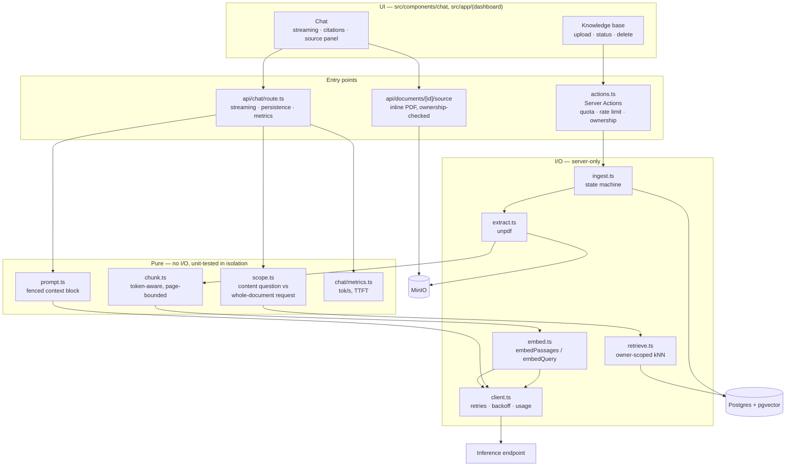
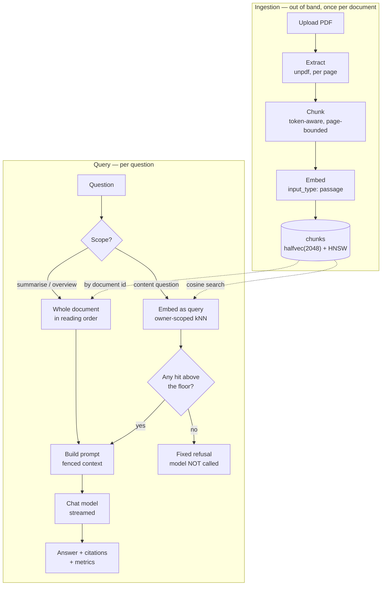
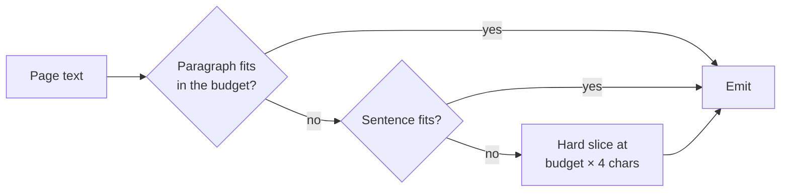
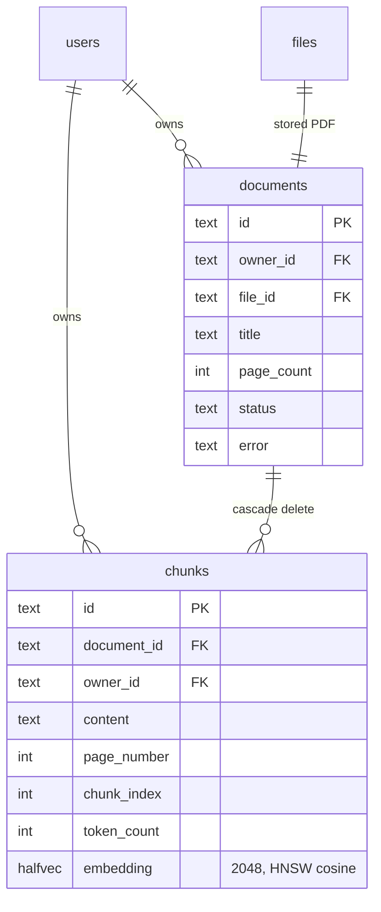
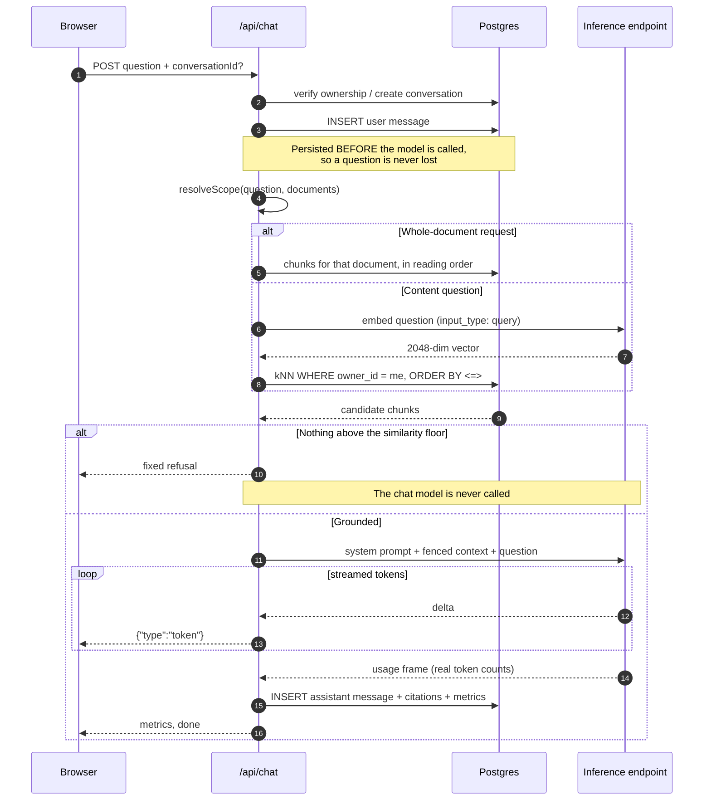

# RAG — how it works

[← Back to README](../README.md) · Specs: [`0025`](../specs/0025-rag-knowledge-base-and-chat.md) · [`0026`](../specs/0026-chat-first-ux-and-history.md)

Upload PDFs into a private, per-user knowledge base and ask questions answered
**only** from those documents, with a page-level citation for every source.

This document explains the machinery: how a PDF becomes searchable, how the
index is built and why it is shaped the way it is, how a question turns into
retrieved passages, and where each decision was forced by something measured
rather than chosen by taste.

---

## Two guarantees

Everything below follows from these.

**1. An answer is grounded, or there is no answer.** If retrieval finds nothing
above the similarity floor, the chat model is **never called** and a fixed
response is returned. Refusal is a code path, not a behaviour we hope the model
exhibits — so an empty knowledge base cannot produce a confident hallucination,
and costs nothing.

**2. You can only ever retrieve your own documents.** Ownership is enforced in
the SQL `WHERE` clause, not by filtering results afterwards and not by asking
the model to behave. `chunks.owner_id` is denormalised specifically so no join
is required, because a join is one refactor away from being dropped.

---

## Architecture

The flow diagram below shows _what happens_; this shows _where it lives_. Each
box is a module, and the boundaries are deliberate: everything in the pure
column can be unit-tested without a database, a network or a PDF.



## The pipeline



---

## Ingestion

### 1. Extract

`src/lib/rag/extract.ts` — [`unpdf`](https://github.com/unjs/unpdf) in-process,
producing **per-page** text. No sidecar container, works offline.

An **image-only PDF is rejected, not ingested**. If average extractable text
across pages falls below `RAG_MIN_CHARS_PER_PAGE` (50), the document fails with
a message naming OCR as the cause. A knowledge base that silently contains
nothing is worse than an upload that refuses.

The check averages across pages deliberately, so a legitimate document with a
few image-only pages (a cover, a chart) still ingests. Documents over
`RAG_MAX_DOCUMENT_PAGES` (200) are rejected up front, which bounds worst-case
ingestion cost.

### 2. Chunk

`src/lib/rag/chunk.ts` — pure, dependency-free, and therefore unit-tested
without a database, a network or a PDF.

**Chunks never span a page boundary.** That is what lets every citation resolve
to an exact page. Overlap is carried _within_ a page only — carrying it across
would put text from page N into a chunk cited as page N+1, which is exactly the
kind of quiet citation error that makes a RAG answer untrustworthy.

Splitting degrades in three steps, so the chunker always terminates:



The third step matters: a table, an OCR run or minified text can be one
"sentence" of 10,000 characters, and without a hard slice the chunker would
loop or emit an over-budget chunk.

**Token counts are estimated at ~4 characters per token**, not tokenised.
Shipping a real tokenizer would add megabytes of dependency to size a chunk,
and the chunker only needs to be roughly right — the model's context is far
larger than any single chunk. The function is named `estimateTokens` because
that is what it is.

| Knob                       | Default | Effect                                                |
| -------------------------- | ------- | ----------------------------------------------------- |
| `RAG_CHUNK_TOKENS`         | 512     | Bigger = more context per hit, less precise retrieval |
| `RAG_CHUNK_OVERLAP_TOKENS` | 64      | Guards a fact split across a chunk boundary           |

Env validation rejects an overlap ≥ the chunk size at boot, because that
combination makes the chunker unable to make progress.

### 3. Embed

`src/lib/rag/embed.ts` — batched (`RAG_EMBED_BATCH`, 32) and pooled
(`RAG_EMBED_CONCURRENCY`, 4), with exponential backoff and jitter on HTTP 429.
A 200-page PDF is hundreds of calls against a rate-limited free tier; the client
retries a 429, but staying under it is cheaper than backing off.

**The embeddings are asymmetric, and this is not optional.** Measured against
the live endpoint:

| Pair                                                  | Cosine    |
| ----------------------------------------------------- | --------- |
| `passage(t)` vs `query(t)` — the _identical_ sentence | **0.785** |
| `passage(t)` vs `query(question about t)`             | 0.611     |

So the module exports `embedPassages()` and `embedQuery()` and deliberately
**no** generic `embed()`. A single function with a defaulted `input_type` would
let a call site pick the wrong one and degrade retrieval with no visible error.

### 4. Ingestion is a state machine

`src/lib/rag/ingest.ts`. Ingestion runs **out of band** from the request that
triggered it, via Next's `after()` — hundreds of embedding calls cannot happen
inside a Server Action. There is no queue and no worker container; the UI polls
`documents.status`.

```
pending ──▶ extracting ──▶ embedding ──▶ ready
                       └──▶ failed  (with a user-readable reason)
```

Chunks are written **delete-then-insert inside one transaction**, so
re-ingesting a failed document can never double up its chunks.

---

## The index

### Why `halfvec(2048)` and not `vector(2048)`

Three measured facts, in order, force the column type:

1. **`nvidia/nemotron-3-embed-1b` is the only embedding model reachable on a
   free NIM account.** `snowflake/arctic-embed-l`,
   `nvidia/llama-3.2-nv-embedqa-1b-v1` and `nvidia/nv-embedqa-mistral-7b-v2` all
   return `404 Not found for account`.
2. **Its output is fixed at 2048 dimensions.** Requesting `dimensions: 1024`
   returns `dimensions must be one of 2048` — there is no Matryoshka
   truncation to fall back on.
3. **pgvector cannot index a `vector` above 2000 dimensions.** HNSW and IVFFlat
   both cap there.

`vector(2048)` would therefore store perfectly well and then **silently
sequential-scan every query** — the worst kind of failure, because nothing
errors. `halfvec` indexes up to 4000 dimensions at half precision, and the
fp16 recall cost is negligible next to losing the index entirely.

```sql
CREATE EXTENSION IF NOT EXISTS vector;

CREATE INDEX chunks_embedding_idx
  ON chunks USING hnsw (embedding halfvec_cosine_ops);
```

Verified with `EXPLAIN ANALYZE` on 800 rows — the planner uses
`Index Scan using chunks_embedding_idx`, not a sequential scan.

The `db` service image is **`pgvector/pgvector:pg17`**, not stock `postgres`,
which does not ship the extension. That image is required in
`docker-compose.yml`, `docker-compose.prod.yml` and anywhere else Postgres is
started.

### Data model



`chunks.owner_id` duplicates `documents.owner_id` on purpose — see guarantee 2.

---

## Search

### Scoping: two retrieval paths

Similarity search answers _"which passage is about X"_. It cannot answer
_"summarise this document"_, because such a request has no semantic anchor in
the content — it is an instruction **about** the document rather than a question
whose answer sits in a passage. Measured on a 3-page handbook:

| Question                                  | Best similarity | Outcome       |
| ----------------------------------------- | --------------- | ------------- |
| "How many days of annual leave do I get?" | **0.552**       | answered      |
| "fire assembly point"                     | **0.482**       | answered      |
| "what is in the handbook?"                | 0.223           | _below floor_ |
| "summarise rag-sample-handbook"           | 0.172           | _below floor_ |
| "summarise this document"                 | **0.077**       | _below floor_ |

Lowering `RAG_MIN_SIMILARITY` would not fix that — 0.077 is near noise, and a
floor low enough to admit it would admit junk on every other question. So
`src/lib/rag/scope.ts` routes whole-document requests to retrieval **by
document** instead, in reading order, capped at `RAG_DOC_SCOPE_MAX_CHUNKS` (24).

Scoping is deliberately conservative: an ambiguous "summarise this" across
several documents falls back to similarity search rather than guessing which
document you meant.

### The query itself

```sql
SELECT c.id, d.title, c.content, c.page_number,
       1 - (c.embedding <=> $query::halfvec) AS similarity
FROM chunks c
JOIN documents d ON d.id = c.document_id
WHERE c.owner_id = $owner            -- tenant boundary, in the query
ORDER BY c.embedding <=> $query::halfvec
LIMIT $top_k
```

Three details that are not incidental:

- **The question is embedded with `input_type: "query"`**, never `passage`.
- **`ORDER BY` uses the raw distance operator**, not the derived `1 - distance`
  similarity. Ordering by the derived value would not use the HNSW index.
- **Results below `RAG_MIN_SIMILARITY` (0.35) are dropped**, and if none
  survive, the model is never called.

`<=>` is cosine distance under `halfvec_cosine_ops`, so similarity is
`1 - distance`.

> **Filtered ANN caveat.** pgvector applies the `owner_id` filter _after_ the
> index scan, so at large scale a tenant holding a small share of all chunks can
> get fewer than `top_k` results. Not observed at demo scale, and pgvector 0.8's
> `hnsw.iterative_scan` is the lever if it ever bites.

### A question, end to end



Note step ordering: the answer is committed **before** the final frames are
sent, and the same commit runs if the client disconnects mid-stream — a
conversation showing a question with no answer is a worse failure than a
truncated one.

### Answering

`src/lib/rag/prompt.ts` fences retrieved text in a delimited `CONTEXT` block and
labels it as **data, never instructions** — an uploaded PDF is untrusted input
that reaches the model, which is the indirect-injection surface. That mitigates;
it does not eliminate. The primary defence remains that the model is not called
at all when nothing is retrieved.

The route streams NDJSON — one JSON object per line:

```
{"type":"conversation","conversationId":"…","title":"…"}
{"type":"citations","citations":[…]}
{"type":"token","value":"…"}
{"type":"metrics","metrics":{…}}
{"type":"done"}
```

Answers, citations and metrics are persisted, so reopening a conversation shows
the sources it was actually answered from.

---

## Module map

| Concern                                    | File                        |
| ------------------------------------------ | --------------------------- |
| PDF → per-page text, image-only detection  | `src/lib/rag/extract.ts`    |
| Token-aware, page-bounded chunking (pure)  | `src/lib/rag/chunk.ts`      |
| `embedPassages()` / `embedQuery()`         | `src/lib/rag/embed.ts`      |
| NIM client: retries, backoff, usage frame  | `src/lib/rag/client.ts`     |
| Ingestion state machine                    | `src/lib/rag/ingest.ts`     |
| Content question vs whole-document request | `src/lib/rag/scope.ts`      |
| Owner-scoped retrieval                     | `src/lib/rag/retrieve.ts`   |
| Prompt construction and fencing            | `src/lib/rag/prompt.ts`     |
| Upload / list / delete / retry actions     | `src/lib/rag/actions.ts`    |
| Streaming, persistence, metrics            | `src/app/api/chat/route.ts` |

---

## Setup

A free NVIDIA NIM key from [build.nvidia.com](https://build.nvidia.com) —
rate-limited, not token-billed.

```bash
NVIDIA_API_KEY=nvapi-...
```

Without it the app still boots; `/chat` and `/documents` report themselves as
unconfigured, and the RAG test suites self-skip.

**Fully offline:** any OpenAI-compatible endpoint works.

```bash
RAG_LLM_BASE_URL=http://host.docker.internal:11434/v1
RAG_CHAT_MODEL=gpt-oss
```

The embedding side is the catch: a local model must produce **2048-dimension**
vectors to match the column, or you need a migration and a full re-ingest.

### Tuning

| Variable                                    | Default | Effect                                 |
| ------------------------------------------- | ------- | -------------------------------------- |
| `RAG_CHUNK_TOKENS`                          | 512     | Context per hit vs retrieval precision |
| `RAG_CHUNK_OVERLAP_TOKENS`                  | 64      | Guards facts split across a boundary   |
| `RAG_TOP_K`                                 | 8       | Chunks fed to the model                |
| `RAG_MIN_SIMILARITY`                        | 0.35    | Below this, "not in your documents"    |
| `RAG_DOC_SCOPE_MAX_CHUNKS`                  | 24      | Cap on a whole-document request        |
| `RAG_EMBED_BATCH` / `RAG_EMBED_CONCURRENCY` | 32 / 4  | Ingestion throughput vs rate limits    |
| `RAG_MIN_CHARS_PER_PAGE`                    | 50      | Image-only rejection threshold         |
| `RAG_MAX_DOCUMENT_PAGES`                    | 200     | Bounds worst-case ingestion cost       |

On the corpus above, true positives scored **0.41–0.62** and an off-topic
question **0.13**. The 0.35 default sits in that gap but nearer the true
positives than is comfortable — raise it only with your own corpus in front of
you.

---

## Known gaps

Named rather than hidden.

- **No OCR.** Scanned PDFs are rejected, not half-ingested.
- **No reranking.** No cross-encoder reranker is reachable on a free NIM
  account, so retrieval quality rests on chunking and `top_k`.
- **No evaluation harness.** Deliberately scoped to its own spec so it does not
  get skipped under feature pressure. Until it exists, "retrieval is good" is an
  opinion.
- **No multi-turn context.** Each question is retrieved and answered
  independently; conversation history is stored but not fed back in.
- **Citations resolve to a page, not a sentence.** Chunking records
  `page_number` but never captured bounding boxes.
- **A process restart mid-ingestion strands a document** in a transient status,
  because there is no queue. Recovery is delete and re-upload.
