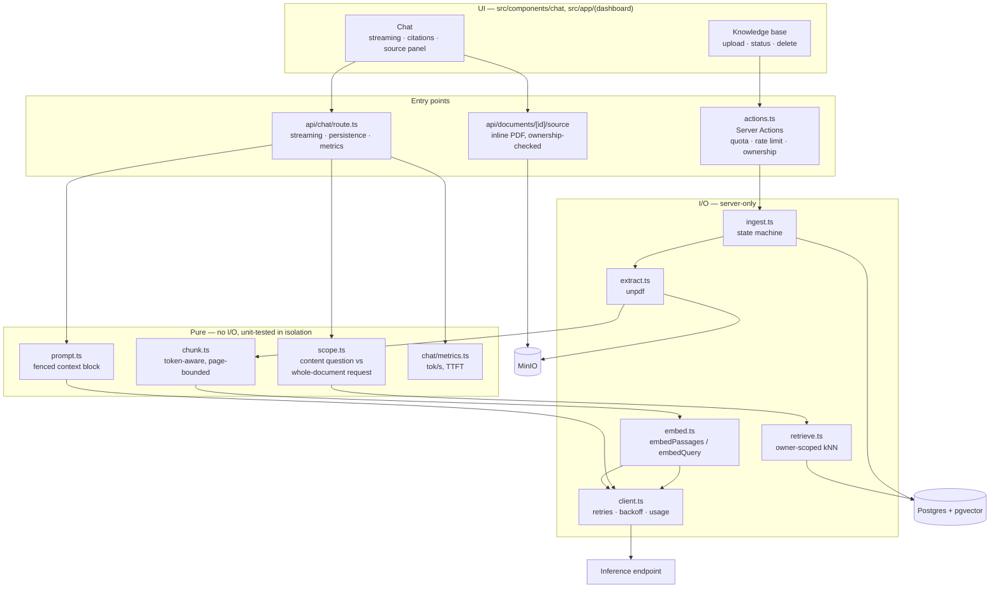
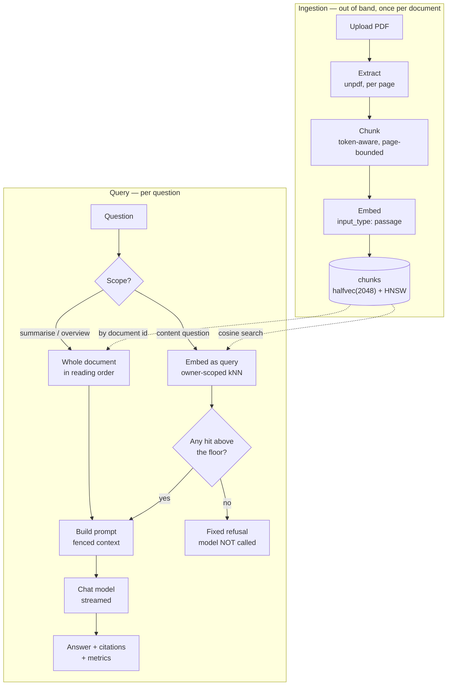
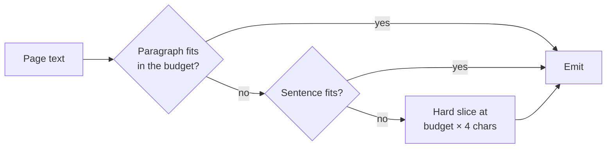
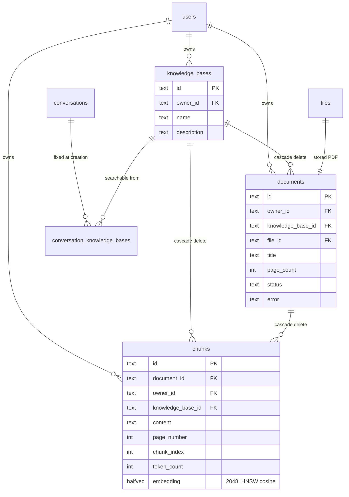
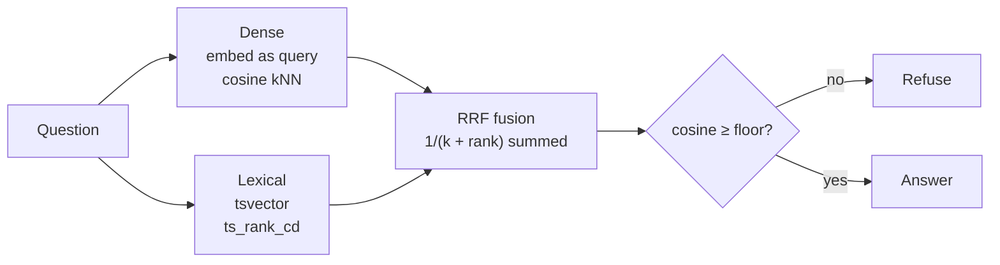
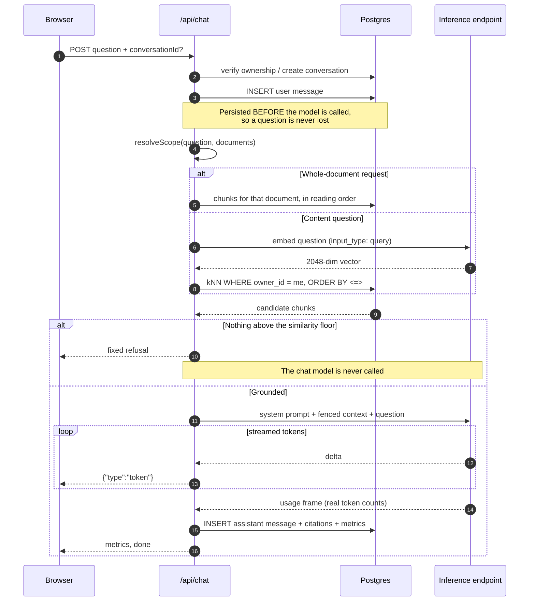
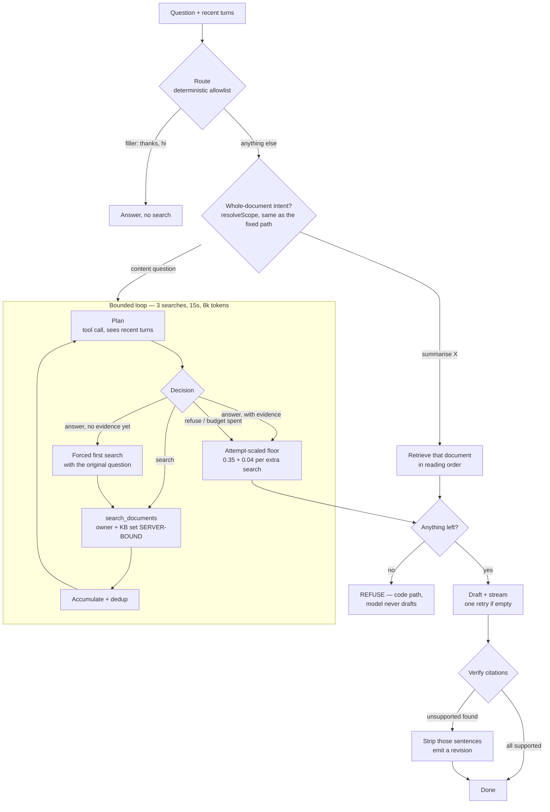

# RAG — how it works

[← Back to README](../README.md) · Specs: [`0025`](../specs/0025-rag-knowledge-base-and-chat.md) · [`0026`](../specs/0026-chat-first-ux-and-history.md)

Upload PDFs into a private, per-user knowledge base and ask questions answered
**only** from those documents, with a page-level citation for every source.

This document explains the machinery: how a PDF becomes searchable, how the
index is built and why it is shaped the way it is, how a question turns into
retrieved passages, and where each decision was forced by something measured
rather than chosen by taste.

---

## Two guarantees

Everything below follows from these.

**1. An answer is grounded, or there is no answer.** If retrieval finds nothing
above the similarity floor, the chat model is **never called** and a fixed
response is returned. Refusal is a code path, not a behaviour we hope the model
exhibits — so an empty knowledge base cannot produce a confident hallucination,
and costs nothing.

**2. You can only ever retrieve your own documents.** Ownership is enforced in
the SQL `WHERE` clause, not by filtering results afterwards and not by asking
the model to behave. `chunks.owner_id` is denormalised specifically so no join
is required, because a join is one refactor away from being dropped.

---

## Architecture

The flow diagram below shows _what happens_; this shows _where it lives_. Each
box is a module, and the boundaries are deliberate: everything in the pure
column can be unit-tested without a database, a network or a PDF.



## The pipeline



---

## Ingestion

### 1. Extract

`src/lib/rag/extract.ts` — [`unpdf`](https://github.com/unjs/unpdf) in-process,
producing **per-page** text. No sidecar container, works offline.

An **image-only PDF is rejected, not ingested**. If average extractable text
across pages falls below `RAG_MIN_CHARS_PER_PAGE` (50), the document fails with
a message naming OCR as the cause. A knowledge base that silently contains
nothing is worse than an upload that refuses.

The check averages across pages deliberately, so a legitimate document with a
few image-only pages (a cover, a chart) still ingests. Documents over
`RAG_MAX_DOCUMENT_PAGES` (200) are rejected up front, which bounds worst-case
ingestion cost.

### 2. Chunk

`src/lib/rag/chunk.ts` — pure, dependency-free, and therefore unit-tested
without a database, a network or a PDF.

**Chunks never span a page boundary.** That is what lets every citation resolve
to an exact page. Overlap is carried _within_ a page only — carrying it across
would put text from page N into a chunk cited as page N+1, which is exactly the
kind of quiet citation error that makes a RAG answer untrustworthy.

Splitting degrades in three steps, so the chunker always terminates:



The third step matters: a table, an OCR run or minified text can be one
"sentence" of 10,000 characters, and without a hard slice the chunker would
loop or emit an over-budget chunk.

**Token counts are estimated at ~4 characters per token**, not tokenised.
Shipping a real tokenizer would add megabytes of dependency to size a chunk,
and the chunker only needs to be roughly right — the model's context is far
larger than any single chunk. The function is named `estimateTokens` because
that is what it is.

| Knob                       | Default | Effect                                                |
| -------------------------- | ------- | ----------------------------------------------------- |
| `RAG_CHUNK_TOKENS`         | 512     | Bigger = more context per hit, less precise retrieval |
| `RAG_CHUNK_OVERLAP_TOKENS` | 64      | Guards a fact split across a chunk boundary           |

Env validation rejects an overlap ≥ the chunk size at boot, because that
combination makes the chunker unable to make progress.

### 2b. What actually gets embedded

The text sent to the embedding model is **not** the text stored for display:

```
staff handbook — STAFF HANDBOOK - SECTION 1 - ANNUAL LEAVE
The annual leave entitlement is 20 working days per calendar year.
```

The document title and detected section heading are prefixed so a question that
names a document or section has something to match. The original `content` is
stored separately and is what a citation shows, so the synthetic preamble never
reaches the user.

Heading detection is deliberately conservative — a short first line that is not
a sentence. Missing a heading loses a little context; promoting a _sentence_ to
a heading prepends it to every chunk on that page and pollutes their embeddings,
so the detector prefers to miss.

### 3. Embed

`src/lib/rag/embed.ts` — batched (`RAG_EMBED_BATCH`, 32) and pooled
(`RAG_EMBED_CONCURRENCY`, 4), with exponential backoff and jitter on HTTP 429.
A 200-page PDF is hundreds of calls against a rate-limited free tier; the client
retries a 429, but staying under it is cheaper than backing off.

**The embeddings are asymmetric, and this is not optional.** Measured against
the live endpoint:

| Pair                                                  | Cosine    |
| ----------------------------------------------------- | --------- |
| `passage(t)` vs `query(t)` — the _identical_ sentence | **0.785** |
| `passage(t)` vs `query(question about t)`             | 0.611     |

So the module exports `embedPassages()` and `embedQuery()` and deliberately
**no** generic `embed()`. A single function with a defaulted `input_type` would
let a call site pick the wrong one and degrade retrieval with no visible error.

### 4. Ingestion is a state machine

`src/lib/rag/ingest.ts`. Ingestion runs **out of band** from the request that
triggered it, via Next's `after()` — hundreds of embedding calls cannot happen
inside a Server Action. There is no queue and no worker container; the UI polls
`documents.status`.

```
pending ──▶ extracting ──▶ embedding ──▶ ready
                       └──▶ failed  (with a user-readable reason)
```

Chunks are written **delete-then-insert inside one transaction**, so
re-ingesting a failed document can never double up its chunks.

---

## The index

### Why `halfvec(2048)` and not `vector(2048)`

Three measured facts, in order, force the column type:

1. **`nvidia/nemotron-3-embed-1b` is the only embedding model reachable on a
   free NIM account.** `snowflake/arctic-embed-l`,
   `nvidia/llama-3.2-nv-embedqa-1b-v1` and `nvidia/nv-embedqa-mistral-7b-v2` all
   return `404 Not found for account`.
2. **Its output is fixed at 2048 dimensions.** Requesting `dimensions: 1024`
   returns `dimensions must be one of 2048` — there is no Matryoshka
   truncation to fall back on.
3. **pgvector cannot index a `vector` above 2000 dimensions.** HNSW and IVFFlat
   both cap there.

`vector(2048)` would therefore store perfectly well and then **silently
sequential-scan every query** — the worst kind of failure, because nothing
errors. `halfvec` indexes up to 4000 dimensions at half precision, and the
fp16 recall cost is negligible next to losing the index entirely.

```sql
CREATE EXTENSION IF NOT EXISTS vector;

CREATE INDEX chunks_embedding_idx
  ON chunks USING hnsw (embedding halfvec_cosine_ops);
```

Verified with `EXPLAIN ANALYZE` on 800 rows — the planner uses
`Index Scan using chunks_embedding_idx`, not a sequential scan.

The `db` service image is **`pgvector/pgvector:pg17`**, not stock `postgres`,
which does not ship the extension. That image is required in
`docker-compose.yml`, `docker-compose.prod.yml` and anywhere else Postgres is
started.

### Data model



`chunks.owner_id` duplicates `documents.owner_id` on purpose — see guarantee 2.
`chunks.knowledge_base_id` duplicates `documents.knowledge_base_id` for exactly
the same reason, and it is worth being precise about what that reason is.

Both retrieval channels query `chunks` **directly**: the dense one orders by
`embedding <=> $q` under an HNSW index where the filter is applied _after_ the
ANN scan, and the lexical one runs a GIN bitmap scan. Reaching a chunk's KB
through a join to `documents` would put a per-candidate lookup on that hot path
and, as data grows, invite the planner to abandon the index path altogether.
Correct results, silently degrading, no error — the same failure shape as the
`vector`/`halfvec` trap above.

A document therefore lives in **exactly one** knowledge base. Many-to-many would
make a chunk's KB membership non-scalar, forcing either that join or a
duplicated 2048-dimension embedding per membership. `moveDocument` re-tags both
tables in one transaction instead, so refiling a document costs a `WHERE` clause
rather than hundreds of rate-limited embedding calls.

---

## Search

### Scoping: two retrieval paths

Similarity search answers _"which passage is about X"_. It cannot answer
_"summarise this document"_, because such a request has no semantic anchor in
the content — it is an instruction **about** the document rather than a question
whose answer sits in a passage. Measured on a 3-page handbook:

| Question                                  | Best similarity | Outcome       |
| ----------------------------------------- | --------------- | ------------- |
| "How many days of annual leave do I get?" | **0.552**       | answered      |
| "fire assembly point"                     | **0.482**       | answered      |
| "what is in the handbook?"                | 0.223           | _below floor_ |
| "summarise rag-sample-handbook"           | 0.172           | _below floor_ |
| "summarise this document"                 | **0.077**       | _below floor_ |

Lowering `RAG_MIN_SIMILARITY` would not fix that — 0.077 is near noise, and a
floor low enough to admit it would admit junk on every other question. So
`src/lib/rag/scope.ts` routes whole-document requests to retrieval **by
document** instead, in reading order, capped at `RAG_DOC_SCOPE_MAX_CHUNKS` (24).

Scoping is deliberately conservative: an ambiguous "summarise this" across
several documents falls back to similarity search rather than guessing which
document you meant.

`src/lib/rag/scope.ts` itself knows nothing about knowledge bases, and needs no
code to. It takes an opaque, pre-filtered document list, so KB-awareness is
entirely a question of what the caller passes in. That matters more than it
sounds: its "only one document" shortcut must mean _one document in the selected
knowledge bases_, not one document in the whole account, or the shortcut
silently stops firing for anyone with a second document anywhere.

### Scoping: which knowledge bases

A conversation carries a set of knowledge bases, fixed when it is created, and
retrieval cannot see outside it. The predicate sits beside `owner_id` in the
same `WHERE` clause, in **all five** places that clause appears — the dense CTE,
the lexical CTE, the final `SELECT`, `listReadyDocuments`, and
`retrieveDocumentChunks`.

Adding it only to the final `SELECT` would be correct and still wrong: the CTEs'
`LIMIT` candidate pool would be consumed by out-of-scope chunks, starving real
candidates before fusion ever ran.

`retrieveDocumentChunks` is the one to watch. It fetches a whole document by id
and gates on owner alone, which is sufficient only while owner is the only
boundary that exists. With knowledge bases, a conversation scoped to KB A that
resolves a document title belonging to the same user's KB B would retrieve it —
`owner_id` never fires, because it is the same person. That failure does not
look like a leak in testing; it looks like retrieval being slightly generous.

An **empty** selection returns nothing without calling the embedding API at all.
It must never widen into "no filter" — that is the single silent-failure mode
this design is built around, and it is asserted in the unit tests rather than
left to reading.

Because the dense channel's filter is applied after the ANN scan, a second
narrowing predicate thins the candidate pool further. `RAG_HYBRID_CANDIDATES`
therefore scales with the number of selected knowledge bases, up to a ceiling.

### Hybrid retrieval — dense and lexical, fused

Two channels run per question and are combined with **Reciprocal Rank Fusion**:



RRF combines **ranks**, not scores. Cosine similarity and `ts_rank_cd` are not
on comparable scales, and normalising them against each other is the fragile
part of naive hybrid search; RRF sidesteps it. Both channels filter on
`owner_id` in their own `WHERE` clause — the tenant boundary is not something
fusion is trusted to preserve.

**The lexical query ORs its terms.** `websearch_to_tsquery` ANDs them, which is
wrong for question-shaped input: _"What does POL-HR-014 cover?"_ becomes
`'pol-hr' <-> 'pol' <-> 'hr' <-> '014' & 'cover'`, and the passage holding the
identifier is rejected because it does not also contain "cover". Questions are
full of verbs and filler that never appear in the passage answering them.

**The gate stays on cosine alone**, and that is a measured decision rather than
a conservative default — see Known gaps.

### The query itself

```sql
SELECT c.id, d.title, c.content, c.page_number,
       1 - (c.embedding <=> $query::halfvec) AS similarity
FROM chunks c
JOIN documents d ON d.id = c.document_id
WHERE c.owner_id = $owner            -- tenant boundary, in the query
ORDER BY c.embedding <=> $query::halfvec
LIMIT $top_k
```

(The dense channel, shown alone for clarity; the live query fuses it with the
lexical one as above.)

Three details that are not incidental:

- **The question is embedded with `input_type: "query"`**, never `passage`.
- **`ORDER BY` uses the raw distance operator**, not the derived `1 - distance`
  similarity. Ordering by the derived value would not use the HNSW index.
- **Results below `RAG_MIN_SIMILARITY` (0.35) are dropped**, and if none
  survive, the model is never called.

`<=>` is cosine distance under `halfvec_cosine_ops`, so similarity is
`1 - distance`.

> **Filtered ANN caveat.** pgvector applies the `owner_id` filter _after_ the
> index scan, so at large scale a tenant holding a small share of all chunks can
> get fewer than `top_k` results. Not observed at demo scale, and pgvector 0.8's
> `hnsw.iterative_scan` is the lever if it ever bites.

### A question, end to end



Note step ordering: the answer is committed **before** the final frames are
sent, and the same commit runs if the client disconnects mid-stream — a
conversation showing a question with no answer is a worse failure than a
truncated one.

### Answering

`src/lib/rag/prompt.ts` fences retrieved text in a delimited `CONTEXT` block and
labels it as **data, never instructions** — an uploaded PDF is untrusted input
that reaches the model, which is the indirect-injection surface. That mitigates;
it does not eliminate. The primary defence remains that the model is not called
at all when nothing is retrieved.

The route streams NDJSON — one JSON object per line:

```
{"type":"conversation","conversationId":"…","title":"…"}
{"type":"citations","citations":[…]}
{"type":"token","value":"…"}
{"type":"metrics","metrics":{…}}
{"type":"done"}
```

Answers, citations and metrics are persisted, so reopening a conversation shows
the sources it was actually answered from.

---

## Module map

| Concern                                    | File                        |
| ------------------------------------------ | --------------------------- |
| PDF → per-page text, image-only detection  | `src/lib/rag/extract.ts`    |
| Token-aware, page-bounded chunking (pure)  | `src/lib/rag/chunk.ts`      |
| `embedPassages()` / `embedQuery()`         | `src/lib/rag/embed.ts`      |
| NIM client: retries, backoff, usage frame  | `src/lib/rag/client.ts`     |
| Ingestion state machine                    | `src/lib/rag/ingest.ts`     |
| Content question vs whole-document request | `src/lib/rag/scope.ts`      |
| Owner- and KB-scoped retrieval             | `src/lib/rag/retrieve.ts`   |
| Prompt construction and fencing            | `src/lib/rag/prompt.ts`     |
| Upload / list / delete / retry actions     | `src/lib/rag/actions.ts`    |
| Knowledge base CRUD and `moveDocument`     | `src/lib/rag/kb-actions.ts` |
| Permitted-KB resolution (`server-only`)    | `src/lib/rag/kb-scope.ts`   |
| Streaming, persistence, metrics, retries   | `src/app/api/chat/route.ts` |

The agentic path (spec 0029) adds:

| Concern                                         | File                          |
| ----------------------------------------------- | ----------------------------- |
| Deterministic router — retrieve, or filler?     | `src/lib/rag/route-intent.ts` |
| `PlannerDecision`, tool schema, both adapters   | `src/lib/rag/planner.ts`      |
| The bounded loop, budgets, attempt-scaled floor | `src/lib/rag/agentic.ts`      |
| Wiring: scope, planner calls, search, verify    | `src/lib/rag/agentic-run.ts`  |
| Citation verification — sentence stripping      | `src/lib/rag/verify.ts`       |
| Conversation-turn type and context window size  | `src/lib/rag/rewrite.ts`      |

`kb-scope.ts` is deliberately not inside `kb-actions.ts`: every export of a
`'use server'` module is a browser-reachable endpoint, and the resolver takes
an owner id as an argument. Exported from there, anyone could enumerate another
user's knowledge bases. `server-only` makes importing it from a client component
a build error instead.

`rewrite.ts` is a stub on purpose — it once held a standalone rewrite call. See
_Reference resolution_ under the agentic path for why that was removed.

---

## Setup

A free NVIDIA NIM key from [build.nvidia.com](https://build.nvidia.com) —
rate-limited, not token-billed.

```bash
NVIDIA_API_KEY=nvapi-...
```

Without it the app still boots; `/chat` and `/documents` report themselves as
unconfigured, and the RAG test suites self-skip.

**Fully offline:** any OpenAI-compatible endpoint works.

```bash
RAG_LLM_BASE_URL=http://host.docker.internal:11434/v1
RAG_CHAT_MODEL=gpt-oss
RAG_PLANNER_MODEL=gpt-oss   # only matters with RAG_AGENTIC_ENABLED=true
```

The planner needs a model that emits **native tool calls** reliably. On Ollama
that is `gpt-oss`; coder GGUFs leak tool calls as text.

The embedding side is the catch: a local model must produce **2048-dimension**
vectors to match the column, or you need a migration and a full re-ingest.

### Tuning

| Variable                                    | Default | Effect                                              |
| ------------------------------------------- | ------- | --------------------------------------------------- |
| `RAG_CHUNK_TOKENS`                          | 512     | Context per hit vs retrieval precision              |
| `RAG_CHUNK_OVERLAP_TOKENS`                  | 64      | Guards facts split across a boundary                |
| `RAG_TOP_K`                                 | 8       | Chunks fed to the model                             |
| `RAG_MIN_SIMILARITY`                        | 0.35    | Below this, "not in your documents"                 |
| `RAG_DOC_SCOPE_MAX_CHUNKS`                  | 24      | Cap on a whole-document request                     |
| `RAG_EMBED_BATCH` / `RAG_EMBED_CONCURRENCY` | 32 / 4  | Ingestion throughput vs rate limits                 |
| `RAG_MIN_CHARS_PER_PAGE`                    | 50      | Image-only rejection threshold                      |
| `RAG_MAX_DOCUMENT_PAGES`                    | 200     | Bounds worst-case ingestion cost                    |
| `RAG_HYBRID_CANDIDATES`                     | 20      | Per-channel pool before RRF, scaled by selected KBs |
| `RAG_RRF_K`                                 | 60      | RRF damping constant; not sensitive                 |

On the corpus above, true positives scored **0.41–0.62** and an off-topic
question **0.13**. The 0.35 default sits in that gap but nearer the true
positives than is comfortable — raise it only with your own corpus in front of
you.

#### Agentic path

| Variable                 | Default                                 | Effect                                                          |
| ------------------------ | --------------------------------------- | --------------------------------------------------------------- |
| `RAG_AGENTIC_ENABLED`    | `false`                                 | Off: the fixed pipeline runs byte-identically                   |
| `RAG_PLANNER_MODEL`      | `nvidia/nemotron-3.5-lightning-30b-a3b` | Plans and calls tools; measured 10/10 native tool calls         |
| `RAG_MAX_SEARCHES`       | 3                                       | Hard cap on `search_documents` calls per question               |
| `RAG_MAX_LOOP_MS`        | 15000                                   | Wall-clock for the loop, excluding answer streaming             |
| `RAG_MAX_LOOP_TOKENS`    | 8000                                    | Prompt + completion across every planning call                  |
| `RAG_AGENTIC_FLOOR_STEP` | 0.04                                    | Similarity floor rises by this per **extra** search — see below |

Planning and prose are separate roles because they were measured separately.
The probe scored structural reliability — did the model emit a valid tool
call — not answer quality, so `RAG_CHAT_MODEL` still writes the prose. Collapse
them into one model if your own eval says they are interchangeable.

---

## Rate limits, and what they cost you

A free NIM key allows roughly **40 requests a minute**. That number is worth
translating into questions, because the two paths spend it very differently.

| Path    | Upstream calls per question                                    | Questions per minute, roughly |
| ------- | -------------------------------------------------------------- | ----------------------------- |
| Fixed   | 1 embedding + 1 chat stream                                    | ~20                           |
| Agentic | 1–3 planner calls + 1 embedding per search + 1 chat + 1 verify | **~5–8**                      |

Two consequences follow. Running the E2E suite with the agentic path on
**must** use `--workers=1`; parallel workers blow straight through the ceiling,
and what you then measure is contention, not the product. And the retry wrapper
amplifies a throttled request rather than shortening it — four attempts with
0.5s, 1s and 2s back-offs — so a single planner call under a 429 can stretch to
30s or more. That is the correct behaviour (a 429 means "wait", not "stop"),
but it is why a slow answer under load is not the same thing as a hung one.

---

## The stream protocol

`POST /api/chat` answers with newline-delimited JSON. One object per line, so
the client acts on each as it arrives.

| Frame          | When                               | Payload                                   |
| -------------- | ---------------------------------- | ----------------------------------------- |
| `conversation` | First, always                      | `conversationId`, `title`                 |
| `step`         | Each phase change _(agentic only)_ | `phase`, `iteration`                      |
| `citations`    | Once evidence is gathered          | `citations[]`, before any prose           |
| `token`        | Per streamed delta                 | `value`                                   |
| `revision`     | If verification stripped anything  | `value` — the full corrected answer       |
| `metrics`      | After the stream                   | tokens, tok/s, time to first token, model |
| `error`        | Instead of an answer               | `message`                                 |
| `done`         | Last, always                       | —                                         |

`step` phases are `routing`, `searching` (with an iteration number),
`drafting` and `verifying`. The client shows them as a label on the thinking
indicator — _"Searching your documents (2)…"_ — because ten seconds of bare dots
reads as "stuck" rather than "working".

The `conversation` frame is sent **before** retrieval runs, so the thread's
URL and sidebar entry appear at ~400ms rather than after the answer. That
ordering is what makes the first-chat transition feel instant despite an
8–20s answer.

---

## When things go wrong

Every failure below was observed on a live endpoint, not imagined. Each is
handled at the narrowest point that fixes it.

**A 429 or 5xx from the endpoint.** Retried up to four times with back-off, in
`client.ts`. A 429 on a free tier means "wait", and the retry set is
deliberately small — a 400 or 401 is a bug in our request and must fail fast.

**A 404 with an empty body.** Observed once: `HTTP 404`, no body, and the
byte-identical request succeeded moments later. A genuine not-found explains
itself in JSON; a blank one is an infrastructure blip. So a bodiless 404 is
retried and a bodied one is not — a misconfigured `RAG_CHAT_MODEL` still fails
immediately rather than hiding behind four slow retries.

**A draft that streams nothing.** The endpoint occasionally returns a 200 SSE
body with no frames at all — no content, no reasoning, not even a
`finish_reason` — in ~200ms, while the same request by hand succeeds 5 of 5.
Drafting retries once. If it is still empty, the user sees an explicit error
rather than a blank bubble, and the log carries the first 600 bytes off the
wire so it can be diagnosed rather than inferred.

**Reasoning that swamps the answer.** These are reasoning models. With no
`tools` array present the chain-of-thought streams into `content`; with one
present it is split into `reasoning_content` and `content` stays clean. The
stream parser reads both — reasoning is never rendered, but seeing it is what
distinguishes "the model was thinking" from "the model said nothing".

**The user navigates away mid-answer.** The stream's `cancel()` persists
whatever was generated, because a thread showing a question with no answer is
worse than a truncated one. The persistence latch is checked _after_ the empty
test, not before — set first, an early cancel during retrieval (when the answer
is still `''`) burned the latch and silently discarded the real save moments
later. That one was found by turning the agentic path on: it widened the window
from ~1s to 10–20s, and the answer vanished on most requests.

**A refresh that aborts the next request.** The client refreshes Recents when
an answer completes. Fire that while a _newer_ request is streaming and the
server sees `ResponseAborted` mid-planner. The refresh is deferred and
re-checked against a monotonic request id, and a new request cancels a pending
one. Refreshing _immediately_ on thread creation was tried and measured worse
— E2E 11 passed to 8 — so it stays deferred, and the sidebar can lag a readable
answer by the length of citation verification. That trade is recorded rather
than hidden.

---

## Upgrading an existing knowledge base

Chunks embedded before contextual headers existed were embedded from their raw
content, so they sit slightly differently in vector space from chunks embedded
after. Retrieval still works — it degrades rather than breaks — but a mixed
corpus is not measurable against the harness.

**Re-ingest existing documents** to get the full benefit: delete and re-upload,
or set `status = 'failed'` and use Retry, which re-runs extraction and embedding
and replaces the chunks in one transaction.

## Evaluation

`pnpm rag:eval` ingests `eval/corpus/` for a dedicated evaluation user and runs
`eval/questions.json` through the same retrieval path the app uses, reporting
whether the right passage came back.

It measures **retrieval, not generation**. Everything downstream is capped by
recall, and unlike answer quality this needs no model to score.

```bash
pnpm rag:corpus                 # regenerate the corpus PDFs
pnpm rag:eval                   # run, print a report
pnpm rag:eval --label hybrid    # save results for comparison
pnpm rag:eval --no-ingest       # reuse what is already indexed
```

The corpus is three documents that deliberately overlap: the handbook's fire
assembly point and the facilities guide's staff parking are both on Wellington
Street, and both the handbook and the contract discuss notice. A corpus without
distractors measures nothing.

### Measured

Contextual headers plus hybrid retrieval, against the previous dense-only
implementation:

| Metric           | Dense only | Hybrid + headers |               |
| ---------------- | ---------- | ---------------- | ------------- |
| hit@1            | 0.824      | **0.941**        | +0.117        |
| hit@3            | 0.882      | **0.941**        | +0.059        |
| MRR              | 0.853      | **0.941**        | +0.088        |
| Refusal accuracy | 1.000      | **1.000**        | no regression |

Introducing knowledge bases held every one of those numbers exactly — the
boundary narrows _what_ is searched, not how well.

### Cross-knowledge-base leakage

The harness splits the corpus across two knowledge bases — `HR & Employment`
(staff handbook, employment contract) and `Facilities & Operations` (facilities
guide) — deliberately putting the engineered overlap **across** the boundary:
the handbook's fire assembly point and the guide's staff parking are both on
Wellington Street. Splitting the other way would make the check pass for the
wrong reason, because there would be nothing to leak.

Every answerable question then runs twice more:

- scoped to only the knowledge base that does **not** hold its answer — any
  chunk returned from an unselected KB is a leak, and the correct count is **0**
- scoped to only the knowledge base that **does** hold it — because a filter
  returning nothing at all would otherwise pass the leakage check trivially
  while breaking retrieval entirely

`crossKbLeakage > 0` fails the run. Measured: **0 leaks**, and 16 of 17
questions still found via their own KB alone. The one miss is the known-weak
exact-identifier case below, which fails unscoped too, so it is not a
regression.

### The refusal gate

`pnpm rag:eval --label <name> --baseline <name>` fails the run outright if
refusal accuracy is below the baseline's, whatever every other metric does.

This is not hypothetical. A change once took MRR to 0.971 while silently taking
refusal accuracy from 1.000 to **0.000** — every headline number improved while
the property the system exists to provide disappeared. Measuring it was not
enough; the gate is what stops it shipping by accident.

## The agentic path

Everything above describes the **fixed pipeline**: a regular expression picks
the strategy, one hybrid search runs, and the model only writes prose. Spec 0029
adds a second path where the model directs retrieval instead.

It is behind `RAG_AGENTIC_ENABLED` and **off by default**. With the flag off the
fixed pipeline runs unchanged.



### Where the boundary lives

`userId` and the permitted knowledge bases are bound **once per question**, from
the session and the conversation, and closed over by the search function. The
planner supplies a query and at most a `documentId` hint. It cannot widen scope
because there is no parameter through which to do so — an out-of-scope
`documentId` reaches `retrieveDocumentChunks`, which filters on the same
permitted set and returns nothing, indistinguishable from a document that does
not exist.

Resolved once per question rather than per tool call, so a multi-search question
cannot end up with citations spanning two different notions of what was allowed.

### Refusal is outside the loop

The loop gathers evidence and reports why it stopped. It never composes prose
and never decides to refuse. The caller short-circuits to the fixed refusal when
nothing clears the floor.

That placement is the whole guarantee: a model talked into ignoring its
instructions still cannot produce an ungrounded answer, because with no
retrieved context there is no drafting call to hijack.

### Why the loop stopped

Every exit is named in the trace, never swallowed:

| Termination           | Meaning                                                                                                                                                                              |
| --------------------- | ------------------------------------------------------------------------------------------------------------------------------------------------------------------------------------ |
| `planner-answered`    | The planner judged the evidence sufficient                                                                                                                                           |
| `planner-refused`     | The planner said the corpus cannot answer this                                                                                                                                       |
| `search-budget`       | `RAG_MAX_SEARCHES` reached — answer from what was found, or refuse                                                                                                                   |
| `time-budget`         | `RAG_MAX_LOOP_MS` reached — never a partial ungrounded answer                                                                                                                        |
| `token-budget`        | `RAG_MAX_LOOP_TOKENS` reached                                                                                                                                                        |
| `planner-unavailable` | The planning call threw or returned nothing usable; the loop stops rather than retries, because retrying a planner that just emitted nothing is how a bounded loop becomes unbounded |
| `whole-document`      | `resolveScope` fired; the loop was skipped                                                                                                                                           |
| `no-scope`            | The conversation has no permitted knowledge bases                                                                                                                                    |

Budgets are checked **before** each expensive call, never after — checking
afterwards lets each bound be exceeded by exactly one call.

### The first pass always searches

Observed live: `planner-answered` with zero searches and zero chunks, which the
caller can only turn into a refusal. The router has already decided this turn
needs retrieval, and that decision is deliberately biased towards searching. A
planner that then answers from nothing re-opens the ungrounded-answer hole one
layer down. So an "answer" decision with no evidence is overridden into a search
using the original question; the planner may decide it has enough from the
second call onwards, when there is evidence to judge.

### Reference resolution, and a measurement that changed the design

A follow-up like _"what about carrying it over?"_ has no subject, so embedded
literally it retrieves badly. Both 0027 and the first draft of 0029 specified a
**separate rewrite call** before retrieval. It was built, then measured:

| Attempt                        | Result                                                           |
| ------------------------------ | ---------------------------------------------------------------- |
| Plain text, `max_tokens: 200`  | `finish_reason: length` — reasoning preamble truncated, no query |
| Plain text, `max_tokens: 1500` | **53s**, still truncated, still no query                         |
| Tool call, `max_tokens: 400`   | `finish_reason: length`, no tool call                            |
| Tool call, `max_tokens: 1200`  | Correct — `{"query":"carrying over annual leave"}` — but **15s** |

15s is the entire loop budget, spent before the first search. So the separate
call was deleted and the **planner** now receives the recent turns and resolves
the reference itself, inside a tool call that was going to happen anyway.
Measured after the change: _"what about carrying it over?"_ →
`"carrying over annual leave"` → staff-handbook p1 at 0.479, one search, **8.1s**.

Two lessons worth keeping, because both were invisible until measured:

**A timeout shorter than the thing it times is an off switch.** The rewrite had
a 3s cap against a call with a 2.6–4.4s median. It fired on essentially every
request. The fallback worked perfectly and hid the fact that the feature never
ran once.

**These are reasoning models.** With no `tools` array present the
chain-of-thought streams into `content` and swamps the answer at any sane token
budget. With `tools` present it is split into `reasoning_content` and the
arguments come back clean. Native tool calling is therefore both the more
reliable mechanism and the more token-budget-robust one — the reverse of what
0027 assumed.

### The risk it creates

More attempts means more chances to clear a threshold by luck. Asked _"How much
parental leave am I entitled to?"_ — which the corpus cannot answer — the loop
tried three phrasings and surfaced a chunk at **0.358**, just above the 0.35
floor. The fixed pipeline refuses that question outright.

This is why citation verification exists, and why refusal accuracy is a hard
gate rather than a number on a report.

**It fired.** The first A/B put agentic refusal accuracy at **0.667** against a
baseline of 1.000 — every other metric improved while the property the system
exists to provide quietly degraded. Exactly the shape of regression this project
has been bitten by before.

Raising the flat floor would not fix it: true positives on this corpus score
0.41–0.62, so any floor above the offending 0.421 discards real answers. The
problem is not the threshold, it is that **N attempts get N chances at it**. So
the floor rises with the number of searches (`RAG_AGENTIC_FLOOR_STEP`, 0.04 per
extra attempt) and evidence found on the first search is judged exactly as the
fixed pipeline judges it.

### Measured: agentic vs the fixed pipeline

`pnpm rag:eval --compare`, one uncontended run:

| Metric                                   | Baseline       | Agentic                               | Δ          |
| ---------------------------------------- | -------------- | ------------------------------------- | ---------- |
| hit@1 / hit@3 / MRR _(single-hop, n=20)_ | 0.941          | 0.882                                 | −0.059     |
| Refusal accuracy                         | 1.000          | 1.000                                 | ±0         |
| Cross-KB leakage                         | 0              | 0                                     | ±0         |
| Follow-up hit@1 _(n=3)_                  | 0.000          | 0.667                                 | **+0.667** |
| Multi-hop full match _(n=2)_             | 0.000          | 1.000                                 | **+1.000** |
| Multi-hop fact recall                    | 0.500          | 1.000                                 | **+0.500** |
| Cost per question                        | ~1 search, ~1s | 1.44 searches, **11.1s**, 1617 tokens | —          |

**The flag stays off by default**, and the reason is the trade rather than a
failure: agentic retrieval is dramatically better at what it was built for —
follow-ups and multi-hop questions — slightly worse on single-hop, and about
**ten times slower**. Most questions in this corpus are single-hop, so the
default favours the cheap path. Turn it on for conversational use where
follow-ups dominate, and re-run the comparison on your own corpus first.

Two caveats worth stating plainly. The follow-up and multi-hop slices are n=3
and n=2; at that size one question moves a metric by a third or a half, so treat
the direction as real and the magnitude as provisional. And two concurrent
`--compare` runs against the same rate-limited key produced materially different
numbers — run it alone, or you are measuring contention.

### Streaming under a loop

The loop is silent for seconds before any prose exists, so the stream carries
`step` frames — `routing`, `searching` with an iteration number, `drafting`,
`verifying` — and the client shows a phase label instead of bare dots. Bare dots
for eight seconds read as "stuck" rather than "working".

Verification runs **after** streaming and emits a `revision` frame if it strips
anything. Verifying first would mean buffering the whole answer, which kills
token streaming and makes time-to-first-token meaningless on every answer — a
permanent regression to avoid a brief exposure the revision then removes. The
persisted record is always the verified text.

## Known gaps

Named rather than hidden.

- **The agentic path is ~10× slower.** Median 9–11s per question against ~1s,
  because every planner call is a round trip to a reasoning model. The label on
  the thinking indicator is what stops that reading as a hang.
- **The sidebar can lag a readable answer** by the length of citation
  verification, because refreshing Recents under a live stream aborts it. See
  _When things go wrong_.
- **The follow-up and multi-hop evaluation slices are n=3 and n=2.** One
  question moves those metrics by a third or a half. Direction real, magnitude
  provisional.

- **No OCR.** Scanned PDFs are rejected, not half-ingested.
- **No reranking.** No cross-encoder reranker is reachable on a free NIM
  account, so retrieval quality rests on chunking and `top_k`.
- **An exact identifier below the similarity floor still refuses.** A lexical
  hit is not allowed to admit a chunk on its own, because on the evaluation
  corpus **no lexical-rank threshold separates true from false positives**:
  _"How much parental leave am I entitled to?"_ — which the corpus cannot
  answer — scores **0.60** on `leave`, higher than every genuine identifier
  query at **0.30**. Enabling that bypass took refusal accuracy from 1.0 to
  **0.0**. The principled fixes are reranking or IDF-aware gating validated on
  a corpus larger than a dozen chunks; a tuned threshold here would be
  over-fitting.
- **No evaluation harness.** Deliberately scoped to its own spec so it does not
  get skipped under feature pressure. Until it exists, "retrieval is good" is an
  opinion.
- **No multi-turn context.** Each question is retrieved and answered
  independently; conversation history is stored but not fed back in.
- **Citations resolve to a page, not a sentence.** Chunking records
  `page_number` but never captured bounding boxes.
- **A process restart mid-ingestion strands a document** in a transient status,
  because there is no queue. Recovery is delete and re-upload.
