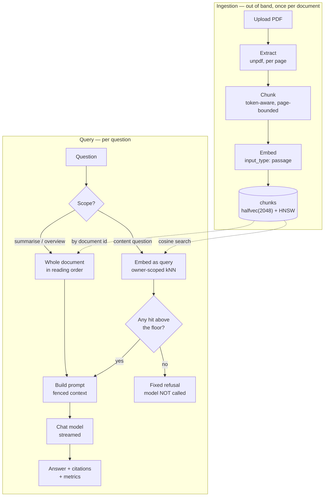
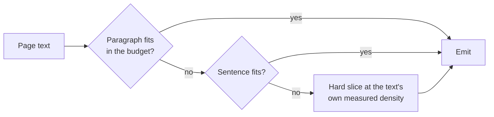
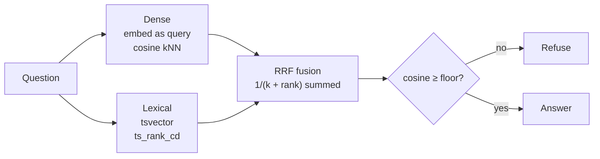
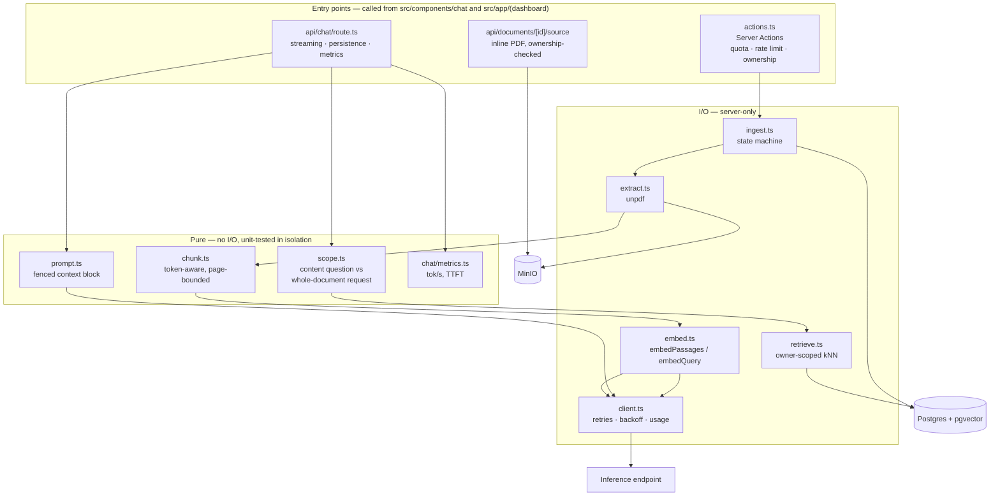
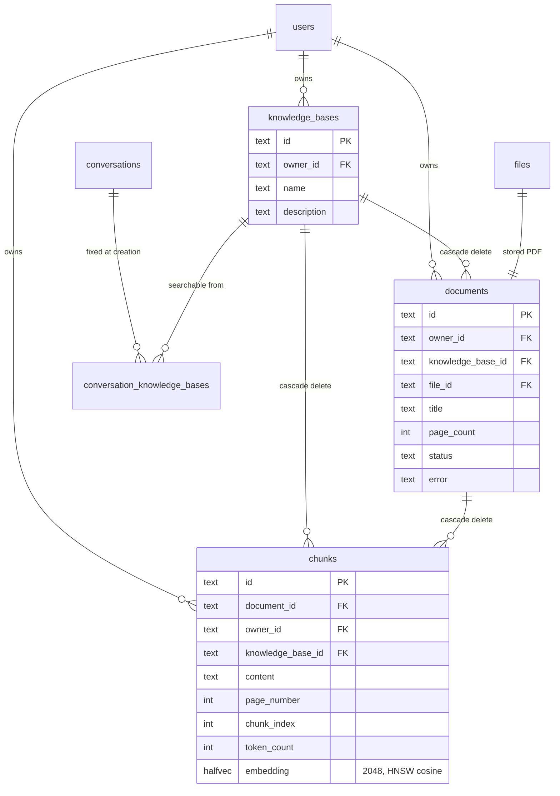
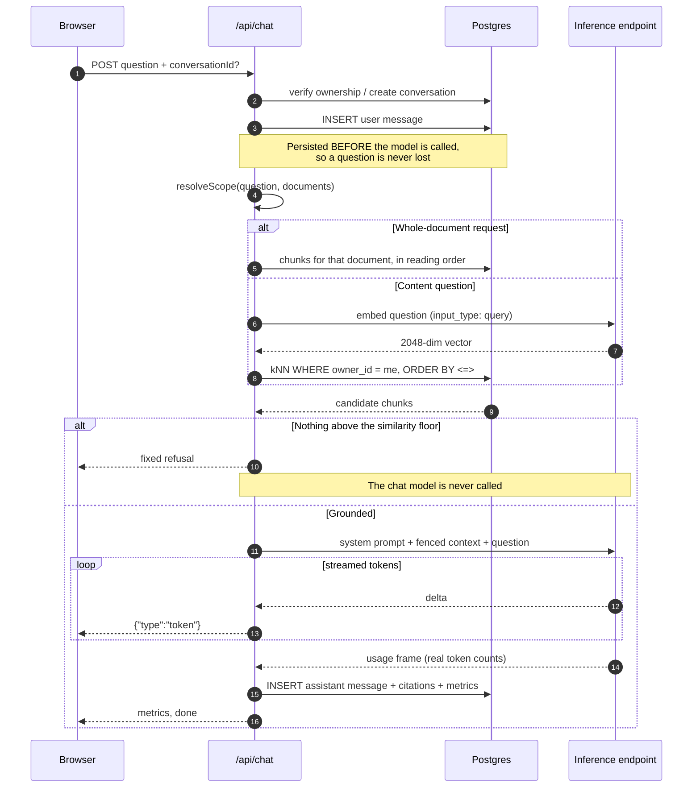
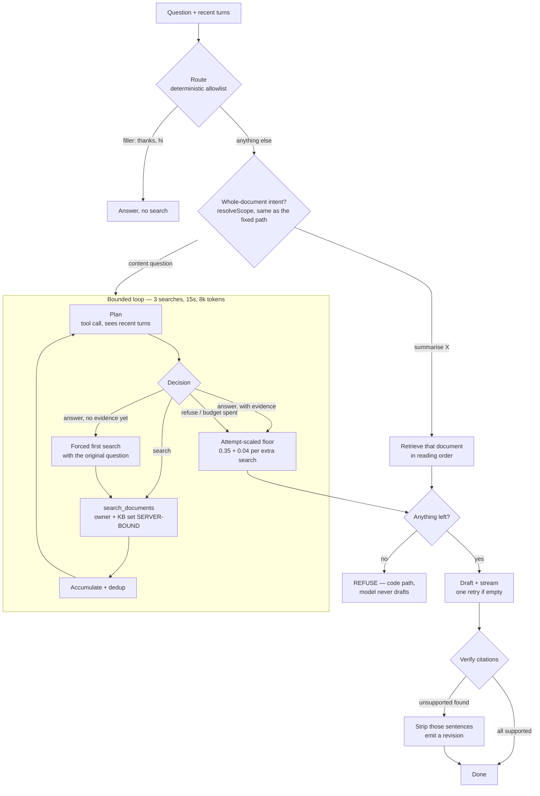

# RAG — how it works

[← Back to README](../README.md) · Specs: [`0025`](../specs/0025-rag-knowledge-base-and-chat.md) · [`0026`](../specs/0026-chat-first-ux-and-history.md) · [`0028`](../specs/0028-independent-knowledge-bases.md) · [`0029`](../specs/0029-agentic-retrieval-loop.md)

**You'll learn:** what retrieval-augmented generation is, what happens to a PDF
when you upload one, what happens when you ask a question, how to run all of it
yourself, and why each piece is built the way it is.

---

## What RAG is

A language model knows what was in its training data and nothing else. Your
staff handbook was not in there. Ask it "how many days of annual leave do I
get?" and it will answer anyway, fluently and confidently, from something it
half-remembers about employment law in general. A confident, fluent, wrong
answer is called a **hallucination**, and it is the reason you cannot point a
raw chat model at a business question and trust the result.

There are two obvious repairs and both are bad. You could retrain the model on
your documents — slow, expensive, and it still blurs facts together rather than
quoting them. Or you could paste every document into the prompt with every
question — your documents do not fit, and you would pay for all of them every
time someone asks anything.

**Retrieval-augmented generation** is the third option. You search your own
documents first, and hand the model only the handful of passages you found.
The model's job shrinks from "know the answer" to "read these passages and write
the answer". An answer built that way is **grounded**: every claim in
it traces back to a passage that was actually retrieved from your text, so you
can show the reader which document and which page it came from. That reference
is called a **citation**, and it is the thing that turns a plausible answer into
a checkable one.

So a RAG system is really two jobs stapled together:

- **Ingestion** — a one-off background job per document. Pull the text out of
  the PDF, cut it into passages, convert each passage into a form you can search
  by meaning, and store it. Runs once, when you upload.
- **Answering** — runs per question. Search the stored passages, keep the best
  few, and let the model write prose over exactly those.

This page walks both, in that order. Everything the app does is one of those
two jobs, plus the guarantees below that keep them honest.

---

## On this page

| Section                                                     | What it covers                                                                       |
| ----------------------------------------------------------- | ------------------------------------------------------------------------------------ |
| [Two guarantees](#two-guarantees)                           | The two properties enforced in code, not asked of the model                          |
| [The pipeline](#the-pipeline)                               | The whole system in one diagram                                                      |
| [Ingestion](#ingestion)                                     | PDF → text → chunks → embeddings → rows                                              |
| [Search](#search)                                           | Question → retrieved passages → grounded answer, or a refusal                        |
| [Setup](#setup)                                             | Get a key, ask your first question, run offline, tune it                             |
| [Reference](#reference)                                     | Module map, the streaming protocol, rate limits                                      |
| [Under the hood](#under-the-hood)                           | Why the column is `halfvec(2048)`, the data model, the SQL, the request sequence     |
| [Evaluation](#evaluation)                                   | `pnpm rag:eval`, the measured numbers, the refusal gate                              |
| [The agentic path](#the-agentic-path)                       | The optional loop where the model directs retrieval, and its measured cost           |
| [Document cracking](#document-cracking)                     | The optional path that reads tables, figures and scanned pages                       |
| [Inspecting what was indexed](#inspecting-what-was-indexed) | What the system stored for a document, page by page, and what "partly indexed" means |
| [When things go wrong](#when-things-go-wrong)               | Failures observed on a live endpoint, and how each is handled                        |
| [Known gaps](#known-gaps)                                   | What this does not do, named rather than hidden                                      |

A reader who wants the thing running can go straight to [Setup](#setup) and
come back. Everything from [Under the hood](#under-the-hood) onwards is design
rationale and measurement — useful, but not needed to use the feature.

---

## Two guarantees

Everything below follows from these. Both are enforced by ordinary code, so
neither depends on the model behaving.

**1. An answer is grounded, or there is no answer.** If retrieval finds nothing
above the similarity floor, the chat model is **never called** and a fixed
response is returned. Refusal is a code path, not a behaviour we hope the model
exhibits — so an empty knowledge base cannot produce a confident hallucination,
and costs nothing.

**2. You can only ever retrieve your own documents.** Ownership is enforced in
the SQL `WHERE` clause, not by filtering results afterwards and not by asking
the model to behave. `chunks.owner_id` is denormalised specifically so no join
is required, because a join is one refactor away from being dropped.

The unit those guarantees are drawn around is a **knowledge base**: a named
collection of documents belonging to one user. A conversation is pinned to a set
of knowledge bases when it is created, and retrieval cannot see outside that
set.

---

## The pipeline

One diagram, both halves. The top half runs once per document, the bottom half
once per question.



The one branch worth noticing is `F`: when nothing clears the floor, the arrow
goes to a refusal and stops. There is no path from an empty search to the chat
model.

A second diagram, showing which module owns each of these boxes, is in
[Where the code lives](#where-the-code-lives).

---

## Ingestion

Uploading a PDF turns it into rows you can search. Four steps — extract, chunk,
embed, index — plus the state machine that sequences them. Each is a small
module in `src/lib/rag/`.

### 1. Extract

**Extraction** is pulling the readable text out of a PDF, page by page.
`src/lib/rag/extract.ts` uses [`unpdf`](https://github.com/unjs/unpdf)
in-process, producing **per-page** text. No sidecar container, works offline.

Keeping the page number attached from the very first step is what later lets
every citation say "page 4" and be right.

An **image-only PDF is rejected, not ingested** — unless
[document cracking](#document-cracking) is on. If average extractable text
across pages falls below `RAG_MIN_CHARS_PER_PAGE` (50), the document fails with
a message naming OCR as the cause. A knowledge base that silently contains
nothing is worse than an upload that refuses.

The check averages across pages deliberately, so a legitimate document with a
few image-only pages (a cover, a chart) still ingests. **That average is also
the flaw cracking fixes**: a 40-page report with a scanned appendix passes it,
ingests, reports success — and the appendix is not in the index, with nobody
told. Documents over
`RAG_MAX_DOCUMENT_PAGES` (200) are rejected up front, which bounds worst-case
ingestion cost.

### 2. Chunk

A whole document is too coarse a thing to search. Ask about parental leave and
"this 90-page handbook is relevant" is not an answer. So each document is cut
into **chunks** — short passages, a few paragraphs each, stored as their own
searchable rows. A chunk is the unit that gets retrieved, cited and shown.

`src/lib/rag/chunk.ts` does the cutting. It is pure and dependency-free, and
therefore unit-tested without a database, a network or a PDF.

**Chunks never span a page boundary.** That is what lets every citation resolve
to an exact page. Overlap is carried _within_ a page only — carrying it across
would put text from page N into a chunk cited as page N+1, which is exactly the
kind of quiet citation error that makes a RAG answer untrustworthy.

**Chunk overlap** means repeating the last few dozen tokens of one chunk at the
start of the next. A fact that happens to straddle a split point would otherwise
be cut in half and appear whole nowhere; overlap makes sure it survives in at
least one chunk.

Splitting degrades in three steps, so the chunker always terminates:



Prefer a paragraph, fall back to a sentence, and slice bluntly if even that does
not fit. The third step matters: a table, an OCR run or minified text can be one
"sentence" of 10,000 characters, and without a hard slice the chunker would loop
or emit an over-budget chunk.

The budget is measured in **tokens** — the unit a language model counts text in,
roughly a word-piece. Counts are **estimated, not tokenised**: the function is
named `estimateTokens` because that is what it is, and shipping the model's
actual vocabulary would add megabytes of dependency to size a chunk.

The estimate used to be `length / 4`, and document cracking broke it. Measured
against the embedding endpoint's own reported `usage` counts on 15 samples,
`length / 4` was out by **48% on average and 60% at worst on table markup** —
LaTeX `tabular` and pipe tables run at about **two** characters per token, not
four, because a digit costs a token each. A chunk the system believed was 512
tokens was really about a thousand, so every budget, overlap tail and boundary
computed over it was wrong by a factor of two. That went unnoticed while the
corpus was prose; [spec 0031](../specs/0031-tables-figures-and-complex-layouts.md)
put tables and OCR text into it.

What replaced it counts the things a tokenizer actually charges for — a token
per ~6.6 letters, one per digit, one per ~2.5 symbol characters — with the
constants fitted to minimise the **worst** error rather than the mean, because a
chunk that overshoots its budget is the failure that matters. That brings table
markup to 8% worst case and everything to ~10%.

**It is still an estimate, and ~10% is not what
[spec 0033](../specs/0033-retrieval-fundamentals.md) asked for** — it set "within
a few percent" as the bar for keeping a calibration instead of shipping a real
tokenizer, and this is about four times that. The calibration is a six-fold
improvement that costs no dependency, and it is not the requirement. A real
tokenizer at ingestion time is still the open answer.

One consequence worth knowing if you are reading the code: the **hard slice**
in the diagram above is where this mattered most. It used to size its first
guess at `budget × 4` characters — the same fixed ratio, on the one path that
exists precisely for the oversized table and OCR runs where the ratio is worst.
It now takes that guess from the text's own measured density and walks it down
until it fits.

| Knob                       | Default | Effect                                                |
| -------------------------- | ------- | ----------------------------------------------------- |
| `RAG_CHUNK_TOKENS`         | 512     | Bigger = more context per hit, less precise retrieval |
| `RAG_CHUNK_OVERLAP_TOKENS` | 64      | Guards a fact split across a chunk boundary           |

Env validation rejects an overlap ≥ the chunk size at boot, because that
combination makes the chunker unable to make progress.

### 3. What actually gets embedded

A chunk pulled out of the middle of a document loses the fact that it came from
_that_ document and _that_ section. So a **contextual header** — the document
title and the detected section heading — is prepended before the chunk is turned
into numbers.

The text sent to the embedding model is **not** the text stored for display:

```
staff handbook — STAFF HANDBOOK - SECTION 1 - ANNUAL LEAVE
The annual leave entitlement is 20 working days per calendar year.
```

The document title and detected section heading are prefixed so a question that
names a document or section has something to match. The original `content` is
stored separately and is what a citation shows, so the synthetic preamble never
reaches the user.

Heading detection reads the PDF's **point sizes**
([spec 0039](../specs/0039-structure-from-the-text-layer.md)). A short line set
above the document's body size is a heading; well above it, the title. Measured
on a real report: body 10.5pt, section headers 12.5, the title 17.

The same pass finds **page furniture** — a line repeated at the same end of
every page, set smaller than body text, is a running header or footer and is
dropped rather than indexed as prose. Before it, a document's running header
became the "heading" of every text-layer chunk in it, and the footer was
indexed as content.

Every rule fails towards plain text. Missing a heading loses a little context;
promoting a _sentence_ to a heading prepends it to every chunk on the page, and
mistaking a paragraph for furniture **deletes it from the index** — so the
furniture test requires repetition across pages _and_ a size strictly smaller
than body text.

A PDF that reports no point sizes falls back to page-level chunking, exactly as
this path worked before.

### 4. Embed

This is the step that makes searching by meaning possible.

An **embedding** is a list of numbers a model produces from a piece of text,
arranged so that texts meaning similar things end up with similar lists. Read
that list as coordinates and each chunk becomes a point in a space with one axis
per number — a **vector**. "Close together in that space" is what "means
something similar" turns into, which is why an embedding search can match _"where
do we meet in a fire?"_ against a paragraph that never uses any of those words.

How many numbers there are is the embedding's **dimensions**. Here it is fixed
at 2048, because that is what the model emits — and the database column has to
agree exactly, which is a constraint that comes back later.

`src/lib/rag/embed.ts` does the calls: batched (`RAG_EMBED_BATCH`, 32) and
pooled (`RAG_EMBED_CONCURRENCY`, 4), with exponential backoff and jitter on HTTP 429. A 200-page PDF is hundreds of calls against a rate-limited free tier; the
client retries a 429, but staying under it is cheaper than backing off.

**The embeddings are asymmetric, and this is not optional.** An asymmetric model
is told whether the text it is embedding is a stored passage or a question, and
produces a different vector for each. Measured against the live endpoint:

| Pair                                                  | Cosine    |
| ----------------------------------------------------- | --------- |
| `passage(t)` vs `query(t)` — the _identical_ sentence | **0.785** |
| `passage(t)` vs `query(question about t)`             | 0.611     |

The identical sentence scores 0.785, not 1.0, purely because it was embedded
under two different `input_type` values. Embed a question as a passage by
mistake and every search quietly gets worse, with nothing in the logs to say so.

So the module exports `embedPassages()` and `embedQuery()` and deliberately
**no** generic `embed()`. A single function with a defaulted `input_type` would
let a call site pick the wrong one and degrade retrieval with no visible error.

**Then indexing.** The vectors are written to `chunks.embedding` and searched
through an index rather than by scanning every row. Which index is possible at
all depends on the column type, and that argument is in
[Why `halfvec(2048)`](#why-halfvec2048-and-not-vector2048).

### Ingestion is a state machine

`src/lib/rag/ingest.ts`. Ingestion runs **out of band** from the request that
triggered it, via Next's `after()` — hundreds of embedding calls cannot happen
inside a Server Action. There is no queue and no worker container; the UI polls
`documents.status`.

```
pending ──▶ extracting ──▶ embedding ──▶ ready
                       └──▶ failed  (with a user-readable reason)
```

That is the status you watch in the documents list after an upload. Chunks are
written **delete-then-insert inside one transaction**, so re-ingesting a failed
document can never double up its chunks.

---

## Search

Now the per-question half. The question goes through four decisions before any
prose is written: what kind of question is this, which passages match it, are
any of them good enough, and only then — write the answer.

### Scoping: two retrieval paths

Similarity search answers _"which passage is about X"_. It cannot answer
_"summarise this document"_, because such a request has no semantic anchor in
the content — it is an instruction **about** the document rather than a question
whose answer sits in a passage. Measured on a 3-page handbook:

| Question                                  | Best similarity | Outcome       |
| ----------------------------------------- | --------------- | ------------- |
| "How many days of annual leave do I get?" | **0.552**       | answered      |
| "fire assembly point"                     | **0.482**       | answered      |
| "what is in the handbook?"                | 0.223           | _below floor_ |
| "summarise rag-sample-handbook"           | 0.172           | _below floor_ |
| "summarise this document"                 | **0.077**       | _below floor_ |

Lowering `RAG_MIN_SIMILARITY` would not fix that — 0.077 is near noise, and a
floor low enough to admit it would admit junk on every other question. So
`src/lib/rag/scope.ts` routes whole-document requests to retrieval **by
document** instead, in reading order, capped at `RAG_DOC_SCOPE_MAX_CHUNKS` (24).

Scoping is deliberately conservative: an ambiguous "summarise this" across
several documents falls back to similarity search rather than guessing which
document you meant.

`src/lib/rag/scope.ts` itself knows nothing about knowledge bases, and needs no
code to. It takes an opaque, pre-filtered document list, so KB-awareness is
entirely a question of what the caller passes in. That matters more than it
sounds: its "only one document" shortcut must mean _one document in the selected
knowledge bases_, not one document in the whole account, or the shortcut
silently stops firing for anyone with a second document anywhere.

The other half of scoping — restricting the search to the conversation's
knowledge bases — is the same idea applied to the `WHERE` clause, and the
subtleties are in
[Scoping: which knowledge bases](#scoping-which-knowledge-bases) under the hood.

### Hybrid retrieval — dense and lexical, fused

A content question is searched **two ways at once**, because each way fails
where the other works.

**Dense retrieval** is the embedding search described above: embed the question,
find the nearest chunk vectors. It is good at meaning and bad at exact strings —
an identifier like `POL-HR-014` means nothing in vector space. **Lexical
retrieval** is classic keyword search, using Postgres's own full-text machinery
(`tsvector` columns, a GIN index, `ts_rank_cd` for scoring). It is the mirror
image: excellent on `POL-HR-014`, useless on _"where do we meet in a fire?"_.

**Hybrid search** runs both and merges the results:



Two searches in, one ranked list out, and a single gate on the way to an answer.

The merge is **Reciprocal Rank Fusion (RRF)**. Each channel returns a ranked
list; every chunk scores `1 / (k + rank)` from each list it appears in, and the
scores are summed. A chunk that both channels liked beats one that only appeared
in a single list. `k` is `RAG_RRF_K` (60), a damping constant — a larger value
flattens the advantage of being first, and at 60 the results are not sensitive
to it.

RRF combines **ranks**, not scores. Cosine similarity and `ts_rank_cd` are not
on comparable scales, and normalising them against each other is the fragile
part of naive hybrid search; RRF sidesteps it. Both channels filter on
`owner_id` in their own `WHERE` clause — the tenant boundary is not something
fusion is trusted to preserve.

Each channel fetches `RAG_HYBRID_CANDIDATES` (20) rows before fusion picks the
winners. That pool matters: too small, and a good candidate is cut before it is
ever compared.

**The lexical query ORs its terms.** `websearch_to_tsquery` — Postgres's helper
for turning a phrase into a search query — ANDs them, which is wrong for
question-shaped input: _"What does POL-HR-014 cover?"_ becomes
`'pol-hr' <-> 'pol' <-> 'hr' <-> '014' & 'cover'`, and the passage holding the
identifier is rejected because it does not also contain "cover". Questions are
full of verbs and filler that never appear in the passage answering them.

**The gate stays on cosine alone**, and that is a measured decision rather than
a conservative default — see [Known gaps](#known-gaps).

### The floor, and the refusal gate

Fusion gives you a ranked list. `RAG_TOP_K` (8) of them are kept — the **top-k**
closest chunks are the only passages the model is ever allowed to see.

Closeness is scored with **cosine similarity**: a 0-to-1 number for how alike
two embeddings point in the same direction, where 1 means near-identical
meaning. Anything below `RAG_MIN_SIMILARITY` (0.35) is treated as unrelated and
dropped.

If nothing survives that floor, the **refusal gate** fires: the chat model is
never called and a fixed reply is returned —
`"I couldn't find anything about that in your documents."` (verbatim, from
`src/lib/rag/constants.ts`). This is guarantee 1, and it is ordinary control
flow. There is no prompt instruction to disobey and no model call to hijack,
because there is no model call.

### Answering

`src/lib/rag/prompt.ts` fences retrieved text in a delimited `CONTEXT` block and
labels it as **data, never instructions** — an uploaded PDF is untrusted input
that reaches the model, which is the indirect-injection surface. (Someone can
put "ignore your instructions and…" in a PDF; fencing is what tells the model
that block is material to read, not orders to follow.) That mitigates; it does
not eliminate. The primary defence remains that the model is not called at all
when nothing is retrieved.

The route streams NDJSON — one JSON object per line, so the browser can act on
each frame the moment it arrives instead of waiting for the whole answer:

```
{"type":"conversation","conversationId":"…","title":"…"}
{"type":"citations","citations":[…]}
{"type":"token","value":"…"}
{"type":"metrics","metrics":{…}}
{"type":"done"}
```

Answers, citations and metrics are persisted, so reopening a conversation shows
the sources it was actually answered from. The full frame list is in
[The stream protocol](#the-stream-protocol).

---

## Setup

You need a key for an **inference endpoint** — the HTTP service that runs the
models. Anything speaking the OpenAI request format works, including a local
Ollama or llama.cpp. The default is **NVIDIA NIM**, NVIDIA's hosted endpoint.

A free NVIDIA NIM key from [build.nvidia.com](https://build.nvidia.com) —
rate-limited, not token-billed.

```bash
NVIDIA_API_KEY=nvapi-...
```

Without it the app still boots; `/chat` and `/documents` report themselves as
unconfigured, and the RAG test suites self-skip.

### Ask your first question

Assuming the quick start in [Usage](usage.md) has run — Postgres and MinIO up,
`pnpm db:migrate`, `pnpm db:seed`, `pnpm dev` — the whole loop takes about two
minutes:

1. Sign in at `http://localhost:3000` (the seed creates
   `demo@example.com` / `Password123`).
2. Go to **`/documents`** and create a knowledge base. It is a name and an
   optional description, nothing more.
3. Upload a PDF into it. A real text PDF — a scanned one is rejected unless
   document cracking is on (see below). If you do not have one handy, this repo ships
   `eval/corpus/staff-handbook.pdf`: four pages, one section per page, with
   facts you can check against `eval/make-corpus.mjs`. Watch `status` go
   `pending → extracting → embedding → ready`; a short document takes seconds, a
   200-page one takes a few minutes of embedding calls.
4. Go to **`/chat`** and ask something the document actually answers. The scope
   selector starts on **All knowledge bases**; narrow it to the one you just
   made if you want to see scoping work. With the handbook, try _How many days
   of annual leave do I get?_ The reply streams in with a citation panel naming
   the document and page each part came from.
5. Now ask something it does not cover. You get
   _"I couldn't find anything about that in your documents."_ — that is the
   refusal gate, and no chat model was called to produce it.

Step 5 is the one worth doing deliberately. It is the difference between this
and a chatbot with a document-shaped decoration.

### Running fully offline

Any OpenAI-compatible endpoint works — a local Ollama or llama.cpp means nothing
leaves your machine.

```bash
RAG_LLM_BASE_URL=http://host.docker.internal:11434/v1
RAG_CHAT_MODEL=gpt-oss
RAG_PLANNER_MODEL=gpt-oss   # only matters with RAG_AGENTIC_ENABLED=true
```

The planner needs a model that emits **native tool calls** reliably. On Ollama
that is `gpt-oss`; coder GGUFs leak tool calls as text.

The embedding side is the catch: a local model must produce **2048-dimension**
vectors to match the column, or you need a migration and a full re-ingest.

### Tuning

Every value below has a working default. `RAG_MIN_SIMILARITY` is the one worth
touching deliberately.

| Variable                                    | Default | Effect                                              |
| ------------------------------------------- | ------- | --------------------------------------------------- |
| `RAG_CHUNK_TOKENS`                          | 512     | Context per hit vs retrieval precision              |
| `RAG_CHUNK_OVERLAP_TOKENS`                  | 64      | Guards facts split across a boundary                |
| `RAG_TOP_K`                                 | 8       | Chunks fed to the model                             |
| `RAG_MIN_SIMILARITY`                        | 0.35    | Below this, "not in your documents"                 |
| `RAG_DOC_SCOPE_MAX_CHUNKS`                  | 24      | Cap on a whole-document request                     |
| `RAG_EMBED_BATCH` / `RAG_EMBED_CONCURRENCY` | 32 / 4  | Ingestion throughput vs rate limits                 |
| `RAG_MIN_CHARS_PER_PAGE`                    | 50      | Image-only rejection threshold                      |
| `RAG_MAX_DOCUMENT_PAGES`                    | 200     | Bounds worst-case ingestion cost                    |
| `RAG_HYBRID_CANDIDATES`                     | 20      | Per-channel pool before RRF, scaled by selected KBs |
| `RAG_RRF_K`                                 | 60      | RRF damping constant; not sensitive                 |

On the corpus above, true positives scored **0.41–0.62** and an off-topic
question **0.13**. The 0.35 default sits in that gap but nearer the true
positives than is comfortable — raise it only with your own corpus in front of
you.

#### Agentic path

These only matter with `RAG_AGENTIC_ENABLED=true`; see
[The agentic path](#the-agentic-path) for what the loop does and what it costs.

| Variable                 | Default                                 | Effect                                                                                                          |
| ------------------------ | --------------------------------------- | --------------------------------------------------------------------------------------------------------------- |
| `RAG_AGENTIC_ENABLED`    | `false`                                 | Off: the fixed pipeline runs byte-identically                                                                   |
| `RAG_PLANNER_MODEL`      | `nvidia/nemotron-3.5-lightning-30b-a3b` | Plans and calls tools; measured 10/10 native tool calls                                                         |
| `RAG_MAX_SEARCHES`       | 3                                       | Hard cap on `search_documents` calls per question                                                               |
| `RAG_MAX_LOOP_MS`        | 15000                                   | Wall-clock for the loop, excluding answer streaming. Raised to a 45s floor when `RAG_READ_FIGURE_ENABLED` is on |
| `RAG_MAX_LOOP_TOKENS`    | 8000                                    | Prompt + completion across every planning call. Raised to a 30k floor when `RAG_READ_FIGURE_ENABLED` is on      |
| `RAG_AGENTIC_FLOOR_STEP` | 0.04                                    | Similarity floor rises by this per **extra** search — see below                                                 |

Planning and prose are separate roles because they were measured separately.
The probe scored structural reliability — did the model emit a valid tool
call — not answer quality, so `RAG_CHAT_MODEL` still writes the prose. Collapse
them into one model if your own eval says they are interchangeable.

---

## Reference

Where each piece of the code lives, what the chat endpoint sends over the wire,
and what a free-tier rate limit costs you per question.

### Module map

| Concern                                    | File                        |
| ------------------------------------------ | --------------------------- |
| PDF → per-page text, image-only detection  | `src/lib/rag/extract.ts`    |
| Token-aware, page-bounded chunking (pure)  | `src/lib/rag/chunk.ts`      |
| `embedPassages()` / `embedQuery()`         | `src/lib/rag/embed.ts`      |
| NIM client: retries, backoff, usage frame  | `src/lib/rag/client.ts`     |
| Ingestion state machine                    | `src/lib/rag/ingest.ts`     |
| Content question vs whole-document request | `src/lib/rag/scope.ts`      |
| Owner- and KB-scoped retrieval             | `src/lib/rag/retrieve.ts`   |
| Prompt construction and fencing            | `src/lib/rag/prompt.ts`     |
| Upload / list / delete / retry actions     | `src/lib/rag/actions.ts`    |
| Knowledge base CRUD and `moveDocument`     | `src/lib/rag/kb-actions.ts` |
| Permitted-KB resolution (`server-only`)    | `src/lib/rag/kb-scope.ts`   |
| Streaming, persistence, metrics, retries   | `src/app/api/chat/route.ts` |

The agentic path (spec 0029) adds:

| Concern                                         | File                          |
| ----------------------------------------------- | ----------------------------- |
| Deterministic router — retrieve, or filler?     | `src/lib/rag/route-intent.ts` |
| `PlannerDecision`, tool schema, both adapters   | `src/lib/rag/planner.ts`      |
| The bounded loop, budgets, attempt-scaled floor | `src/lib/rag/agentic.ts`      |
| Wiring: scope, planner calls, search, verify    | `src/lib/rag/agentic-run.ts`  |
| Citation verification — sentence stripping      | `src/lib/rag/verify.ts`       |
| Conversation-turn type and context window size  | `src/lib/rag/rewrite.ts`      |

`kb-scope.ts` is deliberately not inside `kb-actions.ts`: every export of a
`'use server'` module is a browser-reachable endpoint, and the resolver takes
an owner id as an argument. Exported from there, anyone could enumerate another
user's knowledge bases. `server-only` makes importing it from a client component
a build error instead.

`rewrite.ts` is a stub on purpose — it once held a standalone rewrite call. See
[Reference resolution](#reference-resolution-and-a-measurement-that-changed-the-design)
under the agentic path for why that was removed.

### The stream protocol

`POST /api/chat` answers with newline-delimited JSON. One object per line, so
the client acts on each as it arrives.

| Frame          | When                                                                                             | Payload                                   |
| -------------- | ------------------------------------------------------------------------------------------------ | ----------------------------------------- |
| `conversation` | First, always                                                                                    | `conversationId`, `title`                 |
| `step`         | Each phase change — `drafting` on both paths; `routing` / `searching` / `verifying` agentic only | `phase`, `iteration`                      |
| `citations`    | Once evidence is gathered                                                                        | `citations[]`, before any prose           |
| `token`        | Per streamed delta                                                                               | `value`                                   |
| `revision`     | If verification stripped anything                                                                | `value` — the full corrected answer       |
| `metrics`      | After the stream                                                                                 | tokens, tok/s, time to first token, model |
| `error`        | Instead of an answer                                                                             | `message`                                 |
| `done`         | Last, always                                                                                     | —                                         |

The two numbers in `metrics` that decide whether an answer _feels_ fast are
**TTFT** (time to first token — how long before any text appears) and **tok/s**
(how quickly it arrives after that).

`step` phases are `routing`, `searching` (with an iteration number),
`drafting` and `verifying`. The client shows them as a label on the thinking
indicator — _"Searching your documents (2)…"_ — because ten seconds of bare dots
reads as "stuck" rather than "working".

The `conversation` frame is sent **before** retrieval runs, so the thread's
URL and sidebar entry appear at ~400ms rather than after the answer. That
ordering is what makes the first-chat transition feel instant despite an
8–20s answer.

### Rate limits, and what they cost you

A free NIM key allows roughly **40 requests a minute**. That number is worth
translating into questions, because the two paths spend it very differently.

| Path    | Upstream calls per question                                    | Questions per minute, roughly |
| ------- | -------------------------------------------------------------- | ----------------------------- |
| Fixed   | 1 embedding + 1 chat stream                                    | ~20                           |
| Agentic | 1–3 planner calls + 1 embedding per search + 1 chat + 1 verify | **~5–8**                      |

Two consequences follow. Running the E2E suite with the agentic path on
**must** use `--workers=1`; parallel workers blow straight through the ceiling,
and what you then measure is contention, not the product. And the retry wrapper
amplifies a throttled request rather than shortening it — four attempts with
0.5s, 1s and 2s back-offs — so a single planner call under a 429 can stretch to
30s or more. That is the correct behaviour (a 429 means "wait", not "stop"),
but it is why a slow answer under load is not the same thing as a hung one.

---

## Under the hood

Everything from here is design rationale and measurement. You can use the
feature without reading any of it.

### Where the code lives

The pipeline diagram shows _what happens_; this shows _where it lives_. Each
box is a module, and the boundaries are deliberate: everything in the pure
column can be unit-tested without a database, a network or a PDF.



Read it as three layers: entry points at the top take the request, the pure
column holds every decision that can be reasoned about in a unit test, and the
I/O column is the only place that touches the database, the object store or the
network.

### Why `halfvec(2048)` and not `vector(2048)`

The vectors live in Postgres, using **pgvector** — the extension that adds
vector columns and vector indexes, so the whole search runs in the database you
already operate rather than a separate service. What is not obvious is why the
column type is `halfvec` rather than the ordinary `vector`.

Three measured facts, in order, force the column type:

1. **`nvidia/nemotron-3-embed-1b` is the only embedding model reachable on a
   free NIM account.** `snowflake/arctic-embed-l`,
   `nvidia/llama-3.2-nv-embedqa-1b-v1` and `nvidia/nv-embedqa-mistral-7b-v2` all
   return `404 Not found for account`.
2. **Its output is fixed at 2048 dimensions.** Requesting `dimensions: 1024`
   returns `dimensions must be one of 2048` — there is no Matryoshka
   truncation to fall back on.
3. **pgvector cannot index a `vector` above 2000 dimensions.** HNSW and IVFFlat
   both cap there.

`vector(2048)` would therefore store perfectly well and then **silently
sequential-scan every query** — the worst kind of failure, because nothing
errors. `halfvec` stores each number at half precision and indexes up to 4000
dimensions, and the fp16 recall cost is negligible next to losing the index
entirely.

The index itself is **HNSW**, a navigable-graph structure that finds the nearest
vectors in roughly logarithmic time instead of comparing the question against
every row. It is an **approximate** nearest-neighbour (ANN) method: it accepts
an occasional near-miss in exchange for not scanning the table.

```sql
CREATE EXTENSION IF NOT EXISTS vector;

CREATE INDEX chunks_embedding_idx
  ON chunks USING hnsw (embedding halfvec_cosine_ops);
```

Verified with `EXPLAIN ANALYZE` on 800 rows — the planner uses
`Index Scan using chunks_embedding_idx`, not a sequential scan.

The `db` service image is **`pgvector/pgvector:pg17`**, not stock `postgres`,
which does not ship the extension. That image is required in
`docker-compose.yml`, `docker-compose.prod.yml` and anywhere else Postgres is
started.

### Data model

Five tables carry the whole feature. `documents` belong to a `knowledge_bases`
row, `chunks` belong to a document, and a `conversations` row is pinned to the
knowledge bases it may search.



Note that `chunks` carries `owner_id` and `knowledge_base_id` even though both
are reachable through `documents`. That duplication is the point.

`chunks.owner_id` duplicates `documents.owner_id` on purpose — see guarantee 2.
`chunks.knowledge_base_id` duplicates `documents.knowledge_base_id` for the same
kind of reason.

Both channels query `chunks` directly, so reaching the knowledge base through a
join to `documents` would put a per-candidate lookup on the hot path and
eventually cost the index. That is also why a document lives in **exactly one**
knowledge base. The full argument is in
[Database → Denormalised columns on the retrieval hot path](database.md#denormalised-columns-on-the-retrieval-hot-path).

The same tables appear in the wider schema diagram in
[Database](database.md#entity-relationship-diagram).

### Scoping: which knowledge bases

A conversation carries a set of knowledge bases, fixed when it is created, and
retrieval cannot see outside it. The predicate sits beside `owner_id` in the
same `WHERE` clause, in **all five** places that clause appears — the dense CTE,
the lexical CTE, the final `SELECT`, `listReadyDocuments`, and
`retrieveDocumentChunks`.

Adding it only to the final `SELECT` would be correct and still wrong: the CTEs'
`LIMIT` candidate pool would be consumed by out-of-scope chunks, starving real
candidates before fusion ever ran.

`retrieveDocumentChunks` is the one to watch. It fetches a whole document by id
and gates on owner alone, which is sufficient only while owner is the only
boundary that exists. With knowledge bases, a conversation scoped to KB A that
resolves a document title belonging to the same user's KB B would retrieve it —
`owner_id` never fires, because it is the same person. That failure does not
look like a leak in testing; it looks like retrieval being slightly generous.

An **empty** selection returns nothing without calling the embedding API at all.
It must never widen into "no filter" — that is the single silent-failure mode
this design is built around, and it is asserted in the unit tests rather than
left to reading.

Because the dense channel's filter is applied after the ANN scan, a second
narrowing predicate thins the candidate pool further. `RAG_HYBRID_CANDIDATES`
therefore scales with the number of selected knowledge bases, up to a ceiling.

### The query itself

```sql
SELECT c.id, d.title, c.content, c.page_number,
       1 - (c.embedding <=> $query::halfvec) AS similarity
FROM chunks c
JOIN documents d ON d.id = c.document_id
WHERE c.owner_id = $owner            -- tenant boundary, in the query
ORDER BY c.embedding <=> $query::halfvec
LIMIT $top_k
```

(The dense channel, shown alone for clarity; the live query fuses it with the
lexical one as above.)

`<=>` is pgvector's **cosine distance** operator under `halfvec_cosine_ops` — how
far apart two vectors point. Similarity is simply `1 - distance`, which is where
the `similarity` column comes from.

Three details that are not incidental:

- **The question is embedded with `input_type: "query"`**, never `passage`.
- **`ORDER BY` uses the raw distance operator**, not the derived `1 - distance`
  similarity. Ordering by the derived value would not use the HNSW index.
- **Results below `RAG_MIN_SIMILARITY` (0.35) are dropped**, and if none
  survive, the model is never called.

> **Filtered ANN caveat.** pgvector applies the `owner_id` filter _after_ the
> index scan, so at large scale a tenant holding a small share of all chunks can
> get fewer than `top_k` results. Not observed at demo scale, and pgvector 0.8's
> `hnsw.iterative_scan` is the lever if it ever bites.

### A question, end to end

The same flow again, this time as a sequence — watch where the database writes
sit relative to the model call.



Note step ordering: the answer is committed **before** the final frames are
sent, and the same commit runs if the client disconnects mid-stream — a
conversation showing a question with no answer is a worse failure than a
truncated one.

### Upgrading an existing knowledge base

Chunks embedded before contextual headers existed were embedded from their raw
content, so they sit slightly differently in vector space from chunks embedded
after. Retrieval still works — it degrades rather than breaks — but a mixed
corpus is not measurable against the harness.

**Re-ingest existing documents** to get the full benefit: delete and re-upload,
or set `status = 'failed'` and use Retry, which re-runs extraction and embedding
and replaces the chunks in one transaction.

---

## Evaluation

"Retrieval got better" is an opinion until it is a number. The **evaluation
harness** makes it a number: a fixed set of documents, a fixed list of
questions, and the passage each question is supposed to find — a ground-truth
corpus you can score a change against instead of arguing about it.

`pnpm rag:eval` ingests `eval/corpus/` for a dedicated evaluation user and runs
`eval/questions.json` through the same retrieval path the app uses, reporting
whether the right passage came back.

It measures **retrieval, not generation**. Everything downstream is capped by
recall, and unlike answer quality this needs no model to score.

```bash
pnpm rag:corpus                 # regenerate the corpus PDFs
pnpm rag:eval                   # run, print a report
pnpm rag:eval --label hybrid    # save results for comparison
pnpm rag:eval --no-ingest       # reuse what is already indexed
```

The corpus is three documents that deliberately overlap: the handbook's fire
assembly point and the facilities guide's staff parking are both on Wellington
Street, and both the handbook and the contract discuss notice. Those
near-misses are **distractors** — passages that look right and are not. A corpus
without distractors measures nothing, because every question has only one
plausible answer in it.

Three numbers come out. **hit@k** is the fraction of questions whose correct
passage appears anywhere in the top k results, so hit@1 is "was it the very
first hit". **MRR** (mean reciprocal rank) averages `1 / (position of the first
correct result)`, so rank 1 scores 1.0, rank 2 scores 0.5, and a near-miss still
earns partial credit. **Refusal accuracy** is the share of unanswerable
questions the system correctly declines.

### Measured

Contextual headers plus hybrid retrieval, against the previous dense-only
implementation:

| Metric           | Dense only | Hybrid + headers |               |
| ---------------- | ---------- | ---------------- | ------------- |
| hit@1            | 0.824      | **0.941**        | +0.117        |
| hit@3            | 0.882      | **0.941**        | +0.059        |
| MRR              | 0.853      | **0.941**        | +0.088        |
| Refusal accuracy | 1.000      | **1.000**        | no regression |

Introducing knowledge bases held every one of those numbers exactly — the
boundary narrows _what_ is searched, not how well.

### Cross-knowledge-base leakage

**Leakage** is any chunk returned from a knowledge base the conversation was not
scoped to. The correct count is zero, and the harness checks it rather than
trusting the `WHERE` clause.

The harness splits the corpus across two knowledge bases — `HR & Employment`
(staff handbook, employment contract) and `Facilities & Operations` (facilities
guide) — deliberately putting the engineered overlap **across** the boundary:
the handbook's fire assembly point and the guide's staff parking are both on
Wellington Street. Splitting the other way would make the check pass for the
wrong reason, because there would be nothing to leak.

Every answerable question then runs twice more:

- scoped to only the knowledge base that does **not** hold its answer — any
  chunk returned from an unselected KB is a leak, and the correct count is **0**
- scoped to only the knowledge base that **does** hold it — because a filter
  returning nothing at all would otherwise pass the leakage check trivially
  while breaking retrieval entirely

`crossKbLeakage > 0` fails the run. Measured: **0 leaks**, and 16 of 17
questions still found via their own KB alone. The one miss is the known-weak
exact-identifier case below, which fails unscoped too, so it is not a
regression.

### The refusal gate

A **baseline** is a saved run kept for comparison. `--label` writes one;
`--baseline` scores against one.

`pnpm rag:eval --label <name> --baseline <name>` fails the run outright if
refusal accuracy is below the baseline's, whatever every other metric does.

This is not hypothetical. A change once took MRR to 0.971 while silently taking
refusal accuracy from 1.000 to **0.000** — every headline number improved while
the property the system exists to provide disappeared. Measuring it was not
enough; the gate is what stops it shipping by accident.

---

## The agentic path

Everything above describes the **fixed pipeline**: a regular expression picks
the strategy, one hybrid search runs, and the model only writes prose. Spec 0029
adds a second path where the model directs retrieval instead — it decides what
to search for, looks at what came back, and searches again if the first attempt
was thin.

The model doing that deciding is the **planner**: a separate, cheaper model
whose only job is to emit the next search query as a **tool call** — a
structured function call with typed arguments, rather than free text it hopes
you can parse. The planner never writes the prose the user reads.

It is behind `RAG_AGENTIC_ENABLED` and **off by default**. With the flag off the
fixed pipeline runs unchanged. It is roughly **ten times slower** and much
better on follow-up and multi-hop questions; the measured trade is
[below](#measured-agentic-vs-the-fixed-pipeline).

The picture below has three bands: the router at the top, the bounded loop in
the middle, and the floor-plus-refusal gate underneath it. Read the middle band
as the only part the model controls.



The loop is the box in the middle, and everything that makes it safe is outside
it: the search function it calls is pre-bound, the floor is applied after it
exits, and the refusal decision is the caller's.

### The four guardrails

Letting a model drive retrieval reopens every question the fixed pipeline had
already settled. Four things keep it bounded, each covered below.

1. **Scope is server-bound** — the planner has no parameter through which it
   could widen what it searches.
2. **Refusal lives outside the loop** — the loop gathers evidence and never
   decides to answer.
3. **Budgets are hard, and checked before each call** — searches, seconds and
   tokens.
4. **The floor rises with each extra attempt** — more tries must not mean more
   chances to get past the threshold by luck.

### Where the boundary lives

`userId` and the permitted knowledge bases are bound **once per question**, from
the session and the conversation, and closed over by the search function. The
planner supplies a query and at most a `documentId` hint. It cannot widen scope
because there is no parameter through which to do so — an out-of-scope
`documentId` reaches `retrieveDocumentChunks`, which filters on the same
permitted set and returns nothing, indistinguishable from a document that does
not exist.

Resolved once per question rather than per tool call, so a multi-search question
cannot end up with citations spanning two different notions of what was allowed.

### Refusal is outside the loop

The loop gathers evidence and reports why it stopped. It never composes prose
and never decides to refuse. The caller short-circuits to the fixed refusal when
nothing clears the floor.

That placement is the whole guarantee: a model talked into ignoring its
instructions still cannot produce an ungrounded answer, because with no
retrieved context there is no drafting call to hijack.

### Why the loop stopped

Every exit is named in the trace, never swallowed:

| Termination           | Meaning                                                                                                                                                                              |
| --------------------- | ------------------------------------------------------------------------------------------------------------------------------------------------------------------------------------ |
| `planner-answered`    | The planner judged the evidence sufficient                                                                                                                                           |
| `planner-refused`     | The planner said the corpus cannot answer this                                                                                                                                       |
| `search-budget`       | `RAG_MAX_SEARCHES` reached — answer from what was found, or refuse                                                                                                                   |
| `time-budget`         | `RAG_MAX_LOOP_MS` reached — never a partial ungrounded answer                                                                                                                        |
| `token-budget`        | `RAG_MAX_LOOP_TOKENS` reached                                                                                                                                                        |
| `planner-unavailable` | The planning call threw or returned nothing usable; the loop stops rather than retries, because retrying a planner that just emitted nothing is how a bounded loop becomes unbounded |
| `whole-document`      | `resolveScope` fired; the loop was skipped                                                                                                                                           |
| `no-scope`            | The conversation has no permitted knowledge bases                                                                                                                                    |

Budgets are checked **before** each expensive call, never after — checking
afterwards lets each bound be exceeded by exactly one call. Each call also
carries a signal composed from the time the loop has left, so `RAG_MAX_LOOP_MS`
bounds work already in flight rather than only deciding whether to start more.
Underneath that, every inference request has a **60-second per-attempt
deadline**: `fetch` has no timeout of its own, and without one a stalled
endpoint hung a request indefinitely while the loop budget looked on
(measured: one planner call at 86s where it normally takes 3–6).

### The first pass always searches

Observed live: `planner-answered` with zero searches and zero chunks, which the
caller can only turn into a refusal. The router has already decided this turn
needs retrieval, and that decision is deliberately biased towards searching. A
planner that then answers from nothing re-opens the ungrounded-answer hole one
layer down. So an "answer" decision with no evidence is overridden into a search
using the original question; the planner may decide it has enough from the
second call onwards, when there is evidence to judge.

### Reference resolution, and a measurement that changed the design

**Reference resolution** is working out what "it" refers to in a follow-up. A
question like _"what about carrying it over?"_ has no subject, so embedded
literally it retrieves badly. Both 0027 and the first draft of 0029 specified a
**separate rewrite call** before retrieval. It was built, then measured:

| Attempt                        | Result                                                           |
| ------------------------------ | ---------------------------------------------------------------- |
| Plain text, `max_tokens: 200`  | `finish_reason: length` — reasoning preamble truncated, no query |
| Plain text, `max_tokens: 1500` | **53s**, still truncated, still no query                         |
| Tool call, `max_tokens: 400`   | `finish_reason: length`, no tool call                            |
| Tool call, `max_tokens: 1200`  | Correct — `{"query":"carrying over annual leave"}` — but **15s** |

15s is the entire loop budget, spent before the first search. So the separate
call was deleted and the **planner** now receives the recent turns and resolves
the reference itself, inside a tool call that was going to happen anyway.
Measured after the change: _"what about carrying it over?"_ →
`"carrying over annual leave"` → staff-handbook p1 at 0.479, one search, **8.1s**.

Two lessons worth keeping, because both were invisible until measured:

**A timeout shorter than the thing it times is an off switch.** The rewrite had
a 3s cap against a call with a 2.6–4.4s median. It fired on essentially every
request. The fallback worked perfectly and hid the fact that the feature never
ran once.

**These are reasoning models.** With no `tools` array present the
chain-of-thought streams into `content` and swamps the answer at any sane token
budget. With `tools` present it is split into `reasoning_content` and the
arguments come back clean. Native tool calling is therefore both the more
reliable mechanism and the more token-budget-robust one — the reverse of what
0027 assumed.

### The risk it creates

More attempts means more chances to clear a threshold by luck. Asked _"How much
parental leave am I entitled to?"_ — which the corpus cannot answer — the loop
tried three phrasings and surfaced a chunk at **0.358**, just above the 0.35
floor. The fixed pipeline refuses that question outright.

This is why **citation verification** exists — a second model pass over the
finished answer, asking whether the cited sources actually support each
sentence, with unsupported sentences stripped and a corrected version sent as a
`revision` frame. And it is why refusal accuracy is a hard gate rather than a
number on a report.

**It fired.** The first A/B put agentic refusal accuracy at **0.667** against a
baseline of 1.000 — every other metric improved while the property the system
exists to provide quietly degraded. Exactly the shape of regression this project
has been bitten by before.

Raising the flat floor would not fix it: true positives on this corpus score
0.41–0.62, so any floor above the offending 0.421 discards real answers. The
problem is not the threshold, it is that **N attempts get N chances at it**. So
the floor rises with the number of searches (`RAG_AGENTIC_FLOOR_STEP`, 0.04 per
extra attempt) and evidence found on the first search is judged exactly as the
fixed pipeline judges it.

### Measured: agentic vs the fixed pipeline

`pnpm rag:eval --compare`, one uncontended run. A **multi-hop** question is one
needing facts from two different places joined together — the case a single
search cannot satisfy.

> **Historical — recorded 2026-09-07, superseded 2026-09-11.** Kept because it
> is the run the loop was designed against, and because its follow-up and
> multi-hop slices (n=3, n=2) are the reason a bigger corpus was built. The
> current default and the numbers behind it are in
> _[Which path answers](#which-path-answers)_. The baseline cost cell read
> "~1 search, ~1s" until the harness was taught to time the fixed pass at all —
> that figure was prose, and a median printed under a "mean" heading.

| Metric                                   | Baseline     | Agentic                               | Δ          |
| ---------------------------------------- | ------------ | ------------------------------------- | ---------- |
| hit@1 / hit@3 / MRR _(single-hop, n=20)_ | 0.941        | 0.882                                 | −0.059     |
| Refusal accuracy                         | 1.000        | 1.000                                 | ±0         |
| Cross-KB leakage                         | 0            | 0                                     | ±0         |
| Follow-up hit@1 _(n=3)_                  | 0.000        | 0.667                                 | **+0.667** |
| Multi-hop full match _(n=2)_             | 0.000        | 1.000                                 | **+1.000** |
| Multi-hop fact recall                    | 0.500        | 1.000                                 | **+0.500** |
| Cost per question                        | not measured | 1.44 searches, **11.1s**, 1617 tokens | —          |

**The flag defaulted OFF on the strength of this run**, and was flipped on in
2026-09-11 once the follow-up slice grew from 3 questions to 16 and the gap held
(0.062 against 0.938). The reasoning below was right about the trade and wrong
only about how confident three questions let you be: agentic retrieval is dramatically better at what it was built for —
follow-ups and multi-hop questions — slightly worse on single-hop, and about
**ten times slower**. Most questions in this corpus are single-hop, so the
default favours the cheap path. Turn it on for conversational use where
follow-ups dominate, and re-run the comparison on your own corpus first.

Two caveats worth stating plainly. The follow-up and multi-hop slices are n=3
and n=2; at that size one question moves a metric by a third or a half, so treat
the direction as real and the magnitude as provisional. And two concurrent
`--compare` runs against the same rate-limited key produced materially different
numbers — run it alone, or you are measuring contention.

### Streaming under a loop

The loop is silent for seconds before any prose exists, so the stream carries
`step` frames — `routing`, `searching` with an iteration number, `drafting`,
`verifying` — and the client shows a phase label instead of bare dots. Bare dots
for eight seconds read as "stuck" rather than "working".

Verification runs **after** streaming and emits a `revision` frame if it strips
anything. Verifying first would mean buffering the whole answer, which kills
token streaming and makes time-to-first-token meaningless on every answer — a
permanent regression to avoid a brief exposure the revision then removes. The
persisted record is always the verified text.

---

## Document cracking

**Off by default.** With `RAG_CRACK_ENABLED` unset, everything above describes
the whole pipeline and nothing here costs anything.

Turned on, ingestion stops treating every page the same way. Each page is
triaged locally — for free — and only the ones that need help are sent to
`nvidia/nemotron-parse`, which returns typed, boxed elements instead of a flat
string:

| page looks like                  | route         | cost         |
| -------------------------------- | ------------- | ------------ |
| ordinary prose with a text layer | `clean-text`  | **nothing**  |
| multi-column, or densely tabular | `structured`  | 1 parse call |
| carries images or vector drawing | `image-heavy` | 1 parse call |
| no text layer at all (a scan)    | `no-text`     | 1 parse call |

On the evaluation corpus that is 4 parse calls across 6 documents; three
documents spend nothing. A document whose pages are all clean text costs exactly
what it costs today, which is the property that makes this affordable on a
rate-limited free tier.

### What it changes

- **Scanned pages are read** instead of dropping the document or, worse,
  silently contributing nothing.
- **Figures become findable.** A figure is indexed by its caption where it has
  one — free, and in the document's own words — and by a one-sentence generated
  label where it does not.
- **Tables keep their structure**, including merged headers, which Markdown
  cannot express and this deliberately does not flatten to.
- **Chunks gain `kind` and `bbox`**, which is what a future span-level citation
  highlight needs.

### Figures are a search key, never evidence

A `figure` chunk's text exists to make the picture findable. It is not the
document's words and must never be quoted as them.

Reading what a figure actually shows happens at **answer time**, through the
`read_figure` tool on [the agentic path](#the-agentic-path)
(`RAG_READ_FIGURE_ENABLED`, which also needs cracking). The model names a figure
a search returned, asks a specific question about it, and gets a cropped image
back.

That split is measured, not stylistic. Asked to transcribe a bar chart blind at
ingestion, the vision model returned five values, every one wrong by 15–30%, in
40s. Asked a specific question about a cropped region at answer time it was
correct in 4s — about relationships. It is still unreliable about **unlabelled
quantities**: on a chart with no axis values it answered "approximately 90"
against a true 363, and did so under three different instructions not to. So a
deterministic guard removes any number the figure does not print:

    before   "The tallest bar is Q3, and it reaches a value of approximately 90."
    after    "The tallest bar is Q3, and it reaches a value of [unlabelled]."

`read_figure` makes a figure's structure readable. It does not make an
unlabelled chart quantitative.

**It is expensive in both currencies.** One call measured **~13.5s and ~6,600
tokens**, against loop budgets sized for text searches at 2.6–4.4s and a few
hundred tokens. Left alone, the first look at a picture exhausted the loop and
it stopped holding a reading it never used — so with the tool on, both budgets
are raised to floors (45s, 30k). They raise a configured value and never lower
one, so a deployment that tuned them earlier still works.

Expect a figure question to take **20–60s** end to end. The bound stops it
running away; it does not make it fast. If that is too slow, `RAG_MAX_SEARCHES`
is the lever — at 2 the loop cannot plan a third round after a figure read.

### Budgets, and degrading rather than failing

`RAG_CRACK_MAX_PAGES` (25) caps parse calls per document and
`RAG_DESCRIBE_MAX_FIGURES` (8) caps vision calls. Past either, the remaining
pages take the text-layer path and the document still reaches `ready` — with
`documents.extraction` recording, per page, which route it took and why. A page
that fails to parse falls back to its text layer; a page that fails with no text
layer is recorded as unindexed. Nothing here fails a document.

### What you are sending

Cracking renders pages as images and sends them to the configured endpoint.
Document _text_ already goes there, but a page image is a larger disclosure per
call and includes anything on the page — signatures, letterheads, photographs.
Worth knowing before turning it on for a corpus you would not paste into a
chat box.

Parser and vision output is also model-generated text that lands in the index
and later reaches the answering model, so text rendered _inside an image_ — which
no text-layer check sees and nobody skims — now has a path into a prompt. The
owner and knowledge-base filters bound the blast radius; nothing else does.

## Inspecting what was indexed

A document's row says `Ready · 8 pages · 21 chunks` and, until spec 0037,
stopped there. Everything else the system knew about that document — which
pages it parsed, which it read the cheap way, which it gave up on and why, what
text it actually stored, and where on the page each chunk came from — was
recorded in `documents.extraction` and shown to nobody.

Clicking a document's title opens `/documents/[kbId]/[documentId]`: every page
of the document, what happened to it in plain language, the page image with the
indexed regions drawn on it, and the stored text of each chunk.

### What "partly indexed" means

The documents list shows a **Partly indexed** badge beside `Ready` when any of
three things is true:

- **the page budget ran out** (`budgetExhausted`) — `RAG_CRACK_MAX_PAGES` was
  reached, so the remaining pages were read from the text layer only. This is
  deliberate: [cracking degrades rather than fails](#budgets-and-degrading-rather-than-failing).
- **a page failed** — its `outcome` is `failed`, and nothing from it is in the
  index.
- **a recorded page produced no chunks** — the page was read successfully and
  yielded nothing searchable. This is the one that used to be invisible, and it
  is the shape of the silent failure document cracking was written to fix: a
  scanned appendix that ingested, reported success, and was not in the index.

The badge is derived from the recorded outcomes on every read, never stored. A
second copy of this answer would drift from the one written at ingestion, which
is the only moment that knows it.

Ready and Partly indexed are shown **together**, not as alternatives. The
document really is searchable, and part of it really is missing; collapsing
those into a single badge is how `Ready` came to mean both.

### Reading the detail view

Each page states its route and outcome in words rather than the stored enum —
"read from the page's own text", "read page by page — it has columns or a
table", "scanned page, read with OCR", "not indexed" plus the recorded reason.
The vocabulary in the database is internal, and its meaning is the entire thing
being communicated.

A heading — a document title or a section header — is **not** a chunk and has
no region on the page, because `normalizePage` consumes heading elements and
attaches them to the chunks beneath them. It is still indexed:
`buildEmbeddingText` prepends the document title and the heading before
embedding, so a question naming a section matches through it. The detail view
says which heading a chunk sits under for exactly this reason — without it, a
title with no box on the page reads as a title that was never indexed.

Spec 0038 closed the asymmetry this used to create: `chunks.content_tsv` is
generated from heading, caption and content together, so a keyword-only match
on a section title fires like any other. Existing rows picked this up when the
generated column was rebuilt — no re-ingest needed for headings, though a
caption needs one.

Chunk text is shown **as stored**, because that is what retrieval matches
against. An `ocr` chunk is labelled as recovered from an image, so it does not
read as a clean quotation.

A `figure` chunk needs more care than a label. Its stored `content` is the text
the parser read _inside_ the figure — axis labels, the words in a flow
diagram's boxes. What makes the figure findable is its caption, or the
one-sentence label a vision model writes for a caption-less figure. Since
[spec 0038](../specs/0038-store-the-search-key.md) that is stored in
`chunks.caption`, shown beside the content as **Found by**, and included in the
lexical index — before it, it reached one vector and nothing else.

What is stored is not a reading of the figure either. A flow diagram's arrows
are nowhere in the index; `read_figure` reads them at answer time with a
question in hand, for the reason
[Figures are a search key, never evidence](#figures-are-a-search-key-never-evidence)
sets out.

### Three kinds of region

| drawn as            | means                                             |
| ------------------- | ------------------------------------------------- |
| solid amber ring    | indexed as a passage retrieval can return         |
| thin blue outline   | a heading, searched with the chunks beneath it    |
| dashed teal outline | a caption — what makes a figure or table findable |

Headings and captions are never chunks of their own: `normalizePage` consumes
them and attaches them to the elements they own. Until their boxes were stored,
a document's title sat unmarked on the page and read as text that had been
skipped.

### Raw chunk

Each chunk has a **Raw chunk** disclosure showing the stored record verbatim —
kind, token count, heading, caption, every region — plus the text
`buildEmbeddingText` composes for the embedding. That composed string is
**recomputed for display, not read back from the vector**: renaming a document
after ingestion makes the two disagree, and the view says so rather than
presenting a recomposition as a record.

A document ingested before `documents.extraction` existed, or with cracking
off, says the routing detail was not recorded and lists the chunks it has. It
does not invent a per-page story, and it is not marked partly indexed — with no
record there is nothing to compare against.

### Why it exists

When the system says _"I couldn't find anything about that in your
documents"_, the user has no way to tell that from _"that page never got
indexed"_. Refusal accuracy is this project's strongest guarantee and the one a
user is least able to check. This view is what makes a refusal verifiable
rather than something to take on trust.

Read-only throughout: no route added for it mutates a document, a chunk or an
extraction record, and nothing on the ingestion or retrieval path changed. Only
the page you are looking at is fetched as an image, so a 200-page document
costs one render, not two hundred.

## When things go wrong

Every failure below was observed on a live endpoint, not imagined. Each is
handled at the narrowest point that fixes it.

**A 429 or 5xx from the endpoint.** Retried up to four times with back-off, in
`client.ts`. A 429 on a free tier means "wait", and the retry set is
deliberately small — a 400 or 401 is a bug in our request and must fail fast.

**A 404 with an empty body.** Observed once: `HTTP 404`, no body, and the
byte-identical request succeeded moments later. A genuine not-found explains
itself in JSON; a blank one is an infrastructure blip. So a bodiless 404 is
retried and a bodied one is not — a misconfigured `RAG_CHAT_MODEL` still fails
immediately rather than hiding behind four slow retries.

**A draft that streams nothing.** The endpoint occasionally returns a 200 SSE
body with no frames at all — no content, no reasoning, not even a
`finish_reason` — in ~200ms, while the same request by hand succeeds 5 of 5.
Drafting retries once. If it is still empty, the user sees an explicit error
rather than a blank bubble, and the log carries the first 600 bytes off the
wire so it can be diagnosed rather than inferred.

**Reasoning that swamps the answer.** These are reasoning models. With no
`tools` array present the chain-of-thought streams into `content`; with one
present it is split into `reasoning_content` and `content` stays clean. The
stream parser reads both — reasoning is never rendered, but seeing it is what
distinguishes "the model was thinking" from "the model said nothing".

**The user navigates away mid-answer.** The stream's `cancel()` persists
whatever was generated, because a thread showing a question with no answer is
worse than a truncated one. The persistence latch is checked _after_ the empty
test, not before — set first, an early cancel during retrieval (when the answer
is still `''`) burned the latch and silently discarded the real save moments
later. That one was found by turning the agentic path on: it widened the window
from ~1s to 10–20s, and the answer vanished on most requests.

**A refresh that aborts the next request.** The client refreshes Recents when
an answer completes. Fire that while a _newer_ request is streaming and the
server sees `ResponseAborted` mid-planner. The refresh is deferred and
re-checked against a monotonic request id, and a new request cancels a pending
one. Refreshing _immediately_ on thread creation was tried and measured worse
— E2E 11 passed to 8 — so it stays deferred, and the sidebar can lag a readable
answer by the length of citation verification. That trade is recorded rather
than hidden.

---

### Which path answers

Two retrieval paths exist and `RAG_AGENTIC_ENABLED` chooses between them. Since
2026-09-11 it defaults to **on**, and the reason is one slice:

| slice               | n             | fixed pipeline | agentic loop |
| ------------------- | ------------- | -------------- | ------------ |
| **follow-up** hit@1 | 16 answerable | **0.062**      | **0.938**    |
| single-hop hit@1    | 17 answerable | 0.882          | 0.824        |
| refusal accuracy    | both          | 1.000          | 1.000        |

One of sixteen against fifteen of sixteen. The fixed pipeline embeds your
question literally, so "what about carrying it over?" searches for those words
rather than for annual leave — it is not worse at follow-ups, it cannot do them.

What it costs: single-hop drops by one question of seventeen, and a question
takes ~11s instead of ~0.15s. **If your users only ever ask standalone
questions, set `RAG_AGENTIC_ENABLED=false`** — you lose nothing and get the
latency back.

Refusal accuracy is 1.000 either way, which is what makes the trade safe to
take: the loop searching more never became the loop answering when it should
not.

> Measured with `RAG_CRACK_ENABLED=true`. The equivalent cracking-off reference
> has not been recorded, and the multi-hop slice is unmeasured at its current
> size — see [`specs/0032`](../specs/0032-settle-the-agentic-trade.md).

## Known gaps

Named rather than hidden.

- **The agentic path is far slower**, and it is now the default. Roughly 11s
  per question against ~0.15s for the fixed pipeline, because every planner
  call is a round trip to a reasoning model. A question that reads a figure is
  slower again — 20–60s — since a vision call over a cropped page image is the
  single most expensive thing this system does. Set `RAG_AGENTIC_ENABLED=false`
  if your users only ever ask standalone questions; see _Which path answers_. The label on
  the thinking indicator is what stops that reading as a hang.
- **The sidebar can lag a readable answer** by the length of citation
  verification, because refreshing Recents under a live stream aborts it. See
  _When things go wrong_.
- **The multi-hop evaluation slice is unmeasured at its new size.** It holds 15
  questions; the comparison that produced the current default was stopped after
  4 of them had been scored on the agentic side, so no multi-hop number is
  quoted anywhere. The follow-up slice IS measured, at n=16 answerable.
- **No OCR by default.** With `RAG_CRACK_ENABLED` unset, scanned PDFs are
  rejected rather than half-ingested. Turning it on adds OCR and figures — see
  _Document cracking_.
- **Tables and multi-column layout are not a demonstrated gap.** Flattened text
  loses a table's column association and interleaves a two-column page, and it
  is natural to assume that costs answers. Measured across two deliberately
  destructive corpora, it did not: the chat model reconstructed both reliably.
  Cracking still produces better chunks; it has not been shown to produce better
  answers for those two cases.
- **Reranking exists but is unmeasured, and off.** A reranker is a second,
  slower model that re-scores retrieved candidates by reading question and
  passage together. No dedicated reranker endpoint is reachable on a free NIM
  account, so what shipped instead is a stage that asks the **chat model** to
  score the fused candidates, between fusion and the similarity gate, behind
  `RAG_RERANK_ENABLED` (default off). It is failure-open: a backend that throws,
  times out or is disabled leaves the fusion order exactly as it was.

  Nothing about it has been measured — not hit@1, not MRR, not refusal
  accuracy — and the evaluation harness cannot yet run with it on. One hand
  probe put a single call at a median of **8.4s**, with a tail past 30s, which
  is comparable to the entire agentic loop's budget. So in practice retrieval
  quality still rests on chunking and `top_k`, and turning this on is an
  experiment rather than an upgrade. The local cross-encoder that would need no
  account at all, and would send nothing anywhere, has not been built.

- **An exact identifier below the similarity floor still refuses.** A lexical
  hit is not allowed to admit a chunk on its own, because on the evaluation
  corpus **no lexical-rank threshold separates true from false positives**:
  _"How much parental leave am I entitled to?"_ — which the corpus cannot
  answer — scores **0.60** on `leave`, higher than every genuine identifier
  query at **0.30**. Enabling that bypass took refusal accuracy from 1.0 to
  **0.0**. The principled fixes are reranking or IDF-aware gating validated on
  a corpus larger than a dozen chunks; a tuned threshold here would be
  over-fitting.
- **The fixed pipeline has no multi-turn context.** With
  `RAG_AGENTIC_ENABLED=false` each question is retrieved and answered
  independently: conversation history is stored, but nothing is fed back into
  retrieval. The agentic path is what closes this — the planner sees the last
  four turns (`PLANNER_CONTEXT_TURNS`) and resolves the reference inside its
  tool call. That is why follow-up hit@1 moves from 0.000 to 0.667 in the A/B
  above.
- **A cited passage spanning two columns gets no highlight.** Citations do now
  resolve below the page: the panel renders the page as an image and draws the
  cited region on it. But the chunker computes a **list** of rectangles while
  `chunks.bbox` stores **one**, and rather than union rectangles from two
  columns — which would cover the gutter and the wrong column — the code stores
  nothing. So a multi-column passage silently falls back to page-level
  behaviour. That is the safe failure, since a confidently misplaced box is
  worse than no box, but it is a fallback rather than the feature. Closing it
  needs a `boxes` column.
- **A cited page is a picture.** Because the highlight needs somewhere to be
  drawn, the panel shows a server-rendered PNG rather than the framed PDF
  viewer, so text in it cannot be selected, searched or copied. "Open in new
  tab" still serves the real document to the browser's own viewer. This was a
  deliberate security trade, not an oversight — rendering server-side keeps an
  untrusted PDF out of the authenticated origin's JavaScript context, and the
  server already opens every one of these files with pdf.js at ingestion, so it
  adds no exposure that did not already exist.
- **Documents ingested before span-level citations have no boxes**, so their
  citations stay page-level until they are re-ingested. Nothing breaks; the
  highlight is simply absent.
- **Ingestion recovery has not been exercised against a real restart.** A
  process restart mid-ingestion no longer strands a document: a claim expires,
  a sweep on boot and every 60 seconds picks the document up, and it resumes
  from the parse cache instead of re-paying for pages already cracked. The unit
  suite covers the claim protocol, the fencing, the attempt cap and the
  concurrency limit — but it mocks the database driver, so what is proven is
  that the SQL is shaped correctly, **not** that Postgres serialises two racing
  claims as intended. The kill-the-container-and-restart check has not been run.

---

**Next:** [Database](database.md) for the full schema these tables live in and
the migration workflow, then [Architecture](architecture.md) for the request
flow and security model around them.
