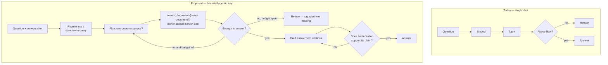

# 0027 — Agentic RAG, document cracking, and the evaluation that makes both provable

## Summary

A review of the retrieval system built in [`0025`](0025-rag-knowledge-base-and-chat.md)
and [`0026`](0026-chat-first-ux-and-history.md), and a set of recommendations to
take it from **single-shot dense retrieval** to an **agentic** one — a model that
can plan a search, look again when the first attempt is thin, and check its own
citations before answering.

This is a **recommendations spec**. It is deliberately not one implementable
change: each phase below should become its own spec with its own acceptance
criteria. The value here is the ordering and the reasoning, particularly the
argument that **none of it should be built before the evaluation harness**.

## Problem / motivation

What exists today works, and its limits are structural rather than incidental.

**Retrieval is one shot.** Embed the question, take the top 8 by cosine, drop
anything under 0.35, answer. If that single query retrieves the wrong passages,
there is no second attempt and no signal that anything went wrong — the model
answers from whatever arrived.

**The system cannot follow a conversation.** History is stored but never used.
Ask _"how much annual leave do I get?"_, then _"what about carrying it over?"_,
and the second question is embedded literally. "What about carrying it over" has
no subject, so it retrieves poorly. This is the most common real failure and it
is invisible in single-question testing.

**Chunking is structure-blind.** Fixed 512-token windows split on paragraphs,
then sentences, then hard character slices. Headings are discarded, so a chunk
from "3.2 Reimbursement limits" arrives with no indication it belongs to that
section, and a chunk that answers a question about a heading it no longer
carries scores badly.

**Retrieval is dense-only.** There is no lexical channel. An exact identifier —
a policy number, a surname, `INV-2024-8831` — is exactly what embeddings are
worst at and what `tsvector` is best at.

**Document cracking is text-or-nothing.** `unpdf` returns a text layer or the
document is rejected. Scanned PDFs are refused outright, tables are flattened
into unreadable runs, and the only structural metadata retained is a page
number.

**Nothing is measured.** There is no evaluation harness, so every improvement
below is currently unfalsifiable. The measured numbers we do have came from ad
hoc probing during implementation, not from a repeatable suite.

### What has actually been measured

| Observation                                | Value              |
| ------------------------------------------ | ------------------ |
| Content question → correct chunk           | 0.41 – 0.62 cosine |
| Off-topic question                         | 0.13               |
| `summarise <document title>`               | **0.172**          |
| `summarise this document`                  | **0.077**          |
| Identical sentence as `passage` vs `query` | 0.785              |

The summarise numbers are why [`0025`](0025-rag-knowledge-base-and-chat.md)
grew a second retrieval path. That fix was a **regex** deciding intent — which
is precisely the kind of decision an agentic system should be making with the
model instead, and a good illustration of the gap this spec addresses.

## Goals

- A repeatable way to tell whether a retrieval change helped or hurt.
- Retrieval that improves on a measured baseline, not on intuition.
- Documents that today are rejected (scanned) or degraded (tables, headings)
  become usable.
- The model can search more than once, and can decline to answer when what it
  found does not support a claim.
- **The grounding guarantee survives all of it**: no retrieved context, no model
  call, no answer.

## Non-goals

- Fine-tuning or training any model.
- GraphRAG / knowledge-graph construction over the corpus.
- Cross-user or shared knowledge bases.
- Replacing pgvector with a dedicated vector database. Nothing below needs it,
  and the pgvector caveats are documented rather than fatal.
- Autonomous actions of any kind. "Agentic" here means the model directs
  _retrieval_; it never gets a tool that writes, sends or deletes.

---

## Implementation status

| Item                                       | Status                                                                    |
| ------------------------------------------ | ------------------------------------------------------------------------- |
| **0** Evaluation harness                   | **Shipped** — `pnpm rag:eval`, 20 questions, 3 documents with distractors |
| **1a** Contextual chunk headers            | **Shipped**                                                               |
| **1b** Hybrid retrieval (RRF)              | **Shipped**, with one sub-decision reversed — see below                   |
| 1c Structure-aware / parent–child chunking | Not started                                                               |
| 1d Real tokenizer                          | Not started                                                               |
| 1e HNSW / filtered-ANN tuning              | Not started                                                               |
| 1f Reranking                               | Blocked — no reranker on this account                                     |
| 1g HyDE                                    | Not started                                                               |
| Phase 2 Document cracking                  | Not started                                                               |
| Phase 3 Agentic loop                       | Not started — blocked on 3a-bis                                           |

Measured effect of 1a + 1b together, against the dense-only baseline:

| Metric           | Baseline | 1a + 1b   |           |
| ---------------- | -------- | --------- | --------- |
| hit@1            | 0.824    | **0.941** | +0.117    |
| hit@3            | 0.882    | **0.941** | +0.059    |
| MRR              | 0.853    | **0.941** | +0.088    |
| Refusal accuracy | 1.000    | **1.000** | unchanged |

### What implementation changed about this spec

**Two things in 1b were wrong as written, and the harness caught both.**

_The lexical query must OR its terms, not AND them._ `websearch_to_tsquery`
ANDs, so _"What does POL-HR-014 cover?"_ required the passage to contain
"cover" as well as the identifier, and matched nothing at all. Question-shaped
input is full of words that never appear in the passage answering it.

_A strong lexical hit cannot be allowed to bypass the similarity floor_ — the
mechanism this spec proposed for rescuing exact identifiers. On the evaluation
corpus **no lexical-rank threshold separates true from false positives**: the
unanswerable _"How much parental leave am I entitled to?"_ scores **0.60** on
`leave`, above every genuine identifier query at **0.30**. With the bypass
enabled, retrieval reached hit@3 1.000 and MRR 0.971 — and **refusal accuracy
fell from 1.000 to 0.000**. It was removed rather than tuned; a threshold fitted
to a dozen chunks is over-fitting, not a fix.

So the lexical channel improves **ordering**, which is safe and measurable, and
does not decide what is relevant enough to answer from. Rescuing a
below-floor identifier needs reranking (1f, blocked) or IDF-aware gating
validated on a larger corpus.

**This is the argument for Recommendation 0 in miniature.** Both errors looked
reasonable in the spec, both would have shipped, and the second would have
silently destroyed the property the whole system is built around.

## Recommendation 0 — Build the evaluation harness first

**Everything else in this spec is unfalsifiable without it.** Hybrid search,
reranking, contextual chunking and agentic loops all _sound_ like improvements;
half of them will be, and the other half will trade recall for precision in ways
that only show up on a corpus. Shipping them blind means accumulating changes
nobody can defend.

The corpus already exists — `corpus/` in the [Quire](https://github.com/devdaviddr/quire)
sense is the model to copy: documents plus a ground-truth map. Here it needs:

- **A question set** with, for each question, the document and page that answers
  it, and the expected answer in substance.
- **Hard cases on purpose**: a fact split across a chunk boundary; an exact
  identifier that dense retrieval will miss; a follow-up question that only
  makes sense with conversation context; a question whose answer is in a table;
  a question with no answer in the corpus at all.

Metrics, reported per question and aggregated:

| Metric                 | Why                                                                                                  |
| ---------------------- | ---------------------------------------------------------------------------------------------------- |
| **Recall@k**           | Did the right chunk get retrieved at all? Everything downstream is capped by this.                   |
| **Citation precision** | Of the citations returned, how many actually support the claim?                                      |
| **Groundedness**       | Does every claim trace to a retrieved chunk? Catches the failure the whole design exists to prevent. |
| **Refusal accuracy**   | Does it refuse when it should, and _only_ then? Both directions matter.                              |
| **Latency + tokens**   | Agentic loops multiply both. Track from day one or the trade is invisible.                           |

Once Phase 3 exists, final-answer metrics stop being sufficient — a right answer
reached by three wasteful searches is not the same result as a right answer
reached by one:

| Metric                      | Why                                                                            |
| --------------------------- | ------------------------------------------------------------------------------ |
| **Trajectory quality**      | Were the searches sensible, or did it flail and get lucky?                     |
| **Tool-call validity**      | Malformed or hallucinated calls per run — the failure mode measured in 3a-bis. |
| **Searches per answer**     | The cost of the loop, in the unit that is actually rate-limited.               |
| **Termination correctness** | Did it stop when it had enough, and refuse when it did not?                    |

**Record and replay.** An agentic loop is non-deterministic, which makes
regressions hard to reproduce. Record model responses as fixtures and replay
them in tests, so the orchestration — caps, dedup, refusal paths — is testable
without a live endpoint, and a regression is reproducible rather than anecdotal.

Run it offline against stored chunks so the deterministic parts are reproducible
without an API key, exactly as the exemption rulebook was in Quire.

> Without this, the correct answer to "did that change help?" is "we don't
> know", and this spec would be a list of plausible-sounding upgrades.

---

## Phase 1 — Retrieval quality, before any agentic machinery

Cheap, high-yield, and each independently measurable. Do these first: an
agentic loop over weak retrieval just makes more calls to the same bad index.

### 1a. Contextual chunk headers

Prepend the document title and heading path to the text that gets **embedded**,
while storing the original text for display:

```
Staff Handbook › 3. Expenses › 3.2 Reimbursement limits
Claims over $500 require director approval before payment.
```

This directly addresses the measured weakness: `summarise <title>` scored 0.172
partly because the title appears nowhere in any chunk's embedded text. Cheap —
no extra model calls, no schema change beyond an `embedded_text` column.

A stronger variant (Anthropic's "contextual retrieval") uses a cheap model to
write a one-sentence context blurb per chunk at ingestion. Materially better,
materially more expensive: one extra call per chunk, against a rate-limited
tier. Worth evaluating as a separate option once the harness can price it.

### 1b. Hybrid retrieval — dense + lexical, fused

Add a Postgres `tsvector` column and full-text index, run both channels, and
fuse with **Reciprocal Rank Fusion**. No new service, no new dependency.

```sql
ALTER TABLE chunks ADD COLUMN content_tsv tsvector
  GENERATED ALWAYS AS (to_tsvector('english', content)) STORED;
CREATE INDEX chunks_content_tsv_idx ON chunks USING gin (content_tsv);
```

RRF needs no score normalisation between two incomparable scales, which is what
makes naive hybrid fusion fragile. This is the single highest-yield retrieval
change available here, and it fixes the class of query dense vectors are worst
at: names, codes, and exact phrases.

### 1c. Structure-aware, parent–child chunking

Split on heading boundaries rather than a fixed window, then **embed the small
chunk and return its parent section**. Retrieval precision comes from the small
unit; answer quality comes from the larger context around it.

Keeps the page-bounded rule from 0025 — citations must stay page-exact.

### 1d. A real tokenizer

`estimateTokens` is characters ÷ 4. Honest, documented, and wrong enough on
dense or non-English text to produce chunks well over the intended budget.
`js-tiktoken` or the model's own tokenizer removes a variable from every
downstream measurement.

### 1e. Tune the index for filtered search

`hnsw.ef_search` is untuned, and pgvector applies the `owner_id` filter _after_
the index scan — so a tenant holding a small share of all chunks can silently
receive fewer than `top_k` results. Not observed at demo scale; set
`hnsw.iterative_scan = relaxed_order` (pgvector 0.8) and measure before it
becomes a production surprise.

### 1g. HyDE — hypothetical document embeddings

Ask a cheap model to write the answer it _expects_, embed that, and search with
it. A hypothetical answer sits in the same region of embedding space as the real
passage; a bare question often does not.

This targets the measured weakness directly. `summarise this document` scored
**0.077** because an instruction shares almost no vocabulary with the prose it
is about — but a hypothetical summary would. HyDE is arguably the principled fix
for what [`0025`](0025-rag-knowledge-base-and-chat.md) patched with a regex in
`scope.ts`.

Costs one small generation per query. Evaluate against the regex path rather
than assuming it wins: the deterministic path is free and currently works.

### 1f. Reranking — blocked, and worth stating why

A cross-encoder reranker over the top 25 is normally the highest-precision
change available. **`nvidia/llama-3.2-nv-rerankqa-1b-v2` returns 404 on this
account** (verified 2026-09-07), and no other reranker is reachable. Options:

1. A local ONNX cross-encoder (`bge-reranker-base`) — adds a dependency and CPU
   cost, but no API dependency.
2. LLM-as-reranker: score the top 25 in one call. Expensive per query, and it
   spends the same rate-limited budget the answer needs.
3. Defer until a reranker is reachable.

**Recommendation: defer.** Hybrid + contextual headers should be measured first;
they may close enough of the gap that reranking is not worth its cost here.

---

## Phase 2 — Document cracking

Today a document is either a clean text layer or it is refused. Two models
reachable on this account change that, both verified on 2026-09-07:

| Model                                | Status                                           | Use                                           |
| ------------------------------------ | ------------------------------------------------ | --------------------------------------------- |
| `nvidia/nemotron-parse`              | **reachable** — rejects text input, takes images | Layout-aware parsing: text, structure, tables |
| `meta/llama-3.2-11b-vision-instruct` | **reachable** (HTTP 200)                         | Figure/chart description, OCR fallback        |
| `nvidia/llama-3.2-nv-rerankqa-1b-v2` | 404 — not on this account                        | —                                             |

> `nemotron-parse` returning **400** rather than 404 is the informative part:
> _"Content cannot be a plain string. The model does not support text input."_
> It is available; it simply takes page images. That makes OCR and layout
> extraction possible without adding a Python sidecar.

### 2a. Scanned PDFs, via page rendering + `nemotron-parse`

Render each page to an image, send to `nemotron-parse`, use the returned text
and structure. Turns the largest documented gap — "no OCR, scanned PDFs are
rejected" — into support, and keeps the current in-process architecture.

Keep the existing detector as the _router_: if a text layer exists, use it
(free, instant, offline); only fall back to parsing when it does not.

### 2b. Capture bounding boxes at extraction

`unpdf`/pdf.js expose word-level positions, and `nemotron-parse` returns layout.
Storing per-chunk boxes enables **span-level citation highlighting** — the item
deferred in [`0026`](0026-chat-first-ux-and-history.md), where citations resolve
to a page because boxes were never captured.

Requires a re-ingest of existing documents, which is the real cost. Worth doing
alongside 2a rather than as a second migration.

### 2c. Tables as Markdown, not flattened text

A table run through plain text extraction becomes a sequence of numbers with no
column association — worse than useless, because it retrieves and then misleads.
Emit Markdown tables and keep them whole in one chunk where they fit.

### 2d. Strip repeated headers and footers

Detect lines recurring at the same position across most pages and drop them
before chunking. Otherwise every chunk carries the company name and page number,
which dilutes embeddings and wastes context.

### 2e. Figure and chart descriptions

For pages whose information is in an image, generate a description with the
vision model and index it as text. Note honestly: a described chart is a lossy
proxy, and the citation should make clear the answer came from a description.

### 2f. More formats

`.docx`, `.html`, `.md`, `.csv` need no OCR and are mostly a parsing exercise.
Lower value than the above, but low risk.

---

## Phase 3 — Agentic retrieval

Only after Phase 1, and only with the harness in place.

### What "agentic" means here

The model stops being a text generator at the end of a fixed pipeline and
becomes the thing that **decides how to search**.



### 3a. Conversation-aware query rewriting

**Start here — it is the cheapest change with the largest real-world effect.**
One small model call rewrites _"what about carrying it over?"_ into
_"Does unused annual leave carry over to the next year?"_ using the last few
turns, and retrieval runs on the rewrite.

Fixes the most common failure in actual use. Costs one extra call per question,
and can be skipped when the question is already standalone.

### 3a-bis. The chat model cannot currently do this — verify before building

**Phase 3 assumes the chat model emits reliable tool calls. The current default
does not.** Probed on 2026-09-07 against the live endpoint:

| Model                                                   | Tool calling                                              |
| ------------------------------------------------------- | --------------------------------------------------------- |
| `nvidia/nemotron-3-super-120b-a12b` _(current default)_ | **0 / 5** — HTTP 200 with **malformed JSON** every time   |
| `nvidia/nemotron-3.5-lightning-30b-a3b`                 | **2 / 2** — `finish_reason: tool_calls`, correct function |

The failure is not a transport error to retry around: the endpoint returns 200
and the body is unparseable. That is consistent with the known structured-output
weakness of the nemotron-3 family.

Three ways forward, in preference order:

1. **Switch `RAG_CHAT_MODEL` to `nemotron-3.5-lightning-30b-a3b` for the agentic
   path.** One env var, verified working. Costs answer quality — evaluate the
   trade with the harness rather than assuming it is free.
2. **Do not use native tool calling.** Drive the loop with a structured JSON
   response instead (`response_format`, which _does_ work on nemotron-3), and
   dispatch server-side. More code, no model constraint, and the orchestration
   stays deterministic.
3. **Use different models for different jobs** — a tool-calling model to plan,
   the stronger model to write the final answer. Best quality, most moving
   parts.

**Nothing in Phase 3 should be started before this is settled**, because it
determines the shape of the whole loop.

### 3b. Retrieval as a tool, with a bounded loop

Expose `search_documents(query, documentId?)` as a tool. The model may call it
up to `RAG_MAX_SEARCHES` (suggest 3) times before it must answer or refuse.

**Non-negotiable invariants:**

- The tool resolves `ownerId` **server-side from the session**. The model never
  supplies it and cannot reference another user's documents, whatever it emits.
- A hard cap on iterations, tokens and wall-clock. An unbounded loop against a
  rate-limited free tier is a denial-of-service against yourself.
- **The grounding guarantee is preserved as a code path**, not a prompt
  instruction: if every search returns nothing above the floor, the refusal is
  returned without asking the model to compose one.

### 3b-bis. Decide whether to retrieve at all

Not every turn needs retrieval. "Thanks", "what can you do?", "summarise what
you just said" — the current design retrieves unconditionally, spending an
embedding call and eight chunks of context to answer a question about the
conversation itself.

An adaptive router (retrieve / answer from context / refuse as out of scope) is
cheap and reduces load on a rate-limited tier. It must **fail towards
retrieval**: wrongly skipping retrieval produces an ungrounded answer, which is
the one failure this system exists to prevent.

### 3b-ter. Grade what came back, explicitly

The loop diagram says "enough to answer?". That needs to be a real component,
not a vibe — the CRAG/Self-RAG pattern. Grade each retrieved chunk as
**relevant / partially relevant / irrelevant**, and let the grade drive the
decision: answer, re-query with different terms, or refuse.

Grading also produces the signal the harness needs: a run where every chunk
grades irrelevant is a retrieval failure, distinguishable from a generation
failure. Today those are indistinguishable.

### 3b-quater. Loop hygiene

Small things that decide whether the loop is usable:

- **Deduplicate across iterations.** Successive searches return overlapping
  chunks; without dedup the context fills with the same passage three times.
- **Accumulate, do not replace.** Keep a running set of retrieved chunks with
  their grades, so the answer draws on everything found, not just the last
  search.
- **Pack the context deliberately.** Order by grade, put the strongest evidence
  at the beginning and end (models attend least to the middle), and enforce a
  token budget rather than letting N searches overflow the window.
- **Cache.** A semantic cache on query embeddings, and a per-conversation cache
  of chunk lookups, both matter more here than in single-shot retrieval because
  the loop repeats itself.

### 3c. Query decomposition

_"Compare the leave and expense policies"_ is two retrievals. Let the planner
split it, retrieve independently, and answer over the union. Naturally handled
by 3b's loop; worth measuring separately because it is where multi-hop questions
are won or lost.

### 3d. Citation verification before returning

After drafting, check each claim against its cited chunk — a cheap entailment
call, or a second pass over the drafted answer. Drop or flag unsupported claims.

This is what keeps an agentic system honest. More retrieval means more
opportunity to blur sources together; without verification, agentic RAG produces
_more confident_ wrong answers than the current single-shot design.

### 3e. Replace the scope regex with a model decision

`scope.ts` currently detects "summarise this" with a regular expression. Under
3b that becomes a tool choice — `search_documents` with a `documentId`, or a
`get_document_outline` tool. **Keep the deterministic path as a fallback** for
when the model does not call a tool at all; it is cheap and it works.

---

## Risks

- **Cost and latency multiply.** Rewrite + plan + N searches + verify is easily
  5× the calls of today, against a tier that rate-limits rather than bills. The
  harness must report tokens and latency, and the caps in 3b are load-bearing.
- **Non-determinism.** Today the same question retrieves the same chunks. With a
  model planning searches it may not, which makes regressions harder to
  reproduce. Log the full trace — rewritten query, each search, each result set.
- **A wider injection surface.** A document that influences the model's _next
  search query_ is a new attack path that does not exist in single-shot
  retrieval. The owner-scoping invariant in 3b contains the blast radius;
  nothing else does.
- **No per-user budget.** The caps in 3b are per request. A user asking twenty
  questions can still exhaust a shared free-tier quota for everyone. A per-user
  and per-deployment budget, with a visible degraded mode when exhausted, is
  part of making the loop safe to expose.
- **Complexity for its own sake.** If Phase 1 closes the gap, Phase 3 may not be
  worth its cost for a boilerplate. That is a legitimate outcome and the harness
  is what would reveal it.

## Recommended sequencing

1. **Evaluation harness** — nothing else is provable without it.
2. **1a contextual headers + 1b hybrid retrieval** — highest yield per unit of
   effort, no new services, immediately measurable.
3. **1c/1d chunking and tokenizer** — measure separately; the effects interact.
4. **2a/2b document cracking + bounding boxes** — one re-ingest, two payoffs
   (scanned documents, span-level citations).
5. **3a query rewriting** — biggest real-world gain of the agentic work, and the
   cheapest part of it. Needs no tool calling, so it is unblocked today.
6. **3a-bis settle the model question** — the loop's shape depends on it.
7. **3b/3c/3d the loop** — only if the numbers still show a gap worth closing.

1g (HyDE) can be evaluated at step 2 alongside contextual headers; it competes
with the existing `scope.ts` regex rather than complementing it, so measure them
against each other.

Reranking (1f) re-enters at any point if a reranker becomes reachable.

## Alternatives considered

- **Jump straight to an agentic loop.** Tempting and wrong: a loop over a
  structure-blind, dense-only index mostly issues more queries against the same
  weak retrieval, at several times the cost.
- **Swap pgvector for a dedicated vector database.** Nothing recommended here
  needs it. Hybrid search is _easier_ in Postgres, because `tsvector` and the
  vectors live in one table and one query.
- **A Python sidecar for document parsing** (PyMuPDF + Tesseract, the Quire
  approach). More capable, and it breaks the single-container story.
  `nemotron-parse` gets most of the benefit without it — a judgement to revisit
  if quality disappoints.
- **Fine-tuning an embedding model on the corpus.** Highest ceiling, entirely
  disproportionate here, and impossible to justify without the harness.

## References

- Builds on [`0025`](0025-rag-knowledge-base-and-chat.md) and
  [`0026`](0026-chat-first-ux-and-history.md); current behaviour is documented
  in [`docs/rag.md`](../docs/rag.md).
- Model availability probed against `https://integrate.api.nvidia.com/v1` on
  2026-09-07: `nemotron-parse` reachable (400 on text input — takes images),
  `llama-3.2-11b-vision-instruct` reachable (200),
  `llama-3.2-nv-rerankqa-1b-v2` **404 on this account**.
- Similarity measurements in the table above were taken against the live
  endpoint during 0025/0026 implementation, not from model cards.
