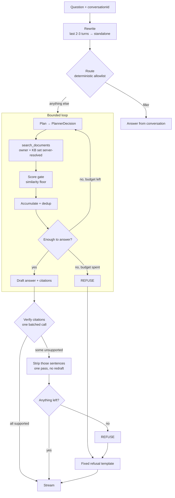

# 0029 — Agentic retrieval loop

## Summary

Retrieval today is a fixed pipeline: a regular expression picks the strategy,
one hybrid search runs, anything under the similarity floor is dropped, and the
model writes prose over whatever arrived. This spec gives the _model_ control of
retrieval — rewrite the question, decide whether to search at all, search again
when the first attempt is thin, and check its own citations before answering —
inside a **bounded loop** that cannot spend unbounded time or tokens, and
without weakening the guarantee that an ungrounded question is never sent to a
model at all.

It implements phase 3 of [`0027`](0027-agentic-rag-and-document-cracking.md),
and deliberately **declines to implement three of that spec's recommendations**
until measurement justifies them.

## Problem / motivation

The pipeline's limits are structural, not incidental.

**It cannot follow a conversation.** History is stored and never used. Ask _"how
much annual leave do I get?"_ then _"what about carrying it over?"_ and the
second question is embedded literally. "What about carrying it over" has no
subject, so it retrieves badly. This is the most common real failure and it is
invisible to single-question testing — which is exactly what the current
evaluation harness does.

**Retrieval is one shot.** If the single query retrieves the wrong passages
there is no second attempt and no signal anything went wrong.

**The strategy decision is a regex.** `resolveScope` distinguishes "summarise
this document" from a content question by pattern-matching. Honest, crude, and
the clearest case in the system of a judgement a model should be making.

### What changed since 0027 was written

0027 recorded the agentic loop as **blocked**: the default chat model was
measured returning HTTP 200 with unparseable tool-call arguments on 5 of 5
attempts. **That result did not reproduce.** A re-probe of 40 native tool-call
attempts across four reachable models produced **zero** HTTP-200-with-malformed-
arguments responses. Every failure was a clean transport 500/503 already inside
`client.ts`'s existing `RETRYABLE` set.

| Model                                            | Native tool calls        | Multi-turn loop | Median latency |
| ------------------------------------------------ | ------------------------ | --------------- | -------------- |
| `nemotron-3.5-lightning-30b-a3b`                 | **10/10**                | **5/5**         | 2.6s           |
| `nemotron-3-super-120b-a12b` _(current default)_ | 8/10 _(2 transport 500)_ | not tested      | 3.5s           |
| `nemotron-3-ultra-550b-a55b`                     | 8/10 _(2 transport 500)_ | not tested      | 4.2s           |
| `nemotron-3-nano-omni-30b-a3b-reasoning`         | 7/10 _(3 rate-limited)_  | not tested      | 4.4s           |

Two further corrections to the record:

- **Latency was overstated.** 0027 and the project notes carry ~10s for `super`
  and ~59s for `ultra`. Measured now: 2.6–4.4s medians across all four. The
  earlier figures were presumably taken under different load or a heavier
  prompt. This materially changes the loop's budget — see _Design_.
- **Structured JSON is the weaker mechanism, not the safer one.** These are
  reasoning models. With no `tools` array present the chain-of-thought streams
  into `content`, so a small `max_tokens` truncates mid-thought before any JSON
  appears — which is what earlier "malformed JSON" observations actually were.
  With `tools` present, reasoning is split into `reasoning_content` and
  `content` stays clean. **Native tool calling is more token-budget-robust than
  the JSON fallback**, reversing 0027's assumption.

## Goals

- A follow-up question retrieves as well as the standalone question it means.
- The model can search more than once when the first attempt is thin, within a
  hard budget.
- Every claim in an answer is checked against its cited chunk before display.
- The agentic path is **provably** better than the pipeline on the same
  questions, or it does not ship.
- Refusal accuracy stays at 1.000.

## Non-goals

- **Per-chunk LLM relevance grading.** See _Design_: the cosine score already
  separates true positives (0.41–0.62) from off-topic (0.13) with a wide dead
  zone. Grading buys precision the score already has, at up to 24 extra calls a
  question.
- **HyDE.** It targets the "summarise this document" failure that `scope.ts`
  already solves deterministically and for free.
- **Query decomposition.** Possibly needed for multi-hop questions; unproven
  against a 3-document corpus at `RAG_TOP_K=8`. Build the multi-hop eval
  questions first and only build decomposition if they fail under one search.
- Changing chunking, extraction, or OCR — those are 0027 phases 1 and 2.

## Requirements

### Functional

- **FR1** — A follow-up is resolved into a standalone query using the recent
  turns. The **original** text stays in the transcript. _(Implemented inside the
  planner rather than as a separate call — see "Reference resolution" below.)_
- **FR2** — A deterministic router skips retrieval for a narrow allowlist of
  conversational filler. Anything ambiguous retrieves.
- **FR3** — A planner emits a typed `PlannerDecision`:
  `{action: 'search'|'answer'|'refuse', query?, documentId?}`.
- **FR4** — `search_documents(query, documentId?)` resolves `ownerId` and the
  permitted `knowledgeBaseIds` **server-side**, per
  [`0028`](0028-independent-knowledge-bases.md).
- **FR5** — The loop is bounded by iteration count, wall-clock and token budget.
  Hitting any bound ends the loop; it never extends it.
- **FR6** — After drafting, one batched call checks each citation supports its
  claim. Unsupported sentences are **stripped**, not redrafted.
- **FR7** — The stream emits `step` events (`routing`, `searching`, `drafting`,
  `verifying`) so the client is never silent without a heartbeat.
- **FR8** — The whole path is behind `RAG_AGENTIC_ENABLED`, default off until
  the eval A/B says otherwise.
- **FR9** — Each request logs a full trace: original question, rewritten query,
  every search and its results, every decision, and the final citation verdict.

### Non-functional

- **NFR1** — Refusal remains a code path _around_ the loop. The model is never
  asked to honour a "refuse if unsure" instruction as the safety mechanism.
- **NFR2** — Worst-case time to first token stays under 20s.
- **NFR3** — `pnpm rag:eval` **exits non-zero** if the candidate's refusal
  accuracy is below the baseline's, whatever every other metric does.
- **NFR4** — The planner's transport failures are absorbed by the existing retry
  wrapper. No new repair logic.

## Design / approach

### Control flow



Every refusal box is code, sitting **before** the drafting call — the same
short-circuit that exists today, with more entry points into the same exit.

### Reference resolution: measured, then redesigned

0027 and the first draft of this spec both specified a **separate** rewrite call
before retrieval. It was built, and then measured against the live endpoint:

| Attempt                                | Result                                                                        |
| -------------------------------------- | ----------------------------------------------------------------------------- |
| Plain-text rewrite, `max_tokens: 200`  | `finish_reason: length` — reasoning preamble truncated, no query ever emitted |
| Plain-text rewrite, `max_tokens: 1500` | **53s**, still `length`, still no query                                       |
| Tool-call rewrite, `max_tokens: 400`   | `finish_reason: length`, no tool call                                         |
| Tool-call rewrite, `max_tokens: 1200`  | Correct: `{"query":"carrying over annual leave"}` — but **15s**               |

15s is the entire loop budget, spent before the first search. So the separate
call is gone: the **planner** receives the recent turns and resolves the
reference itself, in a tool call that was going to happen anyway. Measured after
the change: _"what about carrying it over?"_ → `"carrying over annual leave"`,
one search, correct passage, **8.1s** total.

This also removes a failure mode rather than adding one. The original design's
3s rewrite timeout was **shorter than the measured 2.6–4.4s median latency of
the call it was timing**, so it fired on essentially every request — the
fallback worked perfectly and silently hid the fact that the feature did
nothing. A timeout shorter than the typical latency of the thing it times is not
a safety net; it is an off switch.

### Models

Two roles, two models:

| Role                 | Model                            | Why                                                      |
| -------------------- | -------------------------------- | -------------------------------------------------------- |
| Planner / tool calls | `nemotron-3.5-lightning-30b-a3b` | 10/10 native tool calls, 5/5 multi-turn, fastest median  |
| Final prose          | `RAG_CHAT_MODEL` (today `super`) | Unchanged; answer quality is not what the probe measured |

New env: `RAG_PLANNER_MODEL`. Splitting the roles is not premature — the probe
measured structural reliability, not prose quality, and there is no reason to
assume one model is best at both.

**Native tool calling is the mechanism.** A `PlannerDecision` type with two
adapters is still specified — native tool-call parsing (default) and a
`response_format` JSON fallback — because the orchestrator is identical either
way and the fallback costs one small module. If the fallback is ever used,
`max_tokens` must be **≥1500**: 300 was the direct cause of every "malformed
JSON" result in the probe.

### Budget

Revised upward from 0027's draft, because the latency it assumed was wrong.

| Cap                   | Value     | At the limit                                         |
| --------------------- | --------- | ---------------------------------------------------- |
| `RAG_MAX_SEARCHES`    | **3**     | Answer from what passed the gate, or refuse          |
| `RAG_MAX_LOOP_MS`     | **15000** | Abort and refuse — never a partial ungrounded answer |
| `RAG_MAX_LOOP_TOKENS` | **8000**  | Stop; answer from accumulated evidence or refuse     |
| Verification passes   | **1**     | Strip, never redraft                                 |

Worst case: rewrite ~2s + 3 × (plan 2.6s + search ~0.5s) + verify ~3s ≈ **14s**
to first token. Typical (one search, planner answers immediately): ~**8s**. At
0027's assumed 10s-per-call this budget would have been 45s and unusable; the
corrected measurement is what makes three searches affordable.

### Relevance gating

The score does the work. Chunks clearly above or below the floor are decided for
free. Only chunks in a narrow ambiguous band (start at 0.35–0.45, tune from eval
data) go to **one batched** grading call per iteration — typically **zero** extra
calls per question on this corpus, worst case one per iteration.

### Citation verification

One batched entailment call after drafting. Unsupported sentences are stripped
server-side. This deliberately departs from 0027's draft⇄verify loop: an
unbounded verify-redraft cycle is the same failure mode as an unbounded search
loop, moved one step later. If stripping empties the answer, that is a code-path
refusal, not a blank response.

### Streaming

One new NDJSON frame, additive to the existing five:

```json
{
  "type": "step",
  "phase": "rewriting|routing|searching|grading|drafting|verifying",
  "iteration": 1
}
```

The client shows a phase label ("Searching your documents (1/3)…") instead of a
bare spinner, then switches to token streaming unchanged. `X-Accel-Buffering:
no` is already set, so nothing buffers these.

### Evaluation

`eval/questions.json` gains a `type` field: `single-hop` (the existing 20),
`multi-hop`, `followup` (a two-turn fixture with a pronoun-bearing question),
and refusal cases that only become unanswerable _after_ a search.

New metrics: searches per answer, termination correctness, planner-decision
validity, latency and tokens per question.

**A/B, not assertion.** Run the same `questions.json` through both paths and
write `eval/results/{baseline,agentic}.json`, then diff. "Is agentic better" is
a table, not an impression.

**Refusal accuracy is a hard gate** (NFR3). This has already happened once here:
a change took MRR to 0.971 while silently taking refusal accuracy from 1.000 to
0.000. Making the run fail is the difference between measuring it and being
unable to ship a regression by accident.

## Acceptance criteria

- [ ] A `followup` question retrieves the passage its standalone form retrieves.
      **Measured:** _"what about carrying it over?"_ → `"carrying over annual
leave"` → staff-handbook p1 @ 0.479, one search, 8.1s.
- [ ] A planner that fails, times out or returns something unparseable leaves
      the loop with whatever it had, and the request still succeeds.
- [ ] The persisted user message is the text the user typed, not the resolved
      query.
- [ ] Router allowlist unit-tested; anything not on it retrieves.
- [ ] Fuzzing the planner's tool arguments with `ownerId`/`userId`/`owner_id`
      fields produces byte-identical results to the same call without them.
- [ ] A planner-supplied `documentId` outside the conversation's permitted KB
      set returns exactly what a missing document returns.
- [ ] Each of `RAG_MAX_SEARCHES`, `RAG_MAX_LOOP_MS`, `RAG_MAX_LOOP_TOKENS` is
      independently shown to terminate the loop.
- [ ] Citation verification strips an unsupported sentence; stripping everything
      yields the fixed refusal, not an empty answer.
- [ ] `step` frames arrive for every phase; no gap exceeds one planner call.
- [x] `pnpm rag:eval --compare` prints both tables. **Measured:** single-hop
      0.941 → 0.882, refusal 1.000 → 1.000, follow-up 0 → 0.667, multi-hop
      0 → 1.000, at 11.1s and 1617 tokens per question.
- [x] The eval run **exits non-zero** when refusal accuracy regresses. It did:
      the first A/B measured 0.667 against a baseline of 1.000, which is why
      `RAG_AGENTIC_FLOOR_STEP` exists.
- [ ] With `RAG_AGENTIC_ENABLED=false` the existing path is byte-identical.
- [ ] `pnpm lint && pnpm typecheck && pnpm test && pnpm build` pass.

### The risk this creates, named

Smoke-testing found the failure mode this spec exists to guard against, in the
wild. Asked _"How much parental leave am I entitled to?"_ — which the corpus
**cannot** answer — the loop tried three phrasings and surfaced a chunk at
**0.358**, just above the 0.35 floor. The fixed pipeline refuses that question.

More attempts means more chances to clear a threshold by luck. That is precisely
why FR6 exists and why NFR3 is a hard gate: citation verification is the second
line, and refusal accuracy is the number that must not move. **The A/B must be
run before `RAG_AGENTIC_ENABLED` is turned on anywhere**, and if refusal accuracy
drops, the floor — not the feature — is what needs revisiting first.

## Security & privacy

- **Scope is never model-supplied.** `ownerId` from the session, permitted KBs
  from the conversation's stored selection, both resolved at the top of the
  request. Asserted by the fuzz test above.
- **Resolve the KB set once per request**, not per tool call, so a multi-search
  question cannot end up with citations spanning an inconsistent notion of what
  was permitted.
- **Wider injection surface.** A retrieved chunk now reaches a model that makes
  _decisions_, not just prose. A malicious PDF may try to widen scope or force a
  search. It cannot change scope (above), and it cannot cause unbounded work
  (budget). It can waste a user's iterations — accepted, and logged via FR9.
- **Refusal is not promptable.** NFR1 is the reason a model that is talked into
  ignoring its instructions still cannot produce an ungrounded answer.

## Alternatives considered

- **Structured JSON as the primary mechanism.** Rejected on measurement: it is
  less token-budget-robust than native tool calling for this model family.
  Retained as a fallback adapter.
- **One model for both roles.** Not rejected — untested. The probe measured
  structural validity, not prose quality. `RAG_PLANNER_MODEL` makes collapsing
  the roles a config change if the eval says they are interchangeable.
- **`RAG_MAX_SEARCHES=2`.** Correct under the old 10s latency figure. At the
  measured 2.6s it costs recall for no meaningful latency saving.
- **Per-chunk grading, HyDE, decomposition.** See _Non-goals_.

## Out of scope / future

- Query decomposition, if the multi-hop eval questions fail under one search.
- A model-based router, if the allowlist proves too narrow or too wide.
- Cross-encoder reranking — no reranker is reachable on this account.

## References

- [`0027`](0027-agentic-rag-and-document-cracking.md) — the recommendations
  this implements, and whose blocked status it overturns.
- [`0028`](0028-independent-knowledge-bases.md) — defines the scope boundary
  `search_documents` must respect.
- `docs/rag.md` — measured baselines: hit@1 0.941, MRR 0.941, refusal 1.000.
